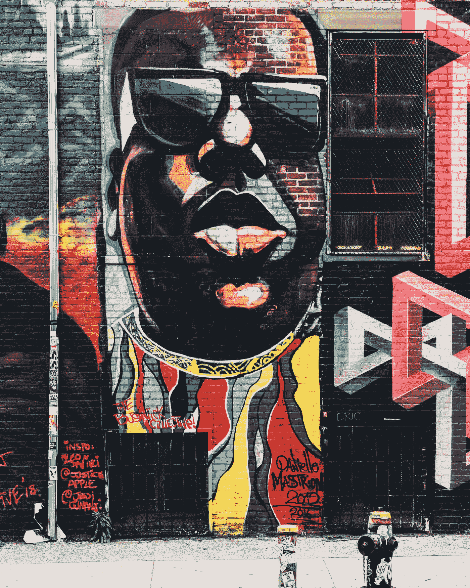

# Web3 新闻帮你摆脱 FTX 的忧郁

> 原文：<https://medium.com/coinmonks/web3-news-to-help-you-shrug-off-the-ftx-blues-4d70054a9470?source=collection_archive---------34----------------------->

尽管加密货币的新闻占据了头条，但出版商发誓要让我们的眼睛盯着我们最了解的东西。11 月和 12 月期待为蓬勃发展的音乐 NFT 舞台增添一些新鲜的变化，所以让我们一起期待 2022 年剩下的时间会带来什么:

**喜欢一个老板**

在今年的最后一段时间里，会有大量的虚拟现场活动发生，但有一个肯定会脱颖而出，那就是[分散地](https://decentraland.org/)即将到来的现场直播音乐会。日本的 [DJ 老板](https://www.bandwagon.asia/articles/dj-boss-bandwagon-pixel-party-christmas-special-metaverse-live-stream-concert-decentraland-december-2022)恰好是这场 NFT 独家活动的主要艺术家之一。他的布景将是[潮流像素派对](https://play.decentraland.org/?realm=artemis&position=-123,-126)的一部分，该派对将结合他的欧洲节拍电子乐曲目以及一些风格化的圣诞视觉效果。

**臭名昭著的网站 3**

Meta 宣布他们将在今年 12 月继续进行计划中的“[声名狼藉先生天空的极限:虚拟现实演唱会体验](https://musically.us2.list-manage.com/track/click?u=d52f6bce2f35240a62f393249&id=fdff9f108e&e=cff7369e7d)”项目。据 Zucherberg 先生和他在 Meta 的团队称，一个备受爱戴和尊敬的说唱歌手，臭名昭著的 B.I.G .的“超现实化身”版本将在元宇宙一个名为 [The Brook](https://musically.com/2022/05/23/the-notorious-b-i-g-to-return-in-virtual-form-in-the-brook/) 的场所登台。希望 Meta 的人们能够公正对待东海岸说唱之王的悠久遗产。

**元谜**

对于我们这些对揭示艺术家的洞察力和动机感兴趣的人来说，今年 11 月我们得到了一个罕见的待遇。伦敦皇家音乐学院(Royal Music College)的作曲家兼词曲作者伊斯亚娜·辩才天女(Isyana Davis)将以“我的神秘 NFT”的形式发布她的第一张 NFT 专辑——这是一个数字收藏品，揭示了她 2022 年 AMI Awards 获奖歌曲[“我的神秘](https://mintify.xyz/eth/0x2520500dfb1206f7f5b71a70a8a6011d3eac1f60/?token=13)”背后的过程。

**宝莱坞区块链**

屡获殊荣的歌手兼词曲作者 Shruti Pathak 因其在宝莱坞电影中的作品以及她的热门单曲而在印度广为人知。她即将发行的《哈妮娅》即将加入印度崭露头角的 NFT 人才库。这首单曲将于今年 11 月通过 FanTiger 推出，FanTiger 是一个帮助艺术家在印度创造充满活力和不断发展的 web3 空间的平台。

虽然熙熙攘攘的 web3 空间继续增长，出版商将继续强调和讨论这个不断变化的数字世界。对于各种天赋水平的后起之秀来说，自信地驾驭 NFT 空间可能会很棘手，尤其是如果你想让自己出名的话。令人欣慰的是，出版商致力于为艺术家、粉丝和 NFT 爱好者创建一个平台，完全拥抱音乐产业的去中心化未来。请关注我们未来的文章，并关注我们即将在 https://the-publicator.com[推出的产品。](https://the-publicator.com/)

> 交易新手？试试[密码交易机器人](/coinmonks/crypto-trading-bot-c2ffce8acb2a)或[复制交易](/coinmonks/top-10-crypto-copy-trading-platforms-for-beginners-d0c37c7d698c)