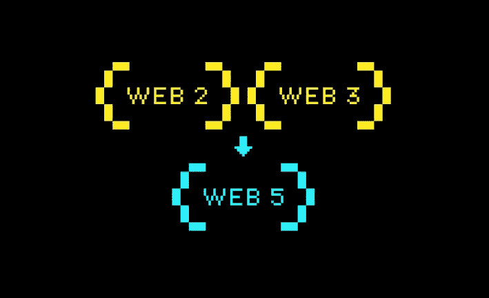
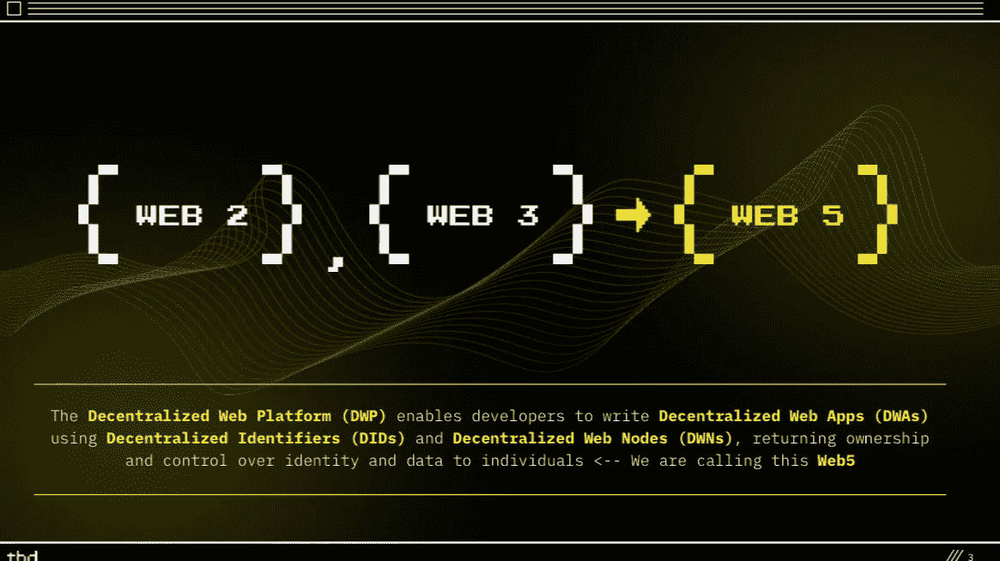

# Web3，现在 Web5？Web4 怎么了？

> 原文：<https://medium.com/coinmonks/web3-now-web5-what-happened-to-web4-596adce6564?source=collection_archive---------7----------------------->

虽然 Web3 已经存在多年，但就在几个月前，围绕它的宣传真的失控了，每个人都开始对这项技术感到好奇，想知道它是什么，做深入的研究等等，只是为了学习和理解这项技术，以及为什么它会存在，或者想首先存在。

快进到几个月后，前 Twitter 首席执行官杰克·多西提出了另一项类似于 Web3 的技术，称之为“Web5”，现在人们真的很困惑，好像他们甚至没有真正理解 Web3 是什么，现在是 Web5。

嗯，这是区块链技术的世界，任何技术都有一个特点，那就是它一直在进化。新技术随时都会出现。如果你愿意，你可以扔掉以前的，然后开始学习新的，或者一个接一个地学习。在这篇文章中，我将向你解释区块链科技领域正在发生的事情，当有 Web3 时，Web5 是什么，Web5 是什么，Web4 到底在哪里。但在此之前，让我们先了解一下 Web3 和 Web2 的皮毛…

# 什么是 Web3 和 Web2？

网络 3 这个术语是以太坊的联合创始人加文·伍德在 2014 年创造的。Web3 是，或者至少被认为是 Web2 的继承者。

Web2 是我们今天使用的互联网，主要由谷歌、脸书和亚马逊等大型科技公司以集中的方式控制。他们利用你的个性化数据和活动，这些数据和活动是你在使用他们的平台时随便扔的，他们利用这些数据做广告，从你的数据中赚钱，给你很少或没有份额。

另一方面，Web3 将成为救世主，它将保护你的个人数据不被未经你同意的人使用，同时也是一个救世主，它将防止以集中的方式使用平台。在区块链的帮助下，Web3 允许你以分散的方式使用互联网。

# 为什么选择 Web5？

Web3 有问题，虽然据说是去中心化的互联网。然而，如果你放大，你会看到它实际上并没有那么分散，它上面的大多数应用程序和协议更像是集中的，它们也受到风投和区块链领域其他一些大型实体的控制。甚至根据杰克·多西(前 Twitter 首席执行官)的说法，Web3 绝对不是分散的，它就像 Web2 一样，也是集中的，但有不同的标签。早在 2021 年 12 月，他在推特上说“这最终是一个带有不同标签的中央集权实体。知道你将面临什么。”

杰克·多西一直不是 Web3 的粉丝，一直批评和警告 Web3 被风投控制，并向用户撒谎说它是分散的，还说 Web3 是基于“单点故障系统”，现在他走出自己的路，提出了他的真正分散化互联网的想法，“Web5”，预计将解决 Web3 更集中而不是分散的问题。这是杰克·多西 Block Inc .(SQ:NYSE)的一个部门 TBD 在 Twitter 上宣布的，同时还有一个解释它是什么和它是关于什么的谷歌文档。

但是不要担心，我读了文档，所以你不必麻烦，所以现在，我在这里，写下我从那个文档中学到的一切…大问题…

# 什么是 Web5？

首先，Web5 的想法是在杰克·多西 Block Inc .(原名 square)的公司 TBD 在 Twitter 上宣布的时候提出来的，目的是使用比特币第二层解决方案，即闪电网络，实现额外的去中心化。根据 TBD 在 Twitter 上分享的文件，Web5 是“支持去中心化应用和协议的网络的新进化”

Web5 有望成为 Web3 的继任者，因为 Web3 中的术语“去中心化”实际上可能是一个彻头彻尾的谎言。Web5 将利用数字钱包，并将带来一个去中心化的 Web 平台(DWP ),这将使开发人员能够使用去中心化的标识符(did)和去中心化的 Web 节点(dwn)编写去中心化的 Web 应用程序(DWA ),将身份和数据的所有权和控制权归还给用户——这基本上就是 Web5 的意义所在。帮助开发人员开发分散式 Web 应用程序，这也将有助于用户拥有他们的数据和控制他们的身份，使用分散式 Web 节点也称为 DWN。

# Web5 是如何工作的？

TBD 在谷歌文档中举例说明了用户如何利用 Web5 控制自己的身份。例如，名为 Alice 的用户拥有一个数字钱包，该钱包可以保护她的数据、授权和第三方应用程序和连接的身份安全。现在，在 Web5 的帮助下，爱丽丝可以使用她的数字钱包登录任何分散的应用程序，比如说，一个分散的社交媒体应用程序。如果爱丽丝可以使用她的数字钱包登录到那个分散的社交媒体应用程序(现在姑且称之为 dApp)，那么她肯定不需要再在应用程序上打开实际的个人资料了。她的数字钱包已经显示为她的个人资料。

此外，使用 Web5 DWNS，她还可以在 dApp 和她的 DWNS(分散式 Web 节点)上存储她的所有数据(无论是她的帖子、关注者、约定等数据)。DWNS 是区块链上的一个节点，Web5 平台上的每个人都拥有它，用来存储他们的公共和加密数据。现在，在作为她的个人数据存储的 DWNS 和作为她的个人资料的数字钱包的帮助下，她可以从一个 dApp 移动到另一个 dApp，真正控制她的身份。

TBD 举例说明的另一个关于拥有数据的例子是，比如说，一个叫鲍勃的用户是一个音乐爱好者，他讨厌把他的个人数据锁定在一个供应商的播放列表上。锁定到一个单一的供应商是简单的，如果他只使用一个音乐应用程序，那么很明显，只有这个音乐应用程序有他的播放列表的音乐数据。但是，如果 Bob 有时喜欢更改音乐应用程序，会发生什么情况呢？这意味着 Bob 必须在新的音乐应用程序上重新创建他的播放列表，而他喜欢更改音乐应用程序的事实意味着，对于他更改的任何音乐应用程序，他都必须重新创建他的播放列表，对吗？

但是有一个解决方案，Web5，DWNS，就像 Alice 一样，Bob 也可以将他的数据从一个音乐应用程序移动到另一个应用程序。一旦他的 DWNS 上已经有了他的数据，他就可以在多个音乐应用程序之间切换，而不必重新创建他的播放列表，因为他已经在 DWNS 上有了他的播放列表数据。一件很酷的事情是，他可以选择让任何音乐应用程序访问他的播放列表、偏好等，如果他想的话，还可以随时撤销不提供他的数据的批准。DWNS 使他能够将他的个性化音乐体验带到他想去的任何地方，同时真正拥有他的数据。很酷，也很容易理解。好吧，你可能想知道…

# Web4 怎么了？

你应该知道 TBD 或杰克·多西并不是真的对保持名字和数字的顺序感兴趣，他们只是把这个新想法叫做 Web5。

此外，他们真的不是不想保持秩序，他们也想说明 Web2 + Web3 = Web5 是如何做到的。所以他们做了一点算术，2+3 = 5。所以是的，差不多就是这么回事。

所以 Web4？它什么事都没有，只是被跳过了，估计不是那个幸运数字(lol)。好的，你明白了，现在…

# Web5 什么时候到达这里？

老实说，这个问题有点太超前了。首先，Web5 实际上是几周前才发布的。所以还在开源开发中。TBD 甚至还没有宣布它的发布日期。然而，据 TBD 的负责人迈克·布鲁克说，Web5 将不会参与代币投资和所有这些事情。与 Web3 不同，NFT 和其他令牌在其开发中至关重要。

此外，布鲁克谈到了为什么他们这么早就宣布 Web5，它甚至还没有准备好。“有人批评我们在发布 web5 之前就发布了 web5。但问题是，当我们推出 TBD 时，这是我们承诺做事的方式。我们承诺我们会有公开、透明和开源的路线图。这就是我们正在做的。”布鲁克说。

他也勇往直前，一头撞上了 Web3。他说:“有些人似乎认为我们在开 web5 的玩笑，我们并没有真正致力于它。我向你保证，我们真的在努力。它会真实存在，不像 web3。”

显然，布鲁克的意思是他们真的致力于开发名为 Web5 的超分散网络平台。

# 最后的想法…

虽然 Web5 对一些人来说听起来很有前途，但对另一些人来说，它听起来可能只是科技领域营销的一个时髦词。如果 Web5 真的会在 Web3 之前成为一个东西，现在预测事情会如何还为时过早，谁知道呢，也许最终，用户将能够选择他们喜欢使用哪个网站，是 Web2 还是 3 还是 4，对不起，意思是 5。我们都还不能说，我想我们只能静观其变。

> 交易新手？试试[加密交易机器人](/coinmonks/crypto-trading-bot-c2ffce8acb2a)或者[复制交易](/coinmonks/top-10-crypto-copy-trading-platforms-for-beginners-d0c37c7d698c)