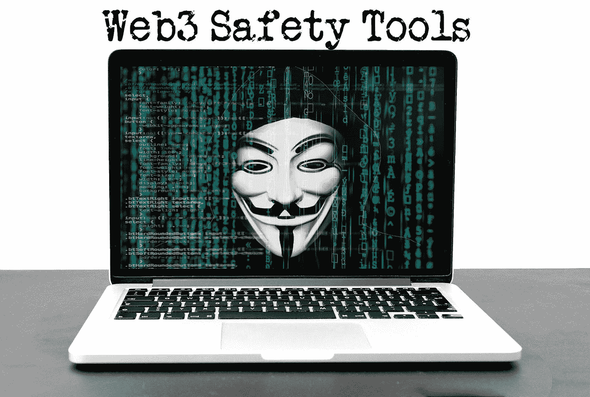

# Web3 安全工具

> 原文：<https://medium.com/coinmonks/web3-safety-tools-f56012d1d371?source=collection_archive---------10----------------------->

黑客、恶意软件和诈骗……天啊！不幸的是，这不是什么新鲜事。随着技术的发展，出现了试图快速赚钱的坏演员。就像互联网的前几次迭代一样，Web3 中也存在安全威胁。听到钱包被掏空的恐怖故事可能会非常令人沮丧，而且骗局继续变得越来越复杂，更难发现它们。最糟糕的部分？没有人能免受坏演员的影响。事实上，我们…