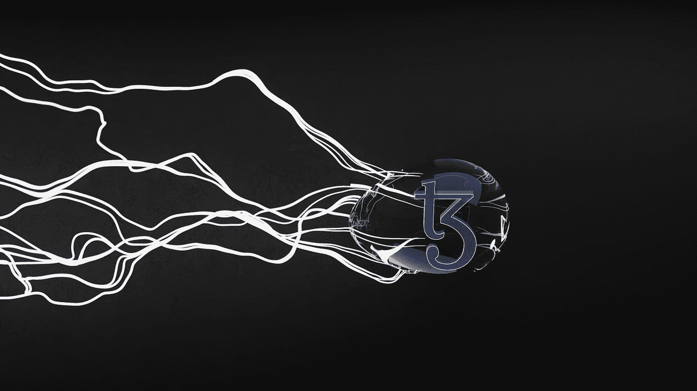

# Web3:区块链和加密货币的未来

> 原文：<https://medium.com/coinmonks/web3-the-future-of-blockchain-and-cryptocurrency-e133271b81f8?source=collection_archive---------29----------------------->

## Web3 是一个总部位于区块链的应用程序，帮助用户以安全有效的方式交易和交换商品和服务。

Photo by [GuerrillaBuzz Crypto PR](https://unsplash.com/@theshubhamdhage?utm_source=medium&utm_medium=referral) on [Unsplash](https://unsplash.com?utm_source=medium&utm_medium=referral)

预计这将有助于降低交易成本，提高效率，并减少信任问题。