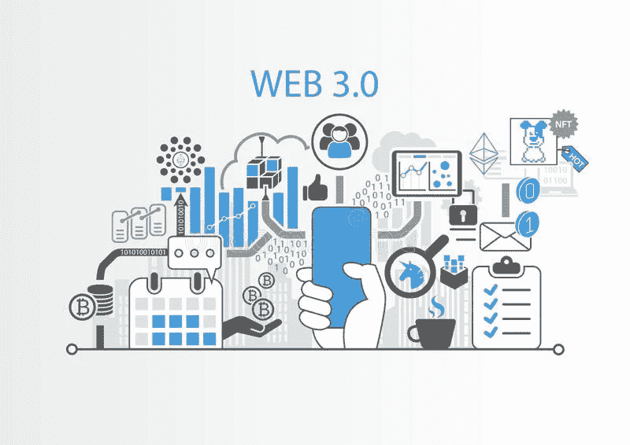

# Web3 与元宇宙:有什么不同？

> 原文：<https://medium.com/coinmonks/web3-vs-metaverse-whats-the-difference-4d930cb7171f?source=collection_archive---------32----------------------->

# 什么是 Web3？

Web 3.0 或 Web 3 是最近才被定义的。首先，Web3 的目标是完全去中心化，将内容创作交给创作者而不是平台所有者。

虽然没有人拥有互联网，但一些大公司施加了相当大的影响，一些批评者说他们权力太大。Web3 使互联网民主化，并将控制权交还给用户。

> 交易新手？在[最佳密码交易所](/coinmonks/crypto-exchange-dd2f9d6f3769)上尝试[密码交易机器人](/coinmonks/crypto-trading-bot-c2ffce8acb2a)或[复制交易](/coinmonks/top-10-crypto-copy-trading-platforms-for-beginners-d0c37c7d698c)

Web3 由五个组件组成:

1.  语义网。语义网使用人工智能来理解用户或客户的意思或意图。它旨在根据搜索词的实际含义，而不是关键字或数字，提供更准确的搜索理解。
2.  **艾。Web3 的人工智能旨在更好地理解某人正在搜索什么，以提供更相关的结果。**
3.  **3D 图形和空间网络。**虚拟现实(VR)耳机和逼真图形的使用使网站在本质上变得更加逼真。
4.  **区块链和加密货币。**web 3 去中心化的关键是区块链和加密货币的使用，这消除了中间人，使各方之间能够直接交易。
5.  **无处不在的连接。** Web3 应用因宽带、5G、Wi-Fi、IoT 而呈现持续连接的特点。

在完全实现的空间网络中，物理世界中每个建筑的每个元素都将完全数字化。每个人都将有虚拟化身，人们可以在虚拟的工作或会议场所漫游。这意味着世界上的每一条信息都将变得空间性。

# 什么是元宇宙？

尽管脸书在 2021 年将公司名称改为 Meta，但元宇宙不是脸书的努力，尽管脸书是元宇宙的参与者。

元宇宙是一个独立于设备和供应商的集体虚拟空间，由虚拟增强的物理和数字现实融合而成。它有自己独立的虚拟经济，由数字货币和不可伪造代币(NFT)支撑。

教育、医疗、零售和虚拟活动可以提供更加身临其境的体验。他们不必创建自己的基础设施，但元宇宙将提供框架。虚拟活动可以提供更多的综合产品，而零售可以提供更身临其境的购物体验。

在这一点上，元宇宙与 Web3 的空间网络没有什么不同。这是一种虚拟的沉浸式体验，专注于 3D 图形和真实世界的图像，而不是像当前的网络体验那样的 2D 图形和文本。用户不再点击网站的链接，而是虚拟地浏览它。

# Web3 和元宇宙的区别

这两种技术的最大区别是人们使用 Web3 访问元宇宙，就像汽车使用道路一样。

Web3 是关于去中心化的所有权和控制权，把网络交到用户和社区的手中。另一方面，元宇宙是一个共享的数字现实，使用户能够相互联系，建立经济并实时互动，它不在乎谁拥有它。

Web3 也建立在区块链和加密货币的基础上，而元宇宙使用 AR/VR 和数字货币等技术。这是因为 Web3 是分散的，没有主要的公司影响力或控制权。

两者在使用方式上也有所不同。Web3 是一套关于如何使用和管理互联网的新标准。元宇宙是关于游戏、社交媒体、零售和其他体验的。

# Web3 和元宇宙的共同点

Web3 和元宇宙密不可分。元宇宙将继续存在于表层和深层网络中，尽管 Web3 仍然经常被称为去中心化的；然而，在社交媒体控制平台方面，元宇宙仍将保持集中化。

两者都建立在不断发展的先进技术之上。语义网是元宇宙和 Web3 的共同基础。人工智能——这两种技术的另一个关键组成部分——将成为构建复杂用户界面的一部分。

从技术角度来说，区块链取得的许多进步为这两种技术创造了共同的基础。每一个新的区块链概念都被评估为集成 Web3 引擎的潜在模块，该引擎将为元宇宙的商品和服务提供动力。

Web3 和元宇宙还处于早期阶段。最终的产品将在几年后出现，可能会有很大的不同，因为技术并不总是与其用途相匹配。

现在加入:-[https://final . fizo . network/JOIN？invite = 0 x4 BF 27 b 09 D8 b 45116172 c 41 e 981 a 7526 ade 65 E4 bb](https://final.fizo.network/join?invite=0x4Bf27b09d8B45116172C41e981A7526AdE65E4bb)

[Fantom 基金会](https://medium.com/u/713a211d04f8?source=post_page-----4d930cb7171f--------------------------------) [Web3 基金会团队](https://medium.com/u/d6954f1a46d9?source=post_page-----4d930cb7171f--------------------------------)[DappRadar](https://medium.com/u/b355b203c3dd?source=post_page-----4d930cb7171f--------------------------------)[Huobi](https://medium.com/u/65d3e2271234?source=post_page-----4d930cb7171f--------------------------------)[币安](https://medium.com/u/57600910a883?source=post_page-----4d930cb7171f--------------------------------) [BNB 链讯](https://medium.com/u/f9759be0020c?source=post_page-----4d930cb7171f--------------------------------) [水果生态区块链项目](https://medium.com/u/763681dada17?source=post_page-----4d930cb7171f--------------------------------)[Blockchain.com](https://medium.com/u/e4f5246afb5c?source=post_page-----4d930cb7171f--------------------------------)[比特币](https://medium.com/u/61e1a4e5105d?source=post_page-----4d930cb7171f--------------------------------) [以太坊](https://medium.com/u/d626b3859bc9?source=post_page-----4d930cb7171f--------------------------------) [信托钱包](https://medium.com/u/d3191ca07046?source=post_page-----4d930cb7171f--------------------------------) [投币僧团队](https://medium.com/u/7fd682ed116d?source=post_page-----4d930cb7171f--------------------------------)

> 加入 Coinmonks [电报频道](https://t.me/coincodecap)和 [Youtube 频道](https://www.youtube.com/c/coinmonks/videos)了解加密交易和投资

# 另外，阅读

*   [Bookmap 评论](https://coincodecap.com/bookmap-review-2021-best-trading-software) | [美国 5 大最佳加密交易所](https://coincodecap.com/crypto-exchange-usa)
*   [加密交易机器人](/coinmonks/crypto-trading-bot-c2ffce8acb2a) | [造币评论](https://coincodecap.com/coingate-review)
*   最佳加密[硬件钱包](/coinmonks/hardware-wallets-dfa1211730c6) | [Bitbns 评论](/coinmonks/bitbns-review-38256a07e161)
*   [新加坡十大最佳密码交易所](https://coincodecap.com/crypto-exchange-in-singapore) | [收购 AXS](https://coincodecap.com/buy-axs-token)