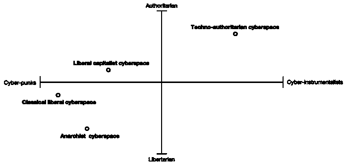

# 网络 3 的核心价值观与网络空间的意识形态战争

> 原文：<https://medium.com/coinmonks/web3s-core-values-and-cyberspace-s-ideological-war-e866a7b4fd27?source=collection_archive---------13----------------------->

每种工具都包含着一种意识形态的偏见，一种倾向于把世界构造成一种东西而不是另一种东西，把一种东西看得比另一种更重要，把一种感觉、技能或态度放大得比另一种更响亮。新技术与旧技术争夺时间、注意力、金钱、声望，但主要是争夺世界观的主导地位。”

*— —尼尔·波兹曼，技术垄断:文化向技术的投降*

我非常尊敬博斯曼教授，他是媒体生态学的先驱之一。这句话来自于他在 20 世纪 90 年代的著作《T4 科技垄断:文化向科技的投降》，现在看来，这个非常前瞻性的观点正在被一场叫做 Web3 的网络革命所验证。

我相信大多数熟悉 Web3 的人都被疯狂的财富效应所吸引，大量的投资正在使这个市场看起来像一个充满黄金的新世界。但同时，我希望你能仔细思考一个问题:Web3 的核心价值是什么？是加密货币使能的低成本金融服务吗？是不对称加密带来的隐私保护吗？还是所谓的网络所有权再分配？这个问题的答案会极大地影响你在 Web3 中的行动，进而影响未来的进化方向，值得仔细思考。

# Web3 辩论的背景是什么？

事实上，关于 Web3 价值的争论一直持续到今天，甚至给 Web3 下一个明确的定义都是一件非常具有挑战性的事情。所以在我们开始讨论这个问题之前，让我们筛选一些有代表性的观点，为下面的叙述创造一个一致的背景。

首先，对于 Web3 的支持者，这里有三个公认的答案，[第一个来自 Josh Stack，他为以太坊基金会工作，这是一个致力于支持以太坊和相关技术的非营利组织:](/l4-media/making-sense-of-web-3-c1a9e74dcae)

> *Web 3 是一组重构互联网控制的技术，不仅仅包括加密货币、区块链和其他加密经济设计的产品。*

[第二个](https://future.com/why-web3-matters)来自 Chris Dixon，他是 a16z 的普通合伙人，a16z 被认为是 Web3 最大的投资机构:

> *Web3 是由建设者和用户拥有的互联网，用令牌编排。在 web3 中，所有权和控制权是分散的。用户和构建者可以通过拥有不可替代(NFTs)和可替代的令牌来拥有互联网服务。*

[第三个问题](https://hbr.org/2022/05/what-is-web3)来自《哈佛商业评论》的高级编辑 Thomas Stackpole，这是国际商界最有影响力的出版物之一:

> *Web3 被吹捧为互联网的未来。这个基于区块链的新网站的愿景包括加密货币、NFT、Dao、分散金融等。它提供了一个读/写/拥有的网络版本，在这个版本中，用户在他们所属的网络社区中拥有经济利益和更多的控制权。*

从这些观点中，我们可以得出两个关键结论。首先，Web3 是一个愿景，而不是一个固定的技术架构或商业模式。第二，这一愿景的核心是改变当前主流的网络所有权或分发控制权的范式。，强调用户在网络世界的自主性和独立性。

一个非常经典的 Web3 例子是在 Web3 世界中，用户将从第三方平台重新获得其数字资产的所有权。以经典的 Web2 公司 Twitter 为例，由于用户在使用过程中产生的数据是平台专有的，它可以利用这些数据通过广告驱动的营收模式来谋取利益，但实际上这些价值应该是属于用户的，谁是数据的生产者，平台利用封闭的生态系统来实现数据垄断，窃取用户的利益。这是一个 Web3 从业者批评 Web2 的经典故事。

> 交易新手？试试[密码交易机器人](/coinmonks/crypto-trading-bot-c2ffce8acb2a)或[复制交易](/coinmonks/top-10-crypto-copy-trading-platforms-for-beginners-d0c37c7d698c)

在这样的愿景指导下，似乎已经形成了 Web3 项目的设计原则。在被视为最具代表性的 Web3 基础设施以太坊的官网中，我们可以找到后面的[:](https://ethereum.org/en/web3/)

> *Web3 是去中心化的:互联网的大部分不是由中心化的实体控制和拥有，而是在其建设者和用户之间分配所有权。*
> 
> *Web3 是无权限的:每个人都可以平等地参与 Web3，没有人会被排除在外。*
> 
> *Web3 拥有原生支付:它使用加密货币在线消费和汇款，而不是依赖于过时的银行和支付处理器基础设施。*
> 
> Web3 是不可信的:它使用激励和经济机制来运行，而不是依赖可信的第三方。

另一方面，Web3 的对手也不甘示弱。同样，我们选择三个有代表性的观点。[第一个](https://moxie.org/2022/01/07/web3-first-impressions.html)来自莫邪·马林斯派克，信号的创造者:

> *对于下游的大多数人来说，权力下放本身实际上并没有直接的实际意义或紧迫的重要性，人们想要的权力下放的唯一数量是某种事物存在所需的最小数量，如果不是非常有意识地加以说明，随着日子变得越来越早，这些力量将推动我们远离而不是接近理想的结果。*

[第二个](https://www.stephendiehl.com/blog/web3-bullshit.html)来自 Stephen Dieh，一名计算机程序员和坚定的加密货币评论家:

> web3 的核心是一场乏味的营销活动，试图将公众对加密资产的负面联想重新构建成一个关于传统科技公司霸权被颠覆的虚假叙事。区块链并没有给科技领域带来任何新的或有价值的东西。这是一个小把戏，其唯一的应用是创建抗审查的加密投资方案，这是一项负外部性和伤害能力远远超过任何可能用途的发明。

[第三个](https://twitter.com/jack/status/1473139010197508098?ref_src=twsrc%5Etfw)来自 Twitter 的联合创始人杰克·多西:

> 你不拥有“web3”风投和他们的有限合伙人知道。它永远不会逃脱他们的激励。它最终是一个带有不同标签的集中实体。

这三位评论家的观点具有代表性。首先是对分散网络重要性的怀疑。他们认为去中心化基本上是 Web 用户的伪需求。相比去中心化，用户更关心的是 Web 应用信息交互的效率或者其他，而从结果来看，很多所谓的 Web3 公司其实并没有贯彻这个原则，只是借用了背后的营销效果。

第二个是对 Web3 的基础设施的怀疑，区块链的技术缺陷，他们认为区块链作为“分布式数据库”技术是失败的，因为这个发明并没有提高查询和插入的效率，甚至是严重的倒退，而这个指标通常是评价数据库技术的重要技术指标。

> *交易新手？试试* [*密码交易机器人*](/coinmonks/crypto-trading-bot-c2ffce8acb2a) *或* [*复制交易*](/coinmonks/top-10-crypto-copy-trading-platforms-for-beginners-d0c37c7d698c)

第三是对 Web3 超金融化现状的质疑。他们通常肯定去中心化的意义，但认为目前的 Web3 过度依赖加密技术，导致 Web3 陷入了超金融化的困境。一方面让整个行业为难。逃离经济周期的规律，双方的资金垄断会导致权力分配的重新集中。

以上信息基本上是对 Web3 发展状况的回顾。你会发现解决纠纷的关键是搞清楚 Web3 的核心价值是什么。我认为答案是，Web3 的出现标志着网络空间的成熟(或者一个时髦的概念取而代之，那就是元宇宙)，网络行动在人类社会生活中的比重越来越大，Web3 为我们提供了相对完整的网络空间的意识形态理论和实用的技术解决方案。从现在开始，意识形态将一起成为未来 web 技术发展新的参考维度。**总而言之，Web3 的核心价值在于其文化价值。**

# 网络空间发展的三个阶段

赛博空间是一个古老的概念，这个名字早在 1960 年就首次出现在丹麦艺术家 Susanne Ussing 的作品中，然而由于这个术语和现在有很大的差距，所以我们就不做过多介绍了。直到蒂姆·伯纳斯·李在 1989 年发明了万维网，这个术语的概念才逐渐转变为我们所熟悉的，它是“一种纯粹存在于表示和交流空间中的社会环境的感觉……它完全存在于计算机空间中，分布在日益复杂和流动的网络中。”

事实上，我认为网络技术的发展基本上可以被视为网络空间的实现过程，将这一概念从虚构带入现实。根据**网络空间人**的协作关系和信息交互，我们大致可以把这个过程分为三个阶段(抱歉 Web +序列号没有充分表达我的观点，所以我选择了其他命名标准):

**(1)古典自由主义时代**

回溯到 1989 年，蒂姆·伯纳斯·李发明的万维网标志着人类正式进入信息时代(当然，这与微软发布的第一代 MPC(多媒体 PC，多媒体个人电脑标准)的普及密不可分)。借助于这个通过互联网接入、由许多互联超文本组成的信息系统，我们实现了信息的超远距离、高速、低成本传输。

得益于当时相对自由的政治环境和全球化的热潮，我们以开放协议的形式完成了互联网底层技术标准的构建。请注意，开放协议的原则是它们不属于某个公司或国家。它类似于物理世界的特征。它是一个中立的网络基础设施。

此时任何人都可以使用三种简单的技术:统一资源标识符(URL)、超文本传输协议(HTTP)、超文本标记语言(HTML)来使用 Web 进行低频信息交换(回想个人博客和电子邮件时代的体验)，网络空间的人通常是同行，既是网络建设者也是网络使用者，信息交换的过程直接依赖于开放的协议，每个人都可以使用 Web 技术按照自己的意愿发布和获取信息。所以我们称这个阶段为古典自由主义时代。

然而，伴随着网络空间的伦理问题，如敲诈勒索、毒品销售、儿童色情等。政府加强了对网络内容的审查。现阶段，网络空间的主要矛盾在于开放协议原则与政府审查之间的矛盾。大多数网络人认为个人自由是网络发展的前提，过度的审查严重违反了开放原则。

这一阶段出现了许多技术主义和制度，[《网络空间独立宣言》](https://www.eff.org/cyberspace-independence)是这一阶段的标志性产物。这些硅谷左翼精英通常对政治有一定的诉求。然而，由于网络空间的发展仍处于初级阶段，网络行为在人们的社会生活中所占的比重很小，认同网络行为的人较少，因此网络行为并不顺畅。其实在当时，web 只是一个给大多数人快速传递信息的工具，和电话没有太大区别。

**(2)技术垄断时代**

接下来，网络空间进入了技术快速发展的阶段。这

进化基本上有两个方向。一种是扩展 Web 可以承载的信息类型，带给人们更真实的信息交互体验，如 Websocket、AJax、流媒体等。二是降低 Web 的技术门槛，从而降低使用成本，提高信息交互效率，如 Nginx、Apache、Caddy 等。

随着 web 的爆炸式增长，掌握所有的技术变得更加困难，不仅因为数量，而且因为复杂性。根据动机的不同，网络空间的人大致可以分为两类:网络用户和技术提供者。其中，web 用户更注重通过网络进行信息交流，技术供应商希望通过向 web 用户提供低成本、高效率的技术服务或工具来获取利益。此时，信息交换逐渐依赖于技术供应商提供的技术服务。因此，我们称这个阶段为技术垄断时代。

这时大量的 Web 技术公司通过高薪吸引技术专家，希望实现技术垄断，获取垄断利润。在社交媒体应用和广告驱动的收入模式出现后，这一过程达到了顶峰。通过广告主的引入，在网络用户、技术供应商和广告主之间形成了一种看似共赢的关系。

随着网络空间人数的庞大，信息种类的丰富，网络行为在人们社会生活中的比重增加，隐私信息泄露和非法监控的负面影响更加严重。斯诺登事件彻底引爆了这颗炸弹，网络空间的主要矛盾逐渐转移到了网络用户和技术寡头之间的矛盾。矛盾的根源在于数据隐私问题。

一些技术专家认为，隐私问题的关键原因在于技术寡头垄断了所有网络资源，并通过垄断网络用户的信息来获利，这是一件不能容忍的事情。所以当前的主流 web 架构需要彻底改变，人们需要一个完全公开、没有垄断的 web 架构。事实上，这是加文·伍德最初的 Web 3.0 愿景，是对[“后斯诺登网络”](https://www.coindesk.com/layer2/2022/01/04/what-is-web-3-heres-how-future-polkadot-founder-gavin-wood-explained-it-in-2014/)的描述:

> Web 3.0，或者可以称之为“后斯诺登”网络，是对我们已经使用网络的各种事物的重新想象，但是对于各方之间的互动有着根本不同的模式。我们认为是公开的信息，我们会公布。我们认为是一致同意的信息，我们放在一致同意的分类账上。我们认为是私人的信息，我们保守秘密，从不泄露。通信总是在加密信道上进行，并且仅使用假名身份作为端点；从不带有任何可追踪的东西(比如 IP 地址)。

我认为这是一个里程碑，因为它标志着我们第一次用一个更完整的思想视角来思考 web 的发展，指导 web 技术的发展。事实上，它看起来像一个由 T2 无政府主义者指挥的网络空间。在此之前，技术发展主要围绕成本优化和效率提高。

**(3)意识形态赛博空间时代**

为了避免与网络政治哲学混淆，首先需要说明的是，这里的意识形态指的是一种网络建构的哲学，不涉及物理学会的政治追求。我认为我们现在已经进入了意识形态的网络空间时代。这个时代的主要特征是，网络空间作为人类社会生活的重要组成部分获得了足够的认可。新的意识形态(或网站建设哲学)和相应的管理制度设计将为网站技术的发展提供新的动力。从那时起，网络空间将被意识形态分割，同时保持薄弱的联系。

在这个时代，网络空间的发展不太可能沿着一条排他性的单线程路径，这就是为什么我不喜欢 Web3 这个名字。情况将非常类似于文艺复兴时期的政治哲学发展，但这一次，互联网基础设施的开放协议精神将决定这是一个自下而上的发展过程，因为建立一个新的网络社会是一件低成本的事情，不需要暴力革命。网络空间的意识形态和管理体系会随着时间的推移而增加，不同的网络空间会通过自己独特的优势吸引网络空间人的迁移。

# 网络意识形态谱系的左移与网络移民浪潮

考虑到这一点，让我们试着回顾一下现有的网络意识形态(更详细的分析在后续文章中):

***古典自由主义网络空间:**这是一种支持言论自由高于一切的网络建设哲学，认为过度的审查会对网络的发展产生负面影响。因此，这些建设者通常主张建立基于开放原则的中性网络基础设施。

***技术权威主义的网络空间:**这是一种以实用为导向的网络构建哲学，认为所谓的网络空间只是技术所有者提供给非技术所有者的产品。这些建设者的核心诉求是提供丰富的功能和高性能的网络以获取商业利益。

***无政府主义网络空间:**这是一种基于反对一切威权主义原则的网络建设哲学，包括技术威权主义和政治威权主义。它认为，没有一个集中的组织或技术解决方案能够带来一个公平的网络空间。因此，这部分网络建设作者通常以去中心化原则来建设网络基础设施(我认为用无政府主义者来描述一个后斯诺登版本的 Web3 的愿景是恰当的)。

***自由资本主义网络空间:**这是一种货币化、市场化主导的网络空间建设理念。它认为，数字资产的私人所有权和不受监管的自由市场是建设更公平的网络空间的核心。

这些建设者主张通过设计合理的基于加密货币的货币政策和经济体系来分配网络空间的权力(我认为这是描述高度金融化的网络 3 的愿景的恰当方式)。

我们无法预测未来会出现什么样新颖的意识形态网络空间，或者哪种意识形态会在这场宏大的战役中胜出，但我认为此时提出一个分析框架是有意义的。网络意识形态图谱，类似于政治图谱，不仅可以实现一个网络意识形态的初步定位，还可以定位网络空间人的思想倾向，进而判断未来发展的方向。

网络意识形态光谱

如图，横轴代表在网络空间的沉浸程度。位置越靠左，网络世界在社会生活中的比例就越高，对网络空间的依赖程度就越大。一般认为极左群体就是所谓的赛博朋克。他们认为自己完全生活在网络空间，而极右翼人士则是所谓的网络乐器演奏者。他们认为网络世界根本不存在，互联网只是传递信息的工具。纵轴代表传统的政治和文化轴(权威对自由)。

在这样的设定下，你会看到上述意识形态网络空间的分布。可以看出，左倾趋势正在发生。我认为随着虚拟现实、增强现实、元宇宙等沉浸式网络技术的发展，这种趋势将进一步加剧。相信在不久的将来，我们将会经历一场令人震惊的互联网居民移民潮。唯一可以确定的是，无论是高投资回报率、更强的产品参与感，还是优秀的隐私保护方案，意识形态上的优势才是赢得这场意识形态斗争的关键因素。