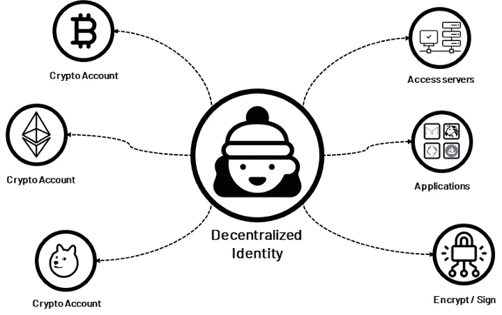

# Web3 的身份问题:分散身份的需要

> 原文：<https://medium.com/coinmonks/web3s-identity-problem-the-need-for-decentralized-identity-c20bad2d1ce6?source=collection_archive---------2----------------------->

*第 1 篇，共 4 篇，作者群*

# 介绍

身份应该是 Web3 中的一个主要关注点，因为它涉及到拥有身份的个人以及他们与空间中其他利益相关者的交互。此外，对于像 DeFi 这样的空间，大规模采用取决于创建一个无缝的身份验证过程。本文探讨了分散身份(DID)，围绕这一现象的好处和问题，以及基于这一愿景的品牌建设。

# 什么是去中心化身份？

[*Image Source*](/amber-group/decentralized-identity-passport-to-web3-d3373479268a)

在过去的五年里，DID 受到的关注比 crypto 和 Web3 的其他方面要少。许多人甚至不认为它是 Web3 生态系统中的一个用例。他们不知道的是，DID 是原生 Web3 应用的重要组成部分。这些 dapps 链接到一个识别层，该识别层从一个地方(例如，他们的钱包)整理用户的身份信息。此外，没有第三方身份提供商控制它。

举例来说，想象一下，不管在什么平台上，你都可以用你所有的生活经历和活动中的联系来参与和探索虚拟世界。

对于更多的上下文，虽然我们可能认为我们在 Web3 中的身份是统一的，但它是以下内容的组合:

*   个人/生物特征身份——驾照、护照。指纹，眼睛扫描。
*   交易身份—您的钱包地址和交易历史。
*   担保身份—数字资产所有权的证明(NFTs)。
*   数据身份—根据您允许访问的数据确定您的身份。
*   你的社交——你的线上和线下社交联系人以及社交档案中揭示“你是谁”的其他因素
*   声誉身份——您的身份基于您以前的工作地点、雇佣关系和执照。

这些元素应该演变成一个单一的 Web3 身份，而不是像 Web2 中那样独立。因此，用户可以对他们分散的身份拥有更多的控制权、安全性和可验证性。

# 为什么 Web3 用户需要一个身份？(接下来是 web3 身份的优势)

消费者需要拥有自己的身份有无数的原因。

首先，Web2 数据管理的特点是将敏感的个人数据交给第三方机构，而不知道这些数据是如何使用的。例如，“登录谷歌”和“登录脸书”选项意味着品牌从谷歌和 Meta 的 [PII](https://www.investopedia.com/terms/p/personally-identifiable-information-pii.asp) 数据库验证用户的身份，这使他们受益，因为他们整理了更多关于用户活动的数据。

其次，数字数据保护是基于另一个第三方的频繁审计。实际上，我们的信息是向第三方泄露的，我们对发生的事情没有发言权。因此，数据可能处于危险之中。

第三，由于公司存储数据，Web2 数据库面临被黑客攻击的风险。自 21 世纪初以来，[数据泄露](https://en.wikipedia.org/wiki/List_of_data_breaches)和利用公司数据库的数量一直在上升。对黑客来说，公司的数据库是某种乌托邦，因为他们可以出于不可告人的目的攻击、利用和使用这些数据。这在 2021 年因身份盗窃/诈骗造成的超过 500 亿美元的损失中显而易见。

DIDs 比 web2 档案有更长的保存期限，这意味着您在 web3 上的身份、声誉和成就将有更永久的记录。例如，你发布的任何内容，你都将永远获得荣誉。或者公共记录可以显示你参与了一个流行的早期运动/项目。除了永久，这也意味着没人能再伪装成你！重要的是，你需要一个包含你的数字资产的身份证明(例如，你的钱包)，但只有你知道里面有什么。因此，您将获得一个自我主权身份(SSI)和可验证的凭证！

# 分散身份的当前问题

虽然分散身份听起来令人兴奋，但我们需要技术来帮助人们在成为主流之前，将他们的非链体验和声誉与区块链融合在一起。展望未来，我们将需要一个流程来标准化和优先处理某些数据。这些问题意味着 DID 的未来仍然取决于迭代和技术发展的速度以及用户采用的速度。

第二个障碍是，当消费者控制他们的数据时，营销和数据分析团队会发现很难提出消费者洞察。这种发展对企业来说也具有挑战性，因为它们要么迅速适应，要么迟早会与客户失去联系。也就是说，我们离这个现实还很远，因为我们还没有完全从 web2 过渡到 web3。此外，我相信目前的营销策略仍将被使用。

# 提供解决方案的项目

无数的项目正在致力于解决 Web3 的身份问题。但我的重点是这两个，因为我亲自与他们互动:

*   [BrightID](https://www.brightid.org/) : BrightID 允许用户根据用户证明其唯一身份的能力获得权利和利益。与社会安全号码(SSN)等政府标识符不同，BrightIDs 是自行发布的，并由亲密的朋友和亲戚验证。BrightID 已经完成了与 Gitcoin、Snapshot、Clr.fund、Discord bots 等 dapps 的集成。该平台还拥有 72，000+赞助用户。
*   Disco :有点新奇，还在私人测试阶段，但它可以帮助用户链接他们的 Web2 和 Web3 身份和应用。目前，用户只能链接几个不同的账户和身份:Twitter 账号、Discord 账号和域名。

# 可能需要改进的地方

很明显，我们仍处于分散识别的开始阶段。然而，在未来几年，公司应关注以下改进领域:

*   私钥恢复:支持密钥恢复，无需集中存储密钥。
*   匿名性:在链上交互过程中提供用户匿名性和安全性。
*   无摩擦交互:给用户一个无摩擦和可互操作的身份。
*   证书基础设施:为政府和大学等机构提供在线颁发证书和资格证书的能力。

这就是目前关于 Web3 身份的内容。

感谢您通读。

如果文章的任何部分引起了你的兴趣，请留下你的评论。

> 交易新手？试试[密码交易机器人](/coinmonks/crypto-trading-bot-c2ffce8acb2a)或者[复制交易](/coinmonks/top-10-crypto-copy-trading-platforms-for-beginners-d0c37c7d698c)