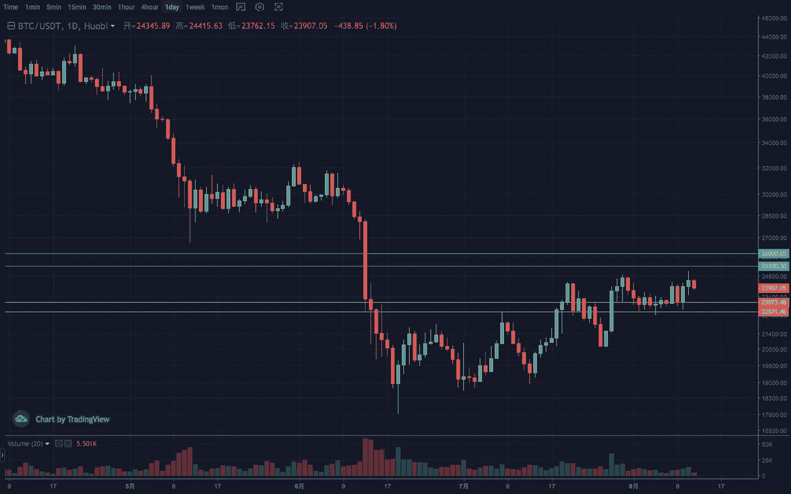
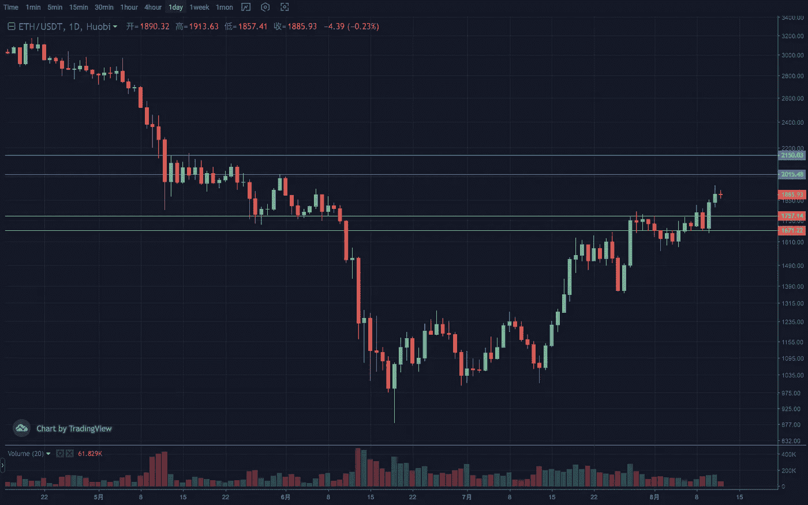
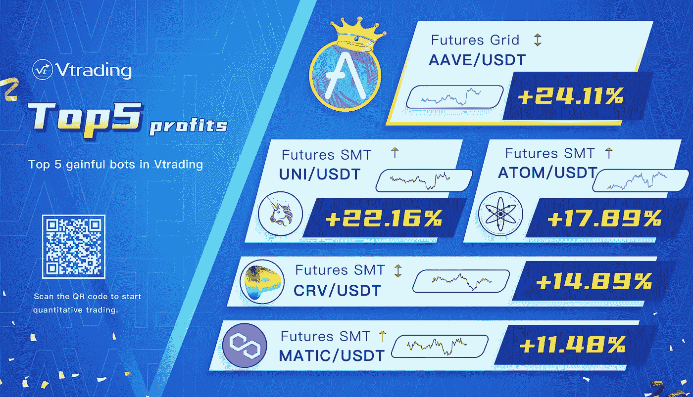

# 2022 年 8 月加密投资周分析

> 原文：<https://medium.com/coinmonks/weekly-analyze-of-crypto-investing-in-august-2022-2393bcd4a1b8?source=collection_archive---------42----------------------->

日期:日期:2022 年 8 月 8 日-2022 年 8 月 12 日。

密码市场本周普遍上涨。

BTC 上周收出调整 k 线，本周走出上涨中继，创出近期新高。日成交量可以适中，走势相对缓慢。目前正在触及通道上缘和下跌波段的斐波纳契 50%反弹水平。有阻力迹象，预计行情还会反复。所以趋势还是需要 22500–23000 的防守区间，25500–26000 的压力区间。

ETH 周线再次走出强势的积极趋势。但是面对 MA120，级别和 2000 整数关口的多重阻力，目前的走势还能维持吗？重点关注回撤的力度，防守区间 1650–1750。日线处于第三期震荡上涨过程中，较前两期走势有所放缓。谨防快速上涨和假突破。压力范围 2050–2150。

[**Vtrading**](http://www.vtrading.com/) 是一个加密交易平台，为每个交易者提供智能硬币交易策略。如果你正在使用 Vtrading 智能加密交易机器人，建议现货市场使用 Grid 和 Martin 策略，期货市场使用 SMT 策略。

> 交易新手？试试[密码交易机器人](/coinmonks/crypto-trading-bot-c2ffce8acb2a)或[复制交易](/coinmonks/top-10-crypto-copy-trading-platforms-for-beginners-d0c37c7d698c)