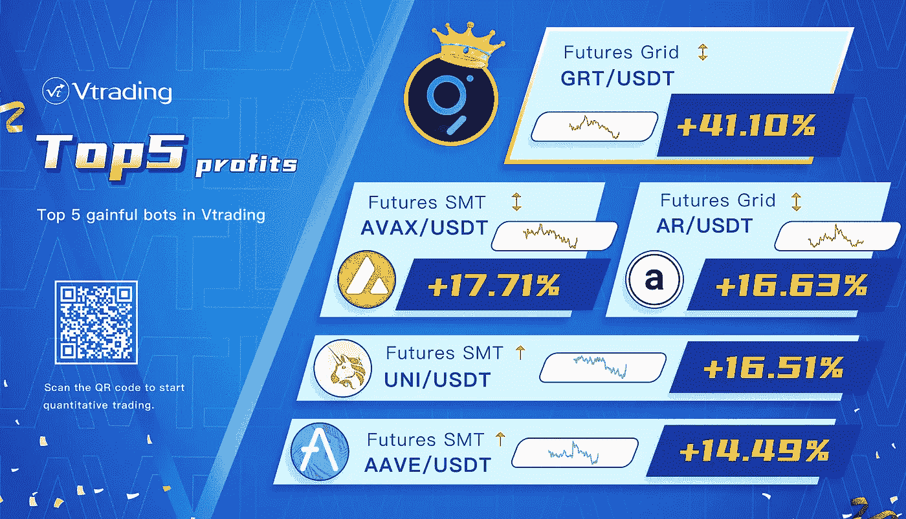

# 2022 年 8 月加密投资周分析

> 原文：<https://medium.com/coinmonks/weekly-analyze-of-crypto-investing-in-august-2022-63fdb99a8c91?source=collection_archive---------53----------------------->

日期:2022 年 8 月 1 日至 2022 年 8 月 5 日。

本周在密码市场火热的非主流币走出了一波不错的轮动补涨行情。

BTC 周线处于反弹趋势的调整阶段，日线呈下跌趋势。趋势支撑区间 22000–22500。如果它破了，市场就会变弱，很容易导致一波加速下跌。如果能在近期收出反跌反阳柱并逐渐企稳在 23800 上方，同时成交量能走出空中加油形态，趋势将会回归。压力范围是 25500–26000。

ETH 在周线上并没有保持强劲的连续阳走势，左侧遇到阻力时巩固了平台和 120 均线，但是回撤并不大。日线在结构上完成了突破和回踩动作，1500–1550 上方上行趋势不变。通道上沿的压力区间是 1800–1900，防守区间是 1450–1500。

[**Vtrading**](http://www.vtrading.com/) 是一个加密交易平台，为每个交易者提供智能硬币交易策略。如果你正在使用 Vtrading 智能加密交易机器人，建议现货市场使用 Grid 和 Martin 策略，期货市场使用 SMT 策略。

> 交易新手？试试[密码交易机器人](/coinmonks/crypto-trading-bot-c2ffce8acb2a)或[复制交易](/coinmonks/top-10-crypto-copy-trading-platforms-for-beginners-d0c37c7d698c)