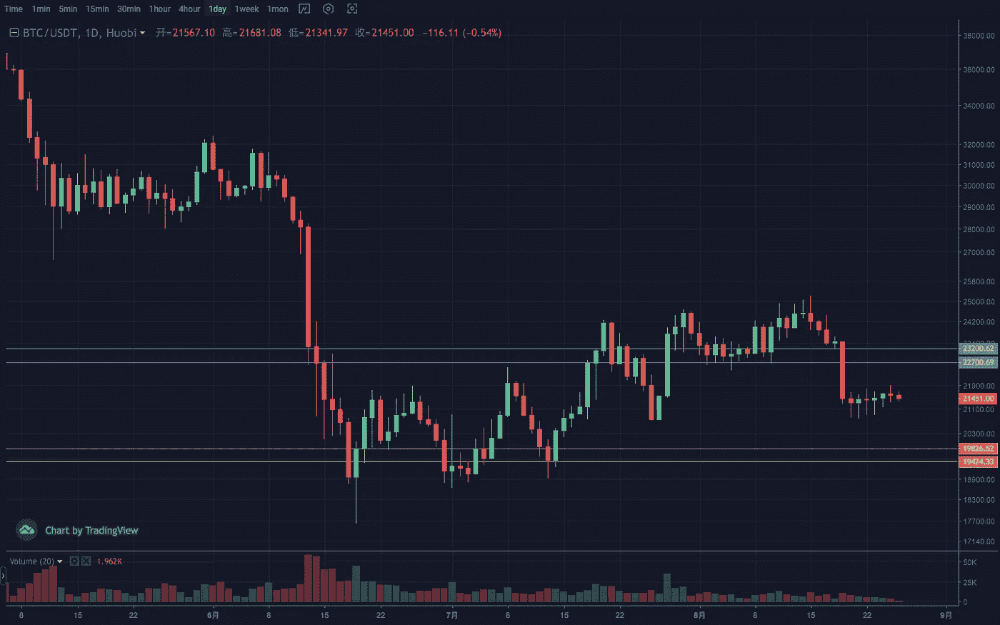
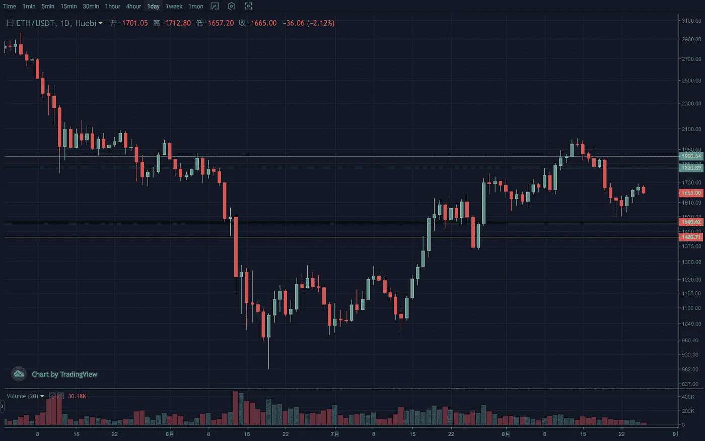
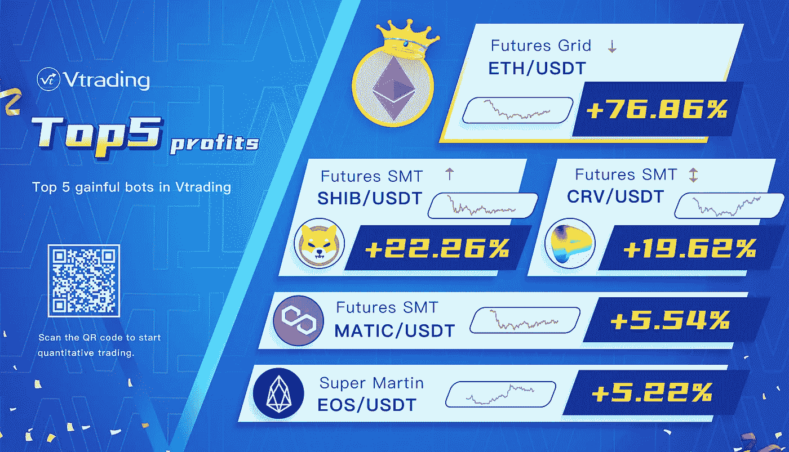

# 2022 年 8 月加密投资周分析

> 原文：<https://medium.com/coinmonks/weekly-analyze-of-crypto-investing-in-august-2022-a4390e73d971?source=collection_archive---------46----------------------->

日期:日期:2022 年 8 月 22 日至 2022 年 8 月 26 日

本周，密码市场在经历了快速下滑后正处于复苏阶段。

BTC 上周的放量吞没阴柱破坏了之前的上涨趋势，其量能的衰减也说明市场热度不在此。日线看跌，弱反弹。在 23200 点企稳之前，大周期有望第二次下探 19000–19500 点。临界位置是 22500，压力范围是 23000–23500。

ETH 兑大盘汇率处于高位，后期有独立强势行情。日线震荡走高，趋势没有明显背离趋势线。多期均线已经开始粘在一起，有发散向上的势头。盘整后有望继续反弹。支撑区间 1450–1500，压力区间 1850–1900。

Vtrading 是一个加密交易平台，为每个交易者提供智能硬币交易策略。如果你正在使用 Vtrading 智能加密交易机器人，建议现货市场使用 Grid 和 Martin 策略，而[期货](https://www.tradingview.com/ideas/commodities/)市场使用 [SMT](https://www.tradingview.com/symbols/SET-SMT/) 策略。

> 交易新手？试试[密码交易机器人](/coinmonks/crypto-trading-bot-c2ffce8acb2a)或[复制交易](/coinmonks/top-10-crypto-copy-trading-platforms-for-beginners-d0c37c7d698c)