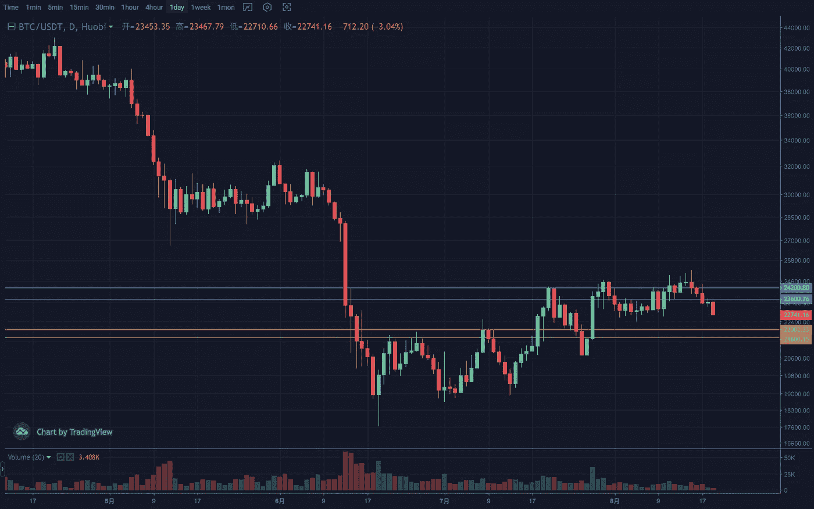
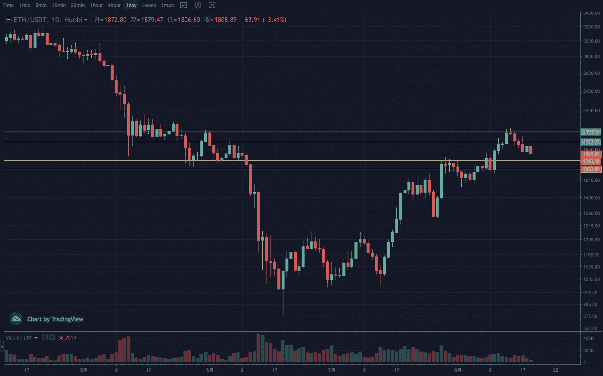
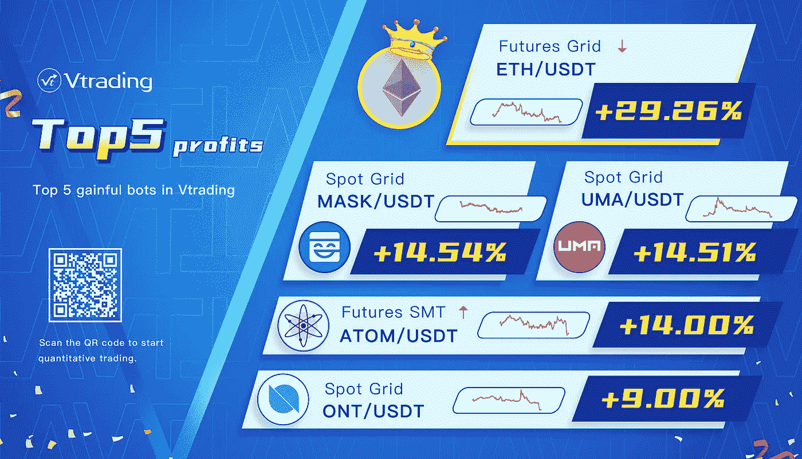

# 2022 年 8 月加密投资周分析

> 原文：<https://medium.com/coinmonks/weekly-analyze-of-crypto-investing-in-august-2022-cd7ae2fc75bb?source=collection_archive---------52----------------------->

日期:日期:2022 年 8 月 15 日至 2022 年 8 月 19 日

本周，经过一轮非主流货币之后，加密市场进入下跌调整阶段。

BTC 的周线目前显示出恶化、转阴和吞没的熊市模式。日线在多次测试通道上沿后走出连续阴跌。最近低趋势线的突破也进一步削弱了市场，并加速了势头。关键位置在 22000，支撑范围在 21000–22000，压力范围在 24000–24500。

ETH 走势强于大盘，周线也在多重阻力下出现遇阻迹象。目前整体上升趋势并未被破坏，仍处于 1650–1750 的防御区间。日线量能减弱，高位成交量放大。预计回调幅度会比前两次更大。结构上，回踩目标区间 1780–1750，压力区间 1900–2000。

[**Vtrading**](http://www.vtrading.com/) 是一个加密交易平台，为每个交易者提供智能硬币交易策略。如果你正在使用 Vtrading 智能加密交易机器人，建议现货市场使用 Grid 和 Martin 策略，期货市场使用 SMT 策略。

> 交易新手？试试[密码交易机器人](/coinmonks/crypto-trading-bot-c2ffce8acb2a)或[复制交易](/coinmonks/top-10-crypto-copy-trading-platforms-for-beginners-d0c37c7d698c)