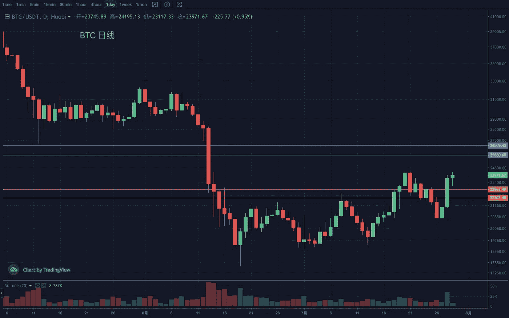
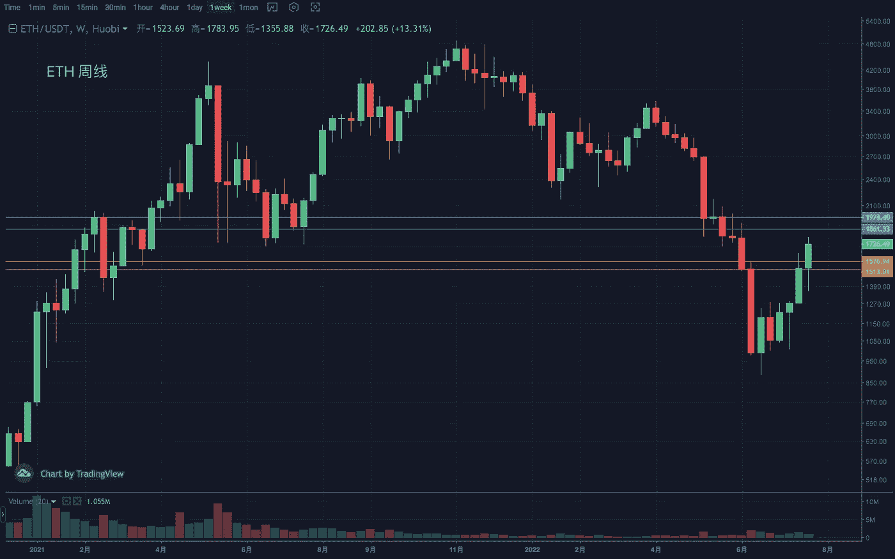
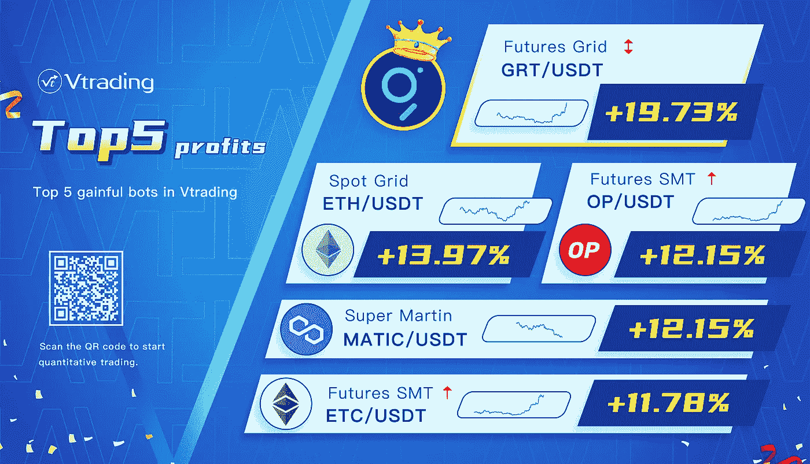

# 2022 年 7 月加密投资周分析

> 原文：<https://medium.com/coinmonks/weekly-analyze-of-crypto-investing-in-july-2022-1232570b171d?source=collection_archive---------50----------------------->

日期:2022 年 7 月 25 日至 2022 年 7 月 29 日。

本周 crypto 市场热度上升，市场顺势突破。预计这一趋势将保持下去。

BTC 的日线突破和回踩验证趋势延伸至周线，最终成功止跌，完成了又一次突破。日线重回上升趋势，构建的上升通道上缘有一定阻力。支撑区间 22000–22500，压力区间 26000–26500。

ETH 周线阳线，目前正在修复前期下跌趋势中的第二根大阴柱。如果叠加 MA120 的潜在阻力，压力范围为 1900–2000。日线出现拉升，盘整再次突破较高格局，走势依然强劲。趋势防御区间 1500-1600。

[**Vtrading**](http://www.vtrading.com/) 是一个加密交易平台，为每个交易者提供智能硬币交易策略。如果你正在使用 Vtrading 智能加密交易机器人，建议现货市场使用 Grid 和 Martin 策略，期货市场使用 SMT 策略。

> 交易新手？试试[密码交易机器人](/coinmonks/crypto-trading-bot-c2ffce8acb2a)或[复制交易](/coinmonks/top-10-crypto-copy-trading-platforms-for-beginners-d0c37c7d698c)