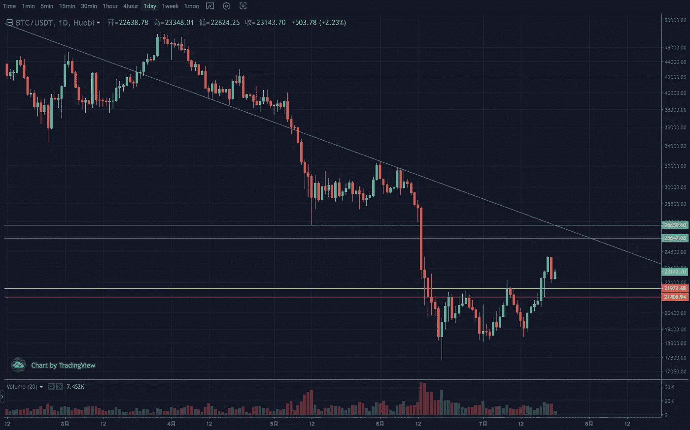
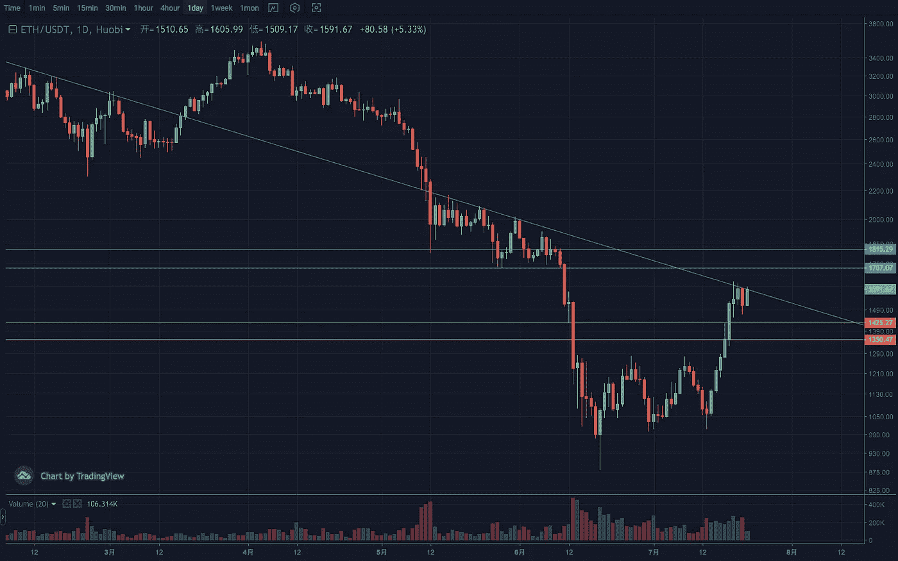

# 2022 年 7 月加密投资周分析

> 原文：<https://medium.com/coinmonks/weekly-analyze-of-crypto-investing-in-july-2022-175137f82055?source=collection_archive---------56----------------------->

日期:2022 年 7 月 18 日至 2022 年 7 月 22 日

本周密码市场走出反弹预期，热度也有所上升。

BTC 周线低位箱体结构突破放量，呈现上升中继形态。日线触及下降通道上沿后有调整形态，有突破回踩验证有效性的趋势。支撑区间 21500–22000，压力区间 26000–26500。

ETH 的周线上升趋势还在继续，有加速的迹象。前实体大阴柱完成恢复。1450 变得很关键。日线目前处于横向整理阶段，进一步突破后将面临前期收敛结构下沿的压制。支撑区间 1350–1450，压力区间 1700–1800。

[**Vtrading**](http://www.vtrading.com) 是一个加密交易平台，为每个交易者提供智能硬币交易策略。如果你正在使用 Vtrading 智能加密交易机器人，建议现货市场使用 Grid 和 Martin 策略，期货市场使用 SMT 策略。

> 交易新手？试试[密码交易机器人](/coinmonks/crypto-trading-bot-c2ffce8acb2a)或[复制交易](/coinmonks/top-10-crypto-copy-trading-platforms-for-beginners-d0c37c7d698c)