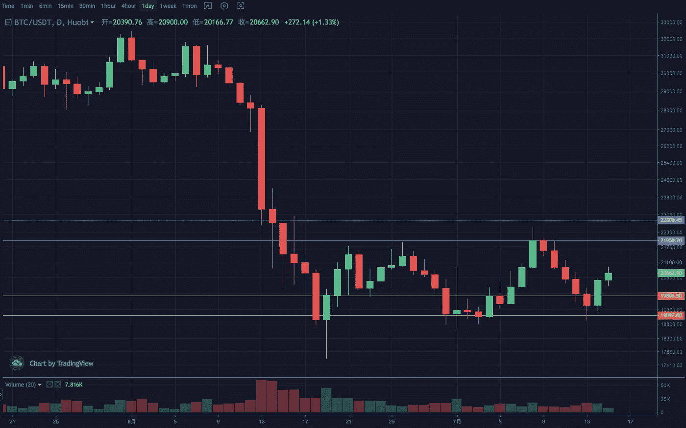
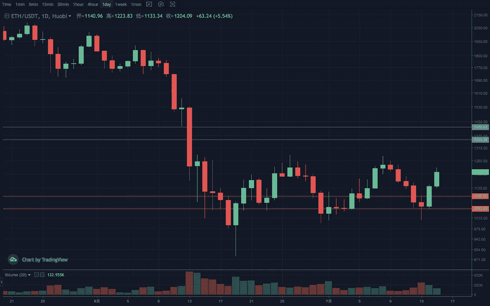
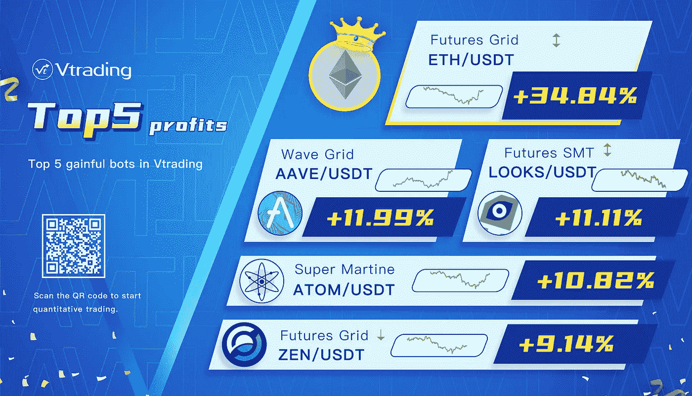

# 2022 年 7 月加密投资周分析

> 原文：<https://medium.com/coinmonks/weekly-analyze-of-crypto-investing-in-july-2022-2c4a3dd36bab?source=collection_archive---------52----------------------->

日期:2022 年 7 月 11 日至 2022 年 7 月 15 日

本周加密市场大部分加密货币仍处于区间整理阶段，强势者已完成突破。总体上有一个强烈的期望。

BTC daily line-Vtrading

BTC 周线阳柱第二次反转回升，日线缓慢上涨。走势和形态与 6 月初相似，延续性有待考证。结构重点在于突破后能否企稳 21500 上方。支撑区间 19500–20000，压力区间 22000–23000。

ETH daily line-Vtrading

ETH 周线阴阳交替，长下影线到达 1000 关口后趋势反转向上。日线箱体下缘再次获得支撑，走出第三波反弹。与前两次相比，乐队节奏加快了。如果结构性高点被有效突破，将会带来一波趋势延伸。支撑区间 1070–1120，压力区间 1350–1450。

> 交易新手？试试[加密交易机器人](/coinmonks/crypto-trading-bot-c2ffce8acb2a)或者[复制交易](/coinmonks/top-10-crypto-copy-trading-platforms-for-beginners-d0c37c7d698c)

Vtrading Top 5 Profits

[**Vtrading**](http://www.vtrading.com) 是一个加密交易平台，为每个交易者提供智能硬币交易策略。如果你正在使用 Vtrading 智能加密交易机器人，建议现货市场使用 Grid 和 Martin 策略，期货市场使用 SMT 策略。

> 加入 Coinmonks [电报频道](https://t.me/coincodecap)和 [Youtube 频道](https://www.youtube.com/c/coinmonks/videos)了解加密交易和投资

# 另外，阅读

*   [OKEx vs KuCoin](https://coincodecap.com/okex-kucoin) | [摄氏替代品](https://coincodecap.com/celsius-alternatives) | [如何购买 VeChain](https://coincodecap.com/buy-vechain)
*   [ProfitFarmers 点评](https://coincodecap.com/profitfarmers-review) | [如何使用 Cornix 交易机器人](https://coincodecap.com/cornix-trading-bot)
*   [如何匿名购买比特币](https://coincodecap.com/buy-bitcoin-anonymously) | [比特币现金钱包](https://coincodecap.com/bitcoin-cash-wallets)
*   [瓦济里克斯 NFT 评论](https://coincodecap.com/wazirx-nft-review)|[Bitsgap vs Pionex](https://coincodecap.com/bitsgap-vs-pionex)|[Tangem 评论](https://coincodecap.com/tangem-wallet-review)
*   [如何使用 Solidity 在以太坊上创建 DApp？](https://coincodecap.com/create-a-dapp-on-ethereum-using-solidity)