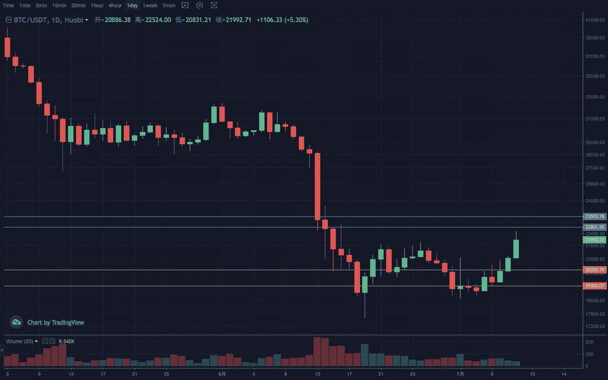
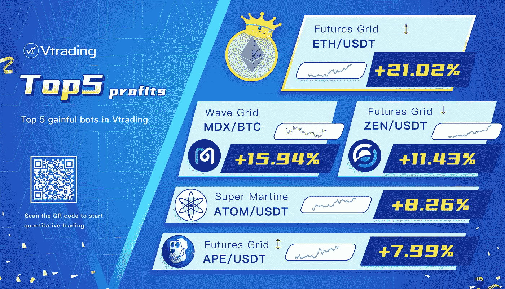

# 2022 年 7 月加密投资周分析

> 原文：<https://medium.com/coinmonks/weekly-analyze-of-crypto-investing-in-july-2022-bb57d34f1730?source=collection_archive---------47----------------------->

本周密码市场复苏，市场也呈现出强劲的反弹势头。

**BTC 的**周线第二次下跌，然后以正向收盘。日线低于十字线后上行。三个高低点决定的箱体结构随趋势突破，构筑 W 底形态。中间价 21000，注意后续回踩。左侧下跌中继平台短期压制 22500–23000。趋势防御区间 19500–20500，压力区间 23000–23500。

> 交易新手？试试[密码交易机器人](/coinmonks/crypto-trading-bot-c2ffce8acb2a)或者[复制交易](/coinmonks/top-10-crypto-copy-trading-platforms-for-beginners-d0c37c7d698c)

**ETH** 由于前期补跌幅度较大，本次超跌反弹强于大盘。周价格创下近期新高，大朱茵已经恢复了一大半。日线第二波以较快的速度完成了拉升和突破动作，量能得到有效协调。没有明显的加速发散形态，趋势稳定，有望延续。支撑区间 1050–1150，压力区间 1350–1450。

Vtrading 是一个加密交易平台，为每个交易者提供智能硬币交易策略。如果你正在使用 Vtrading 智能加密交易机器人，建议现货市场使用 Grid 和 Martin 策略，期货市场使用 SMT 策略。