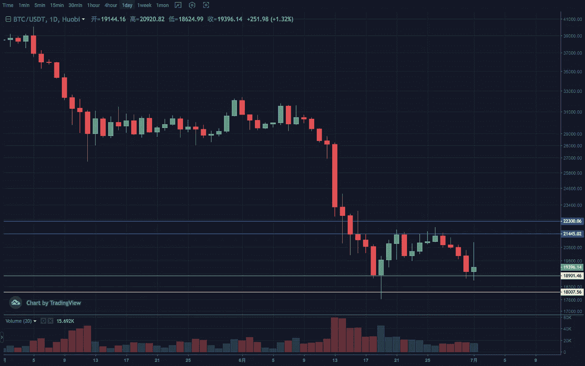
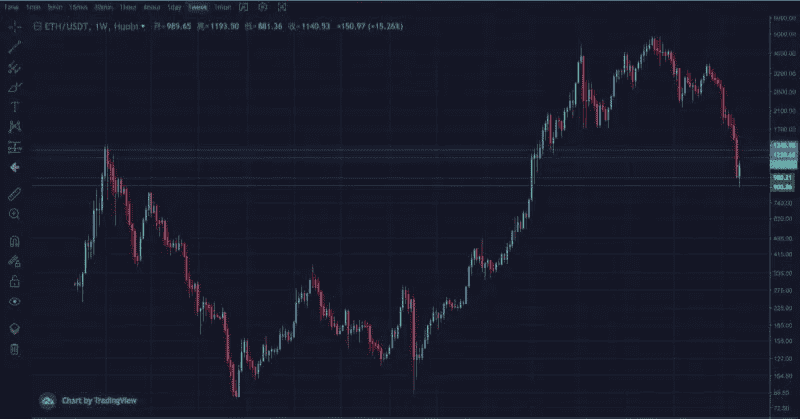
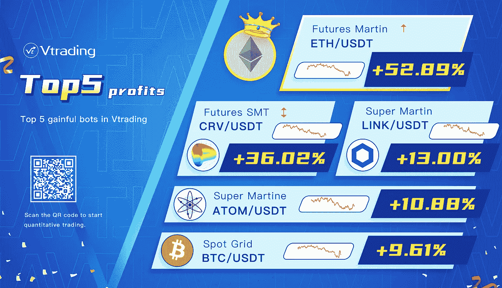

# 加密投资每周分析(2022 年 6 月 28 日—2022 年 7 月 1 日)

> 原文：<https://medium.com/coinmonks/weekly-analyze-of-crypto-investing-jun-28-2022-jul-1-2022-5ca91c652c8c?source=collection_archive---------61----------------------->

本周密码市场没有延续上周的反弹趋势，而是震荡下行。

BTC 周刊转负。日线遇到阻力，左侧盘整区吞没了上周的涨幅。结构从潜在的头肩底演变为箱体形态，调整周期变长。支撑区间 18000–19000，压力区间 21500–22500。

ETH 周线惯性下跌，预计会出现背离反弹走势。日线在打破低位盘整局面之前继续视为盘整阶段。注意区间上下两侧突破的有效性。中间价 1150，支撑区间 900–1000，压力区间 1200–1300。

> 交易新手？试试[加密交易机器人](/coinmonks/crypto-trading-bot-c2ffce8acb2a)或者[复制交易](/coinmonks/top-10-crypto-copy-trading-platforms-for-beginners-d0c37c7d698c)

Vtrading 是一个加密交易平台，为每个交易者提供智能交易策略。如果你正在使用 Vtrading 智能加密交易机器人，建议现货市场使用 Grid 和 Martin 策略，期货市场使用 SMT 策略。

(仅供参考，请理性投资)