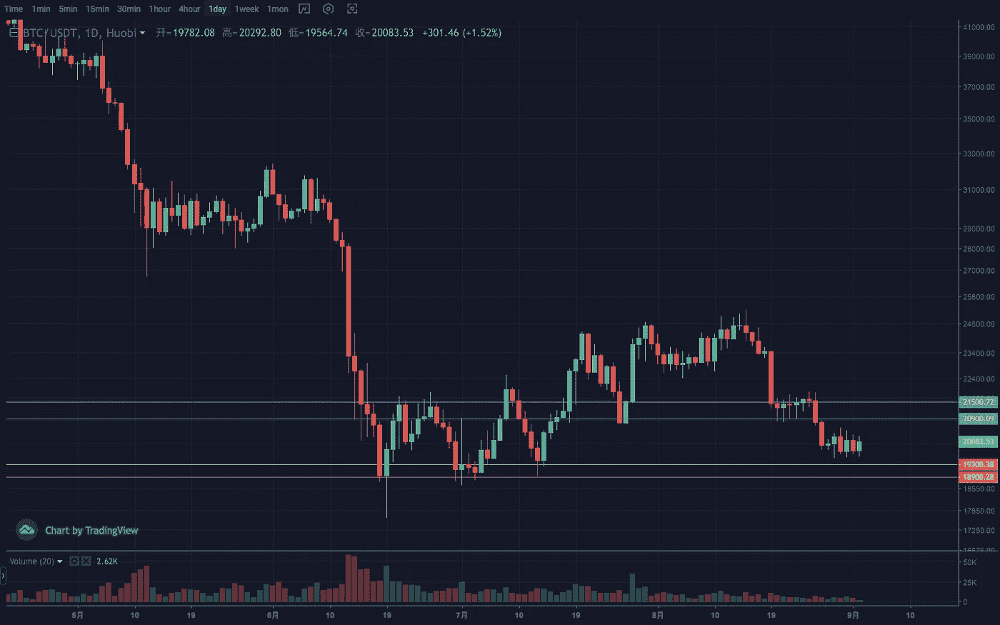
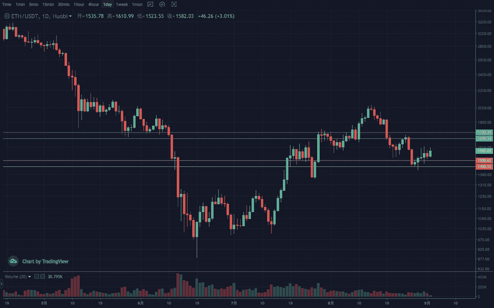
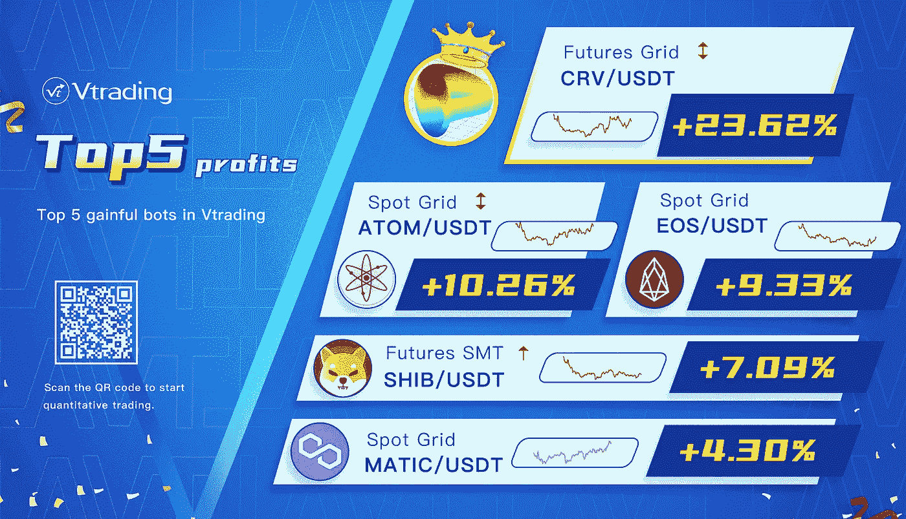

# 每周秘密投资分析

> 原文：<https://medium.com/coinmonks/weekly-analyze-of-the-crypto-investing-d434ab78b67b?source=collection_archive---------51----------------------->

日期:2022 年 8 月 29 日至 2022 年 9 月 2 日

本周加密市场相对平淡和缓慢。

在第二周下跌后，BTC 微弱反弹，维持在前期低点 18500-19000 上方。该结构预计将建立一个底部盘整区间。日线两阶段回调后，从类似上周的通道反弹。重点触及 19500 点止跌，19000 点潜在三段延伸。压力范围 22000–22500。

ETH 的走势依然明显强于大盘，回撤小，反弹强。周线几乎收复了上周的实体损失。日线在周一收出饱和的反包络阳柱后，也为本周的反弹定下了基调。在 1600 点左右逐渐收敛，形态上趋于突破。防守位 1500，支撑位 1400–1450，压力位 1700–1750。

Vtrading 是一个加密交易平台，为每个交易者提供智能硬币交易策略。如果你正在使用 Vtrading 智能加密交易机器人，建议现货市场使用 Grid 和 Martin 策略，期货市场使用 SMT 策略。

> 交易新手？试试[密码交易机器人](/coinmonks/crypto-trading-bot-c2ffce8acb2a)或者[复制交易](/coinmonks/top-10-crypto-copy-trading-platforms-for-beginners-d0c37c7d698c)