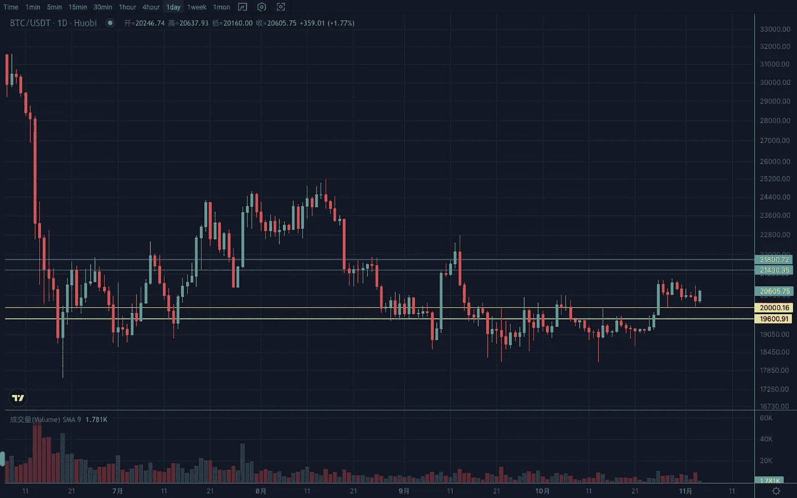
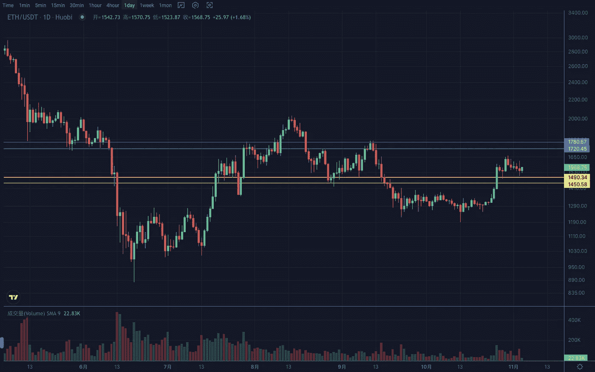

# 2022 年 11 月加密投资周分析

> 原文：<https://medium.com/coinmonks/weekly-analyze-of-the-crypto-investing-in-november-2022-1cc483df6ae3?source=collection_archive---------46----------------------->

日期:2022 年 10 月 31 日至 2022 年 11 月 4 日

本周，加密市场出现了分化。主流币经过一波反弹后，本周进入下跌调整阶段。相反，一些热钱表现出了良好的旋转增加。

BTC 上周收出有效实体 k 线，摆脱之前的连续多吉盘，行情启动。日线下跌，在 20000–21000 区间整理。目前从斐波那契回撤区间和 k 线形态来看，倾向于趋势回撤。上升趋势保持不变。支撑区间 19600–19800，阻力区间 21500–22000。

ETH 周线破高点连接压制。若突破 1780 浪高点上方，则正式开启周线上涨趋势。日线维持上行节奏，MA120 已经拐头向上。预计市场将依靠其波动性走高。支撑区间 1450–1480，阻力区间 1720–1780。

Vtrading 是一个加密交易平台，为每个交易者提供智能硬币交易策略。如果你正在使用 Vtrading 智能加密交易机器人，建议现货市场使用 Grid 和 Martin 策略，期货市场使用 SMT 策略。

(仅供参考，请理性投资)

> 交易新手？试试[密码交易机器人](/coinmonks/crypto-trading-bot-c2ffce8acb2a)或者[复制交易](/coinmonks/top-10-crypto-copy-trading-platforms-for-beginners-d0c37c7d698c)