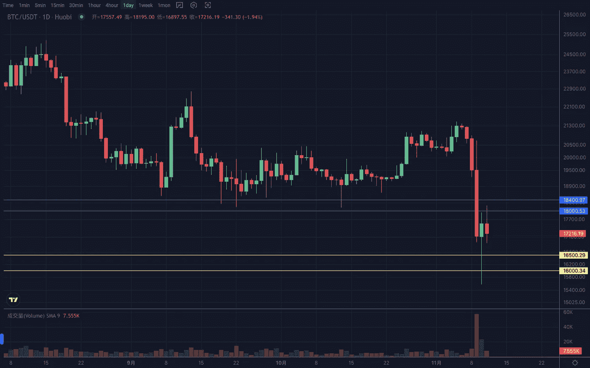
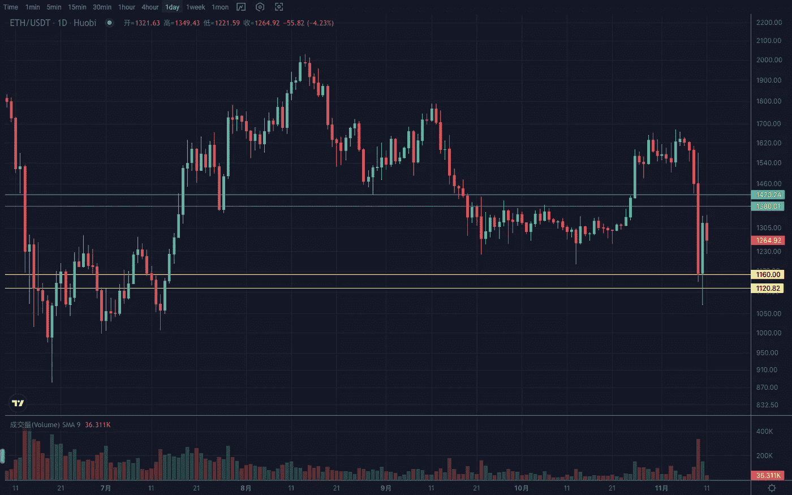

# 2022 年 11 月加密投资周分析

> 原文：<https://medium.com/coinmonks/weekly-analyze-of-the-crypto-investing-in-november-2022-98def47ccce?source=collection_archive---------40----------------------->

日期:2022 年 11 月 7 日至 2022 年 11 月 11 日

本周，加密市场在消息的影响下经历了快速下跌。

BTC 的周线结构走出了第三个下跌期。日线冲高回落后，跌势加速，突破区间下沿，再创新低。由于对加息放缓的预期，该指数周四反弹。虽然不能扭转下跌趋势，但至少可以依靠前期低点进行修复。支撑区间 16000–16400，阻力区间 18000–18500。

ETH 的周线突破了之前的摆动低点但没有再创新低。而是到达前期低位盘整区域，走势强于大盘。而以太坊对比特币的汇率处于高阻力区，因此存在补偿预期。日线如果没有第二次跌破 1150，将延续反弹趋势，支撑区间 1140–1170。否则下跌趋势延伸将测试 1000 点关口支撑。关键位置是 1300，阻力范围是 1380–1420。

Vtrading 是一个加密交易平台，为每个交易者提供智能硬币交易策略。如果你正在使用 Vtrading 智能加密交易机器人，建议现货市场使用 Grid 和 Martin 策略，期货市场使用 SMT 策略。

(仅供参考，请理性投资)

> 交易新手？试试[密码交易机器人](/coinmonks/crypto-trading-bot-c2ffce8acb2a)或者[复制交易](/coinmonks/top-10-crypto-copy-trading-platforms-for-beginners-d0c37c7d698c)