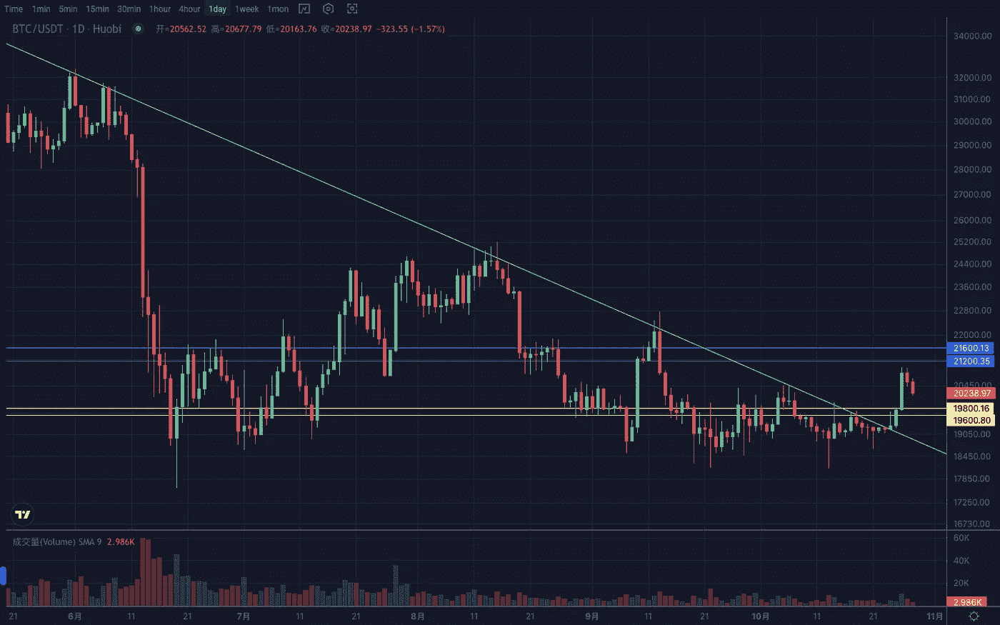
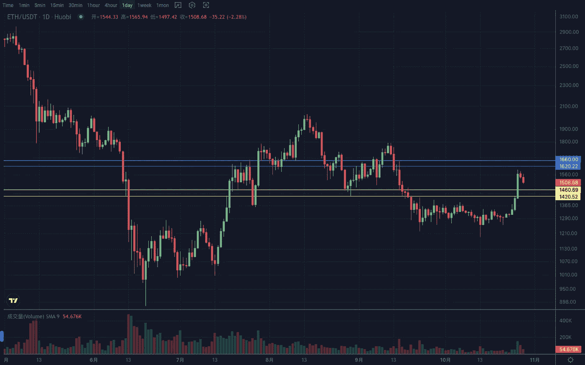

# 2022 年 10 月加密投资周分析

> 原文：<https://medium.com/coinmonks/weekly-analyze-of-the-crypto-investing-in-october-2022-166a0e1a705d?source=collection_archive---------46----------------------->

日期:2022 年 10 月 24 日-2022 年 10 月 28 日

密码市场本周出现反弹。

BTC 周线维持重心缓慢上移，但与前几周相似。目前在振幅达到 10%后又开始下跌，不排除本周也会以小实体结束。

日线在区间下沿窄幅震荡后多日选择向上突破，突破趋势均线压制和波段高位，形成上升趋势。

目前遇到该段的斐波那契 61.8%线。从形态上来说，可以看作是突破箱体后回踩的一种确认。经过调整，如果在 20500 上方企稳，下周有望继续上涨。

支撑区间 19500–19700，阻力区间 21300–21800。

ETH 兑大盘汇价已有走强迹象，且周涨幅较大，可重点关注。日线突破后走势较为平稳，1450–1480 区间上方出现强势盘整。防守区间 1400–1420，压力区间 1620–1660。

Vtrading 是一个加密交易平台，为每个交易者提供智能硬币交易策略。如果你正在使用 Vtrading 智能加密交易机器人，建议现货市场使用 Grid 和 Martin 策略，期货市场使用 SMT 小仓位策略。

(仅供参考，请理性投资)

> 交易新手？试试[密码交易机器人](/coinmonks/crypto-trading-bot-c2ffce8acb2a)或者[复制交易](/coinmonks/top-10-crypto-copy-trading-platforms-for-beginners-d0c37c7d698c)