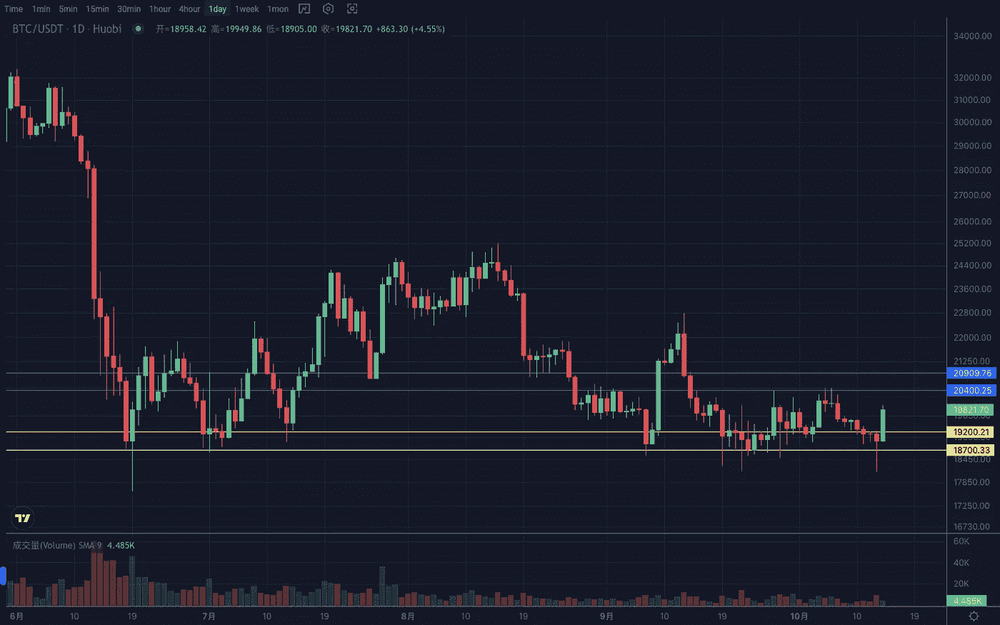
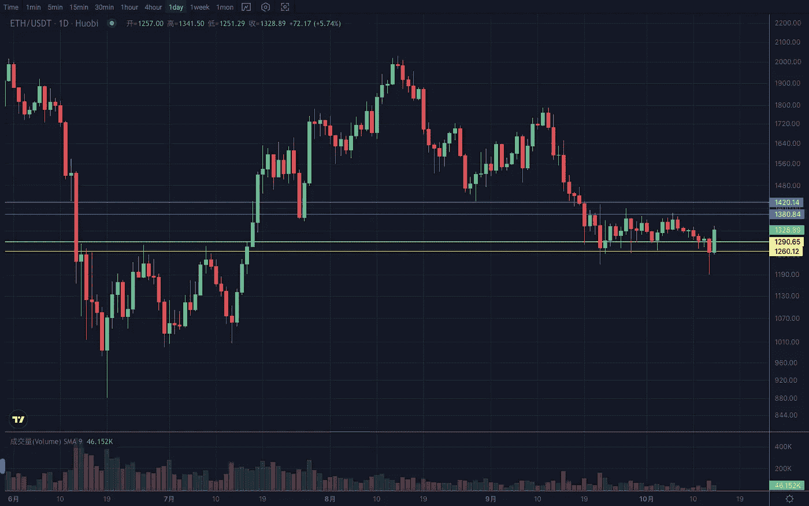

# 2022 年 10 月加密投资周分析

> 原文：<https://medium.com/coinmonks/weekly-analyze-of-the-crypto-investing-in-october-2022-1d7f9c5d325e?source=collection_archive---------55----------------------->

日期:2022 年 10 月 10 日至 2022 年 10 月 14 日

本周加密市场经过几天的小波动后，消息影响跌势，得到快速回升。

BTC 周线站回 19400，维持震荡上行趋势。日线在形态末端收敛，在大头针下沿后快速反弹。人们预期结构会发生变化，目前它正在上边缘附近盘整。如果 19200–19500 上方出现强势窄幅整理，将有再次测试 20400–20600 区间的动力。如果之后继续，就会摆脱目前的震荡，走出一个趋势。支撑区间 18700–19200，阻力区间 20800–21200。

ETH 周线重心有所抬升，依旧运行在 1200–1400 的箱体区间内。日线假跌破低点线收长上影，再破近期高点线。目前强势反弹维持在 1280–1300 上方。支撑区间 1250–1280，压力区间 1380–1420。

Vtrading 是一个加密交易平台，为每个交易者提供智能硬币交易策略。如果你正在使用 Vtrading 智能加密交易机器人，建议现货市场使用 Grid 和 Martin 策略，期货市场使用 SMT 策略。

(仅供参考，请理性投资)

> 交易新手？试试[密码交易机器人](/coinmonks/crypto-trading-bot-c2ffce8acb2a)或者[复制交易](/coinmonks/top-10-crypto-copy-trading-platforms-for-beginners-d0c37c7d698c)