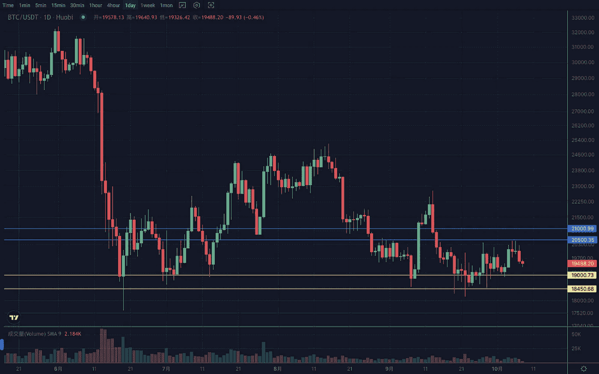
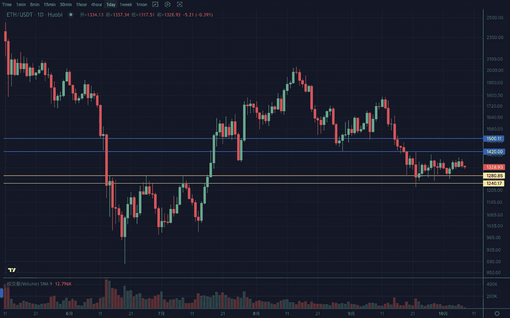

# 2022 年 10 月加密投资周分析

> 原文：<https://medium.com/coinmonks/weekly-analyze-of-the-crypto-investing-in-october-2022-42a85bb38d12?source=collection_archive---------24----------------------->

日期:2022 年 10 月 1 日至 2022 年 10 月 8 日

本周密码行情走出反弹修复行情，但走势依然不强，整体震荡。

BTC

BTC 的周线高点和低点都被抬高，在有效突破 18900 之前，这种弱势反弹将会维持。日线在 3 日收敛后选择向上突破，并突破前期高点。在遇到本节斐波纳契 50%的阻力和 20500 水平阻力位后回落。目前运行在上升通道的下沿附近。支持范围是 18500–19000。如果结构击穿中继，支撑在 16500–17000 左右，阻力区间在 20500–21000。

ETH

ETH 周破 1270 转阴前继续反弹修复预期，但需要突破 1400–1420 打开上行区间。日线一直窄幅横盘整理，目前处于低位震荡区间的上沿，接近收敛形态的末端。支撑区间 1250–1300，压力区间 1450–1500。

Vtrading 是一个加密交易平台，为每个交易者提供智能硬币交易策略。如果你正在使用 Vtrading 智能加密交易机器人，建议现货市场使用 Grid 和 Martin 策略，期货市场使用 SMT 策略。

(仅供参考，请理性投资)

> 交易新手？试试[密码交易机器人](/coinmonks/crypto-trading-bot-c2ffce8acb2a)或者[复制交易](/coinmonks/top-10-crypto-copy-trading-platforms-for-beginners-d0c37c7d698c)