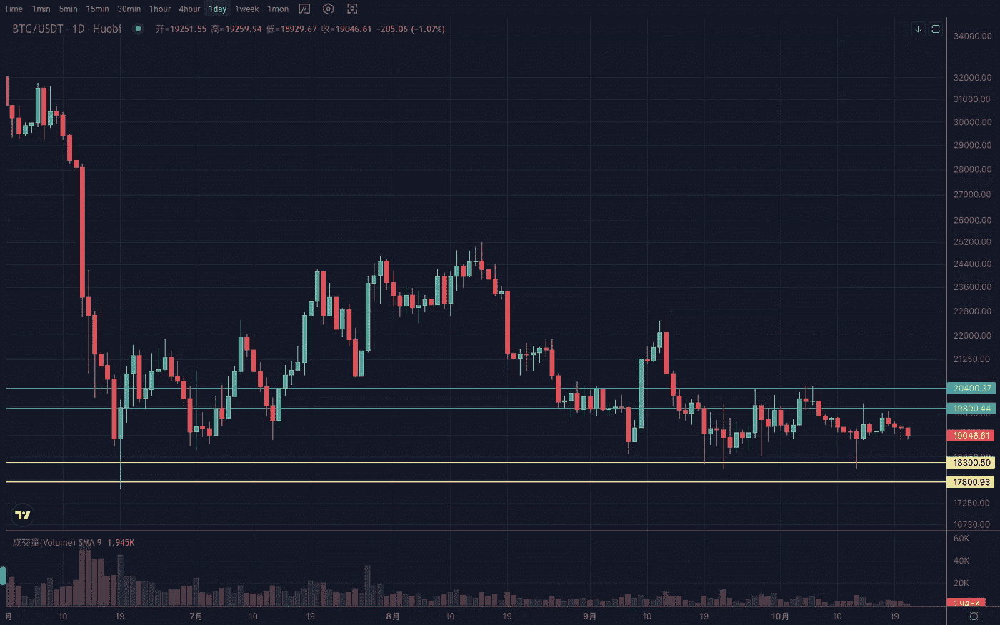
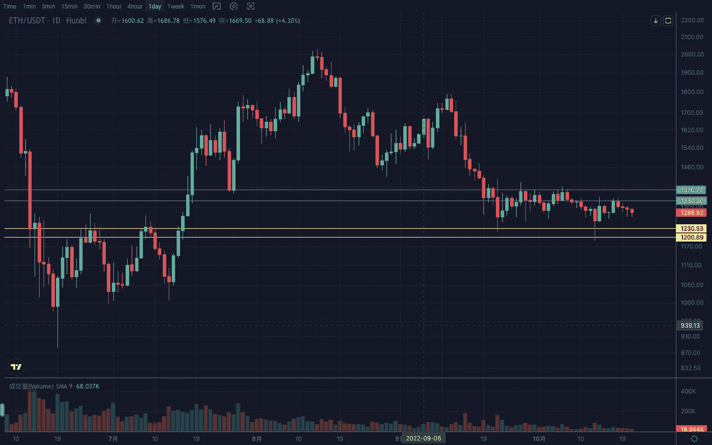

# 2022 年 10 月加密投资周分析

> 原文：<https://medium.com/coinmonks/weekly-analyze-of-the-crypto-investing-in-october-2022-95b3219b7122?source=collection_archive---------47----------------------->

日期:2022 年 10 月 17 日-2022 年 10 月 21 日

本周，加密市场整体走软，形势趋于看跌。

BTC 周线小实体长下影线，以收敛形态结束，类似 2018 年同期的横盘走势。箱体波动区间 18000–20000，日波动区间收窄至 18900–19600。量能减弱，符合变动前的格局。多空关键点位 19500，支撑位 17800–18200，阻力位 19800–20400

ETH 近期周线也是接连收出 dojis，联动大盘，横向区间 1200–1400。日线在 1260–1340 区间收窄。目前处于收敛状态的下缘弱势盘整。注意突破后结构上下边缘的延展性。支撑区间 1180–1220，压力区间 1340–1380。

Vtrading 是一个加密交易平台，为每个交易者提供智能硬币交易策略。如果你正在使用 Vtrading 智能加密交易机器人，建议现货市场使用 Grid 和 Martin 策略，期货市场使用 SMT 策略。

(仅供参考，请理性投资)

> 交易新手？试试[密码交易机器人](/coinmonks/crypto-trading-bot-c2ffce8acb2a)或者[复制交易](/coinmonks/top-10-crypto-copy-trading-platforms-for-beginners-d0c37c7d698c)