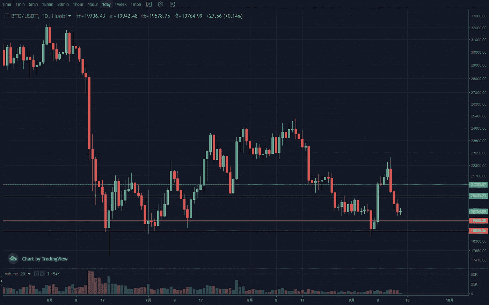
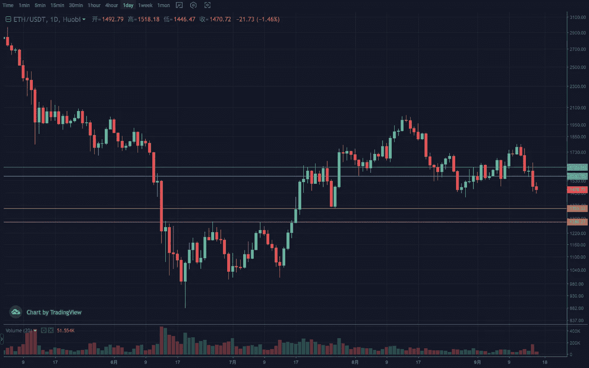
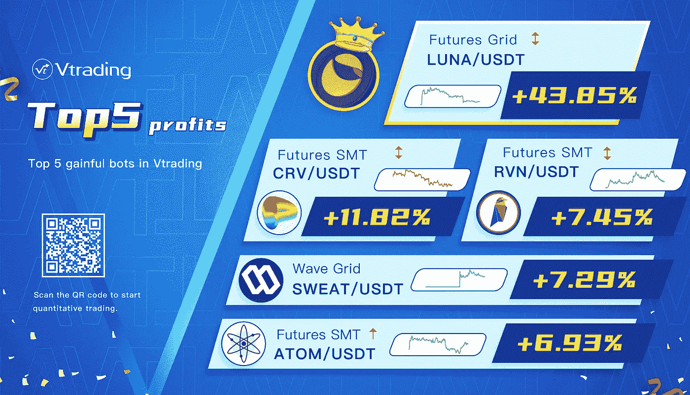

# 2022 年 9 月加密投资周分析

> 原文：<https://medium.com/coinmonks/weekly-analyze-of-the-crypto-investing-in-september-2022-5da7318ff413?source=collection_archive---------44----------------------->

日期:2022 年 9 月 12 日—2022 年 9 月 16 日

本周密码市场从高位下跌没有形成有效走势，整体弱势震荡。

BTC 的周高点转为负值，并再次来到该区间的底部。结构上也演变成三角形收敛形态，下缘在 18500 左右。日线行情较为集中，一波快速行情之后是小幅调整。临界点在 20500，支撑区间在 18500–19000，阻力区间在 21000–21500。

ETH 落地好，汇价对大盘的强势也被破坏，盘面走弱。目前，周线朱茵已经吞没了上周的涨幅，并有延续的趋势。对日线上的头肩顶形态和箱体的 1400–1800 结构有双重预期。注意关键区间 1350–1400 的收盘。支撑区间 1250–1300，压力区间 1580–1620。

Vtrading 是一个加密交易平台，为每个交易者提供智能硬币交易策略。如果你正在使用 Vtrading 智能加密交易机器人，建议现货市场使用 Grid 和 Martin 策略，期货市场使用 SMT 策略。

(仅供参考，请理性投资)

> 交易新手？试试[密码交易机器人](/coinmonks/crypto-trading-bot-c2ffce8acb2a)或者[复制交易](/coinmonks/top-10-crypto-copy-trading-platforms-for-beginners-d0c37c7d698c)