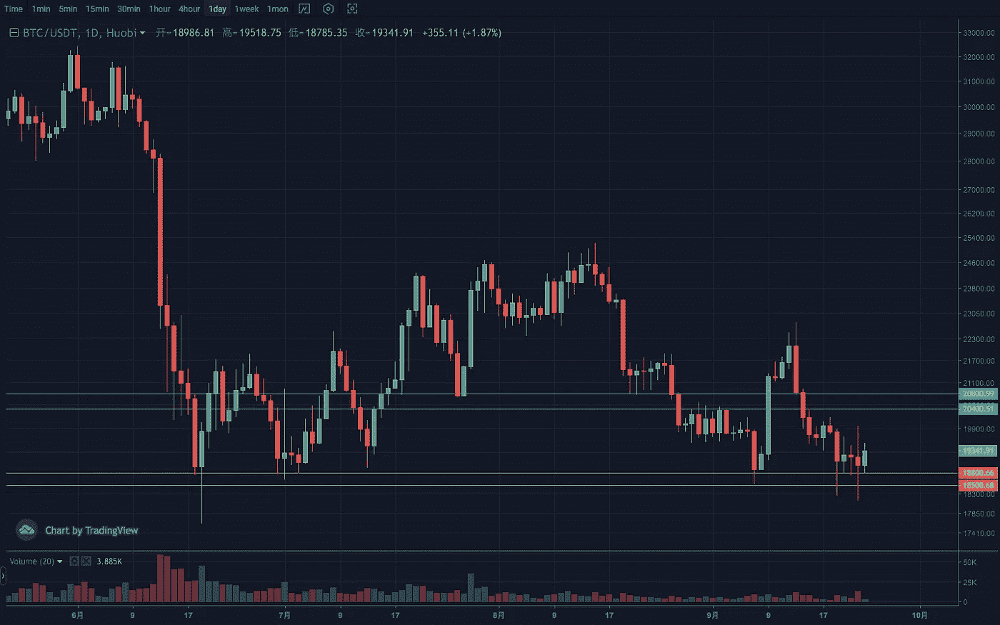
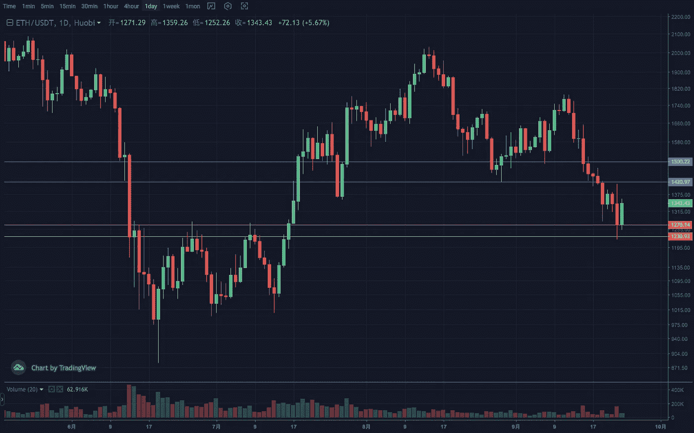
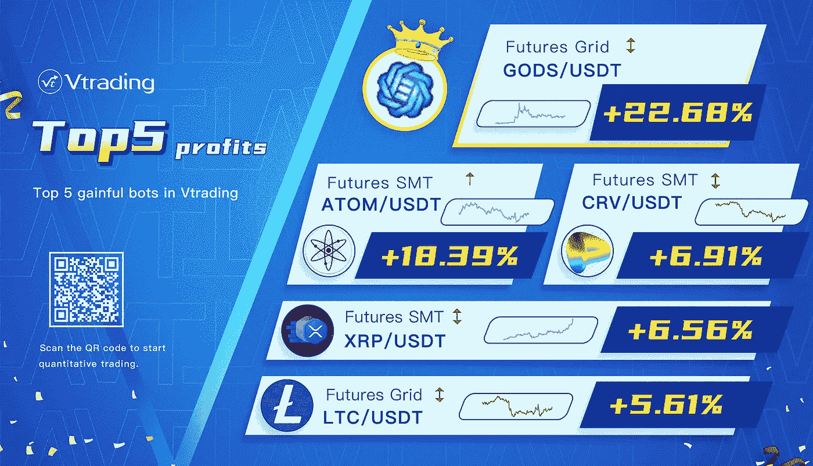

# 2022 年 9 月加密投资周分析

> 原文：<https://medium.com/coinmonks/weekly-analyze-of-the-crypto-investing-in-september-2022-a81f9fa4a21b?source=collection_archive---------48----------------------->

日期:2022 年 9 月 19 日—2022 年 9 月 23 日

本周，加密市场作为一个整体仍然处于疲软和动荡的局面。

BTC 没有打开周线下跌。虽然日线近期持续震荡下行并创出新低，但在假破之后，积极转正出现企稳迹象，类似于 7 月初的走势。前提是捍卫 18000–18500 的低位区间。阻力区在 20500–21000。

虽然 ETH 在周线上也是持续下跌，但力度不够。它更像是一个惯性下冲，现在已经有所恢复。日线已经从高点 1790 下跌 30%，相当于前一波下跌。该结构在前期已经回落到长期盘整区的上边缘。另外，底部背离趋势，市场反弹预期强烈。如果能企稳 1400 上方，摆脱跌势，反弹目标将在 1500 附近，斐波那契 50%线。支撑区间 1200–1250，压力区间 1500–1550。

Vtrading 是一个加密交易平台，为每个交易者提供智能硬币交易策略。如果你正在使用 Vtrading 智能加密交易机器人，建议现货市场使用 Grid 和 Martin 策略，期货市场使用 SMT 策略。

(仅供参考，请理性投资)

> 加入 Coinmonks [电报频道](https://t.me/coincodecap)和 [Youtube 频道](https://www.youtube.com/c/coinmonks/videos)了解加密交易和投资

# 另外，阅读

*   [Bookmap 评论](https://coincodecap.com/bookmap-review-2021-best-trading-software) | [美国 5 大最佳加密交易所](https://coincodecap.com/crypto-exchange-usa)
*   [加密交易机器人](/coinmonks/crypto-trading-bot-c2ffce8acb2a) | [造币评论](https://coincodecap.com/coingate-review)
*   最佳加密[硬件钱包](/coinmonks/hardware-wallets-dfa1211730c6) | [Bitbns 评论](/coinmonks/bitbns-review-38256a07e161)
*   [新加坡十大最佳加密交易所](https://coincodecap.com/crypto-exchange-in-singapore) | [购买 AXS](https://coincodecap.com/buy-axs-token)
*   [红狗赌场评论](https://coincodecap.com/red-dog-casino-review) | [Swyftx 评论](https://coincodecap.com/swyftx-review)