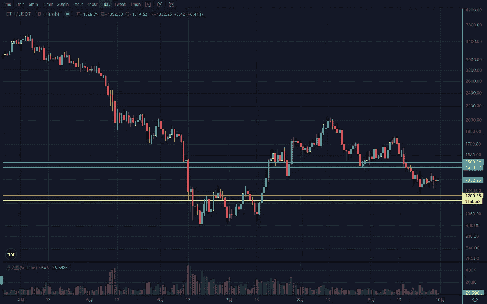

# 2022 年 9 月加密投资周分析

> 原文：<https://medium.com/coinmonks/weekly-analyze-of-the-crypto-investing-in-september-2022-b03413ae7589?source=collection_archive---------49----------------------->

日期:2022 年 9 月 26 日至 2022 年 9 月 30 日

本周加密货币市场延续弱势震荡走势，走势多次往复。

BTC 的周线受到趋势平均线的压力。如果参照 18 年同期的走势，那么这么窄的区间，一定要整理出来，才能走出更大的行情。日线处于三角形收敛形态的末端附近，在低位区间震荡，维持在 18000–18500 上方弱势反弹。不然还有一滴。支撑区间 17500–18000，阻力区间 20500–21000。

ETH 预计本周以一根上下影线的小实体收出一根类似上周的非趋势修复 k 线，临界区间 1420–1450。日线接连收出道指，横向盘整在 1250–1350 区间内。突破后有望摆脱弱势。支撑区间 1150–1200，压力区间 1450–1500。

Vtrading 是一个加密交易平台，为每个交易者提供智能硬币交易策略。如果你正在使用 Vtrading 智能加密交易机器人，建议现货市场使用 Grid 和 Martin 策略，期货市场使用 SMT 策略。

(仅供参考，请理性投资)

> 交易新手？试试[密码交易机器人](/coinmonks/crypto-trading-bot-c2ffce8acb2a)或者[复制交易](/coinmonks/top-10-crypto-copy-trading-platforms-for-beginners-d0c37c7d698c)