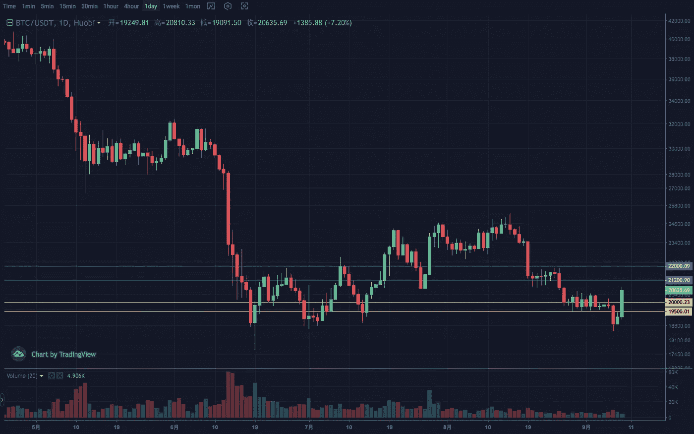

# 2022 年 9 月加密投资周分析

> 原文：<https://medium.com/coinmonks/weekly-analyze-of-the-crypto-investing-in-september-2022-c6c114569484?source=collection_archive---------40----------------------->

日期:2022 年 9 月 5 日—2022 年 9 月 9 日

本周密码市场回暖，市场也开启了回撤调整后的反弹模式。

BTC 周线第二次下跌，在到达 18500 左侧低点后转为正值。结构上，双底的初步形态已经构筑，关键位置 21500。日线收敛向下突破时，跌势没有延续而是反弹并突破下降趋势线压制。第一阻力区间 20800–21200，延伸区间 21500–22000；

ETH 周线维持积极的节奏。日线在收敛结束时向上向下做了一次假突破，然后选择继续在通道向上震荡上涨的走势。1600 的压力转换点成为当前趋势的第一防守位置。支撑区间 1500–1550，压力区间 1850–1900。

Vtrading 是一个加密交易平台，为每个交易者提供智能硬币交易策略。如果你正在使用 Vtrading 智能加密交易机器人，建议现货市场使用 Grid 和 Martin 策略，期货市场使用 SMT 策略。

(仅供参考，请理性投资)

> 交易新手？试试[加密交易机器人](/coinmonks/crypto-trading-bot-c2ffce8acb2a)或者[复制交易](/coinmonks/top-10-crypto-copy-trading-platforms-for-beginners-d0c37c7d698c)