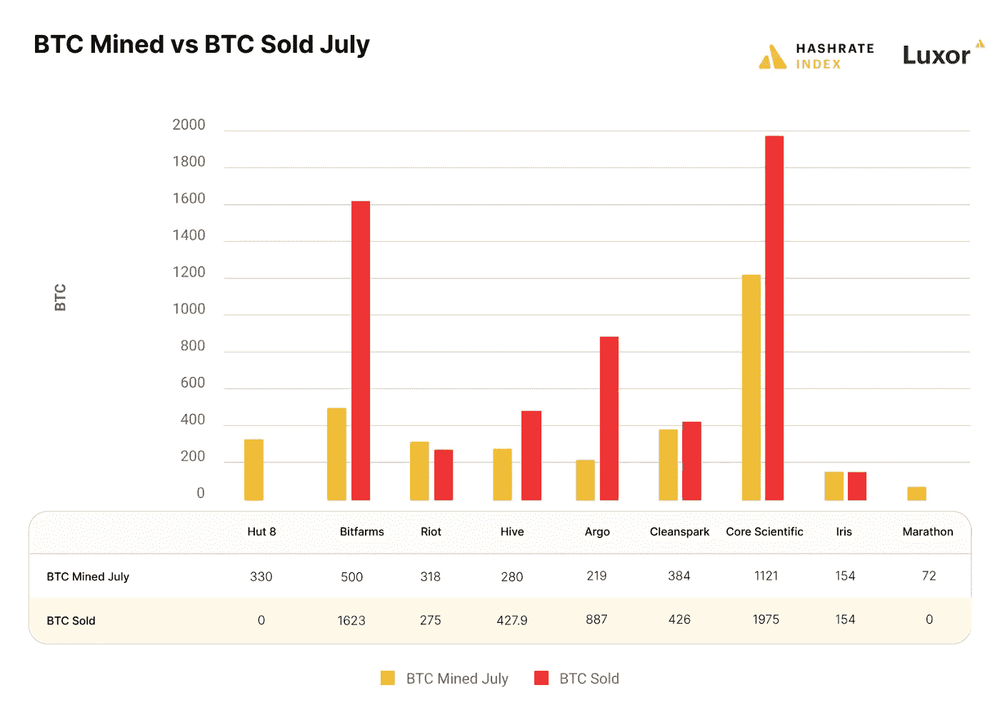

# ProBit Global 的每周区块链位(第 17 卷)

> 原文：<https://medium.com/coinmonks/weekly-blockchain-bits-vol-17-by-probit-globals-220b88014f14?source=collection_archive---------47----------------------->

以太坊的合并如何改善加密支付并导致链分裂？快乐阅读！

**改善加密支付的合并**

以太坊的联合创始人 Vitalik Buterin 上周表示，一旦他们的网络变得更便宜，他相信加密货币支付将成为主流。他在[韩国区块链周 2022](https://koreablockchainweek.com) 上告诉观众，以太坊也将更容易被更广泛的用户群所接受。

随着合并升级，更多的加密交易将使许多人负担得起区块链，因为低收入国家的人们不必为一次交易“支付五个小时的工资”。

无效的金融体系和与发达国家经济联系不紧密导致的通货膨胀让这些国家深受其害。然而，他说，加密支付还有许多机会。自 2022 年 5 月以来，本周 ETH 突破了 2000 美元。

**提议的有争议的以太坊拆分继续引发怨恨**

从交易所开始，火币表示不鼓励“没有切实创新和改进”的分叉，反对“任何形式的预挖掘行为”，但[将支持](https://www.huobi.com/support/en-us/detail/94914028834041)计划中的 ETH 分叉资产，前提是它们满足一定的安全要求。

这些包括双向重放保护的实现；新链条未被覆盖或消除；以及通过公开测试和评估的官方客户端软件。

MEXC 交易所表示，ETH 持有者可以以 1:1 的比例交换两种“潜在分叉”代币:ETHS 和 ETHW。

支持者计划废除 EIP-1599

虽然尚未得到证实，但 ETHPOW 的支持者(主要是矿工)已经宣布，一旦新链分叉，他们将废除 EIP-1559。在“致以太坊社区的一封公开信”中，[他们指出](https://twitter.com/EthereumPoW/status/1557275479597391877)引入改变交易费用机制并烧掉必须支付的基础费用的提案是不合理的。

他们认为 [EIP-1559](https://notes.ethereum.org/@vbuterin/eip-1559-faq) 是“以牺牲矿工利益为代价，试图创造一个乐观的故事”然而，他们认为，矿工应该被视为一种具有一定影响力的政治力量，而不是所有权力被以太坊基金会“危险地集中”。

EIP1559 至今已经使得[多达 258.8 万的 ETH 被烧毁](https://ultrasound.money/)。在 ETH 传输中发现了最多的 ETH 燃烧行为(在撰写本文时为 238，796 ETH ),其次是 Opensea、Uniswap V2 和 USDT。

【ETC 合作社发公开信给钱德勒郭

ETHPOW 的主要倡导者之一钱德勒·郭(Chandler Guo)收到了以太坊经典(ETC)阵营的一封信。ETC 合作组织[毫不含糊地声明](https://etccooperative.org/posts/2022-08-08-open-letter-to-chandler-guo)以太坊动力叉不会起作用，而且会是一件非常困难的事情。他们引用了需要移除 POS 转换逻辑、禁用难度炸弹和更新链 ID 以提供重放保护的代码库。他们还提到，采矿软件可能会被分叉。

相反，他们建议——就像一些行业人士所说的那样 ETH 矿商应该转向 ETC，以实现长期收入最大化。随着分裂的逼近，以太坊矿商将在合并后的世界中终结于两个阵营中的任何一个:

有 ETHPOW 的支持者(主要由中国矿工组成),他们希望通过以太坊来维持一个工作证明链，而其他人将会迁移到其他区块链，比如 ETC。

**Tornado Cash 被批准为混合器**

美国财政部外国资产控制办公室(OFAC)上周[批准了加密混合器 Tornado Cash](https://home.treasury.gov/news/press-releases/jy0916) 。

他们声称，自 2019 年以来，该平台已被用于清洗价值超过 70 亿美元的密码，其中包括朝鲜资助的拉扎勒斯集团窃取的超过 4.55 亿美元。龙卷风现金在美国或由美国人拥有或控制的所有财产和财产权益被冻结。一名或多名被封锁者直接或间接拥有 50%或更多股份的任何实体也被封锁。

因此，据报道，OFAC 已将 Tornado Cash 的网站 [http://tornado.cash](https://t.co/aG6Y6Vzdz6) 、39 个 ETH 地址和 6 个 USDC 地址添加到其特别指定的国民和阻止人员名单中。

大约在同一时间，荷兰财政信息和调查部门于 8 月 10 日在阿姆斯特丹逮捕了一名 29 岁的涉嫌开发 Tornado Cash 的嫌疑人。Cypherhunter [声称被捕的男子](https://t.co/c29R2BmsVj)是 Alexey Pertsev，龙卷风投资公司 PepperSec 的首席执行官，也是龙卷风现金团队的成员。虽然欧盟公民不受美国对 Tornado Cash 制裁的影响，但根据 2024 年即将出台的欧盟法规，使用混合器可能需要理由，或者被标记为高风险交易。

**伊朗首次使用 cryptos 进行进口贸易支付**

在过去的一周里，工业、矿业和贸易部副部长兼伊朗贸易促进组织主席 Alireza Peymanpak 写道，伊朗首次正式订购了价值 1000 万美元的加密货币进口。他的推文的松散翻译指出，到 9 月底，加密货币和智能合约的使用将在与目标国家的对外贸易中广泛使用。

**随着夏季熊市的持续，上市比特币矿工卖出的数量超过了开采的数量**

上周数据显示，提供加密开采的卢克索矿业公司 7 月份出售的比特币多于他们开采的比特币。该公司表示，矿工们在 7 月份出售的比特币总量超过了他们在该月开采的比特币:根据一周前发布的 7 月份产量更新，BTC 出售了 5767.9 枚比特币，BTC 开采了 3478 枚比特币。

它指出，矿商的过度抛售被视为熊市之夏的一个标志。

除了 Riot 卖得少，Bitfarm，Hive，Argo，Cleanspark 和 Core Scientific 卖的 BTC 比他们开采的还多。卢克索显示，Hut 8 和 Marathon 是两家没有卖出的矿商，而格林里奇和 DMG 区块链在其出版时没有报告 7 月份的数据。

> 交易新手？尝试[加密交易机器人](/coinmonks/crypto-trading-bot-c2ffce8acb2a)或[复制交易](/coinmonks/top-10-crypto-copy-trading-platforms-for-beginners-d0c37c7d698c)