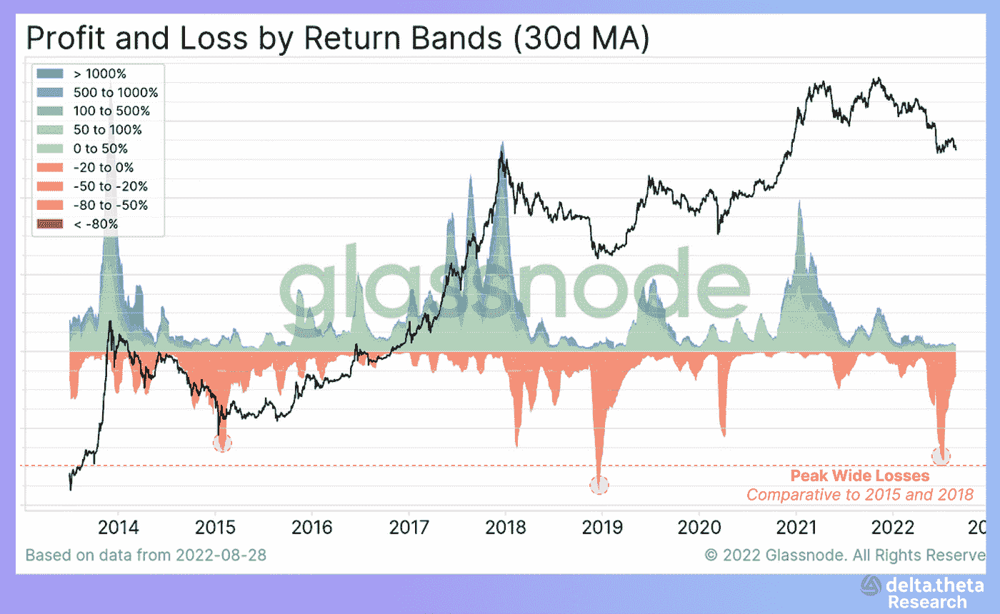
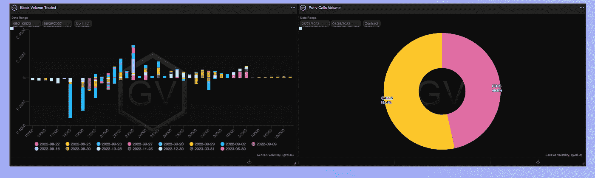
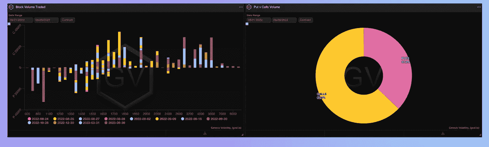

# 每周加密市场概述。

> 原文：<https://medium.com/coinmonks/weekly-crypto-market-overview-b617be545c3a?source=collection_archive---------21----------------------->

值得承认的是，历史上高度波动的加密市场的相对平静和轻微的夏季复苏期即将结束。美联储主席在周末前的讲话震动了全球所有市场。如果这位全球最大央行代表的主要目标是安抚市场，带来更多的确定性，那么他肯定没有以最好的方式做到这一点。

在 8 分钟的演讲结束时，股票指数下跌了 3%至 5%，加密市场的市值下跌了 10%以上，本周约为 9300 亿美元。

主要美元流动性监管机构的立场给高风险资产的价格带来了直接压力。在决定再融资利率时依赖未来统计数据的决定和缺乏透明度剥夺了官员的主动性，其结果是所有市场注意力将集中在 9 月中旬发布的经济指标上，主要是消费者价格指数。

**新闻**

巴拉圭总统马里奥·阿卜杜·贝尼特斯[否决了一项法案，该法案将监管与数字资产](https://cointelegraph.com/news/president-of-paraguay-vetoes-crypto-regulation-law)相关的商业活动，包括加密货币开采。Abdo 否决该法案的决定似乎与承认加密货币采矿是一项工业活动的条件有关，其电价比当前的工业电价高 15%。该法案将返回巴拉圭立法机构的两院，立法者可以重新考虑或否决该提案。

游戏软件开发和风险投资公司,【Animoca Brands 将宣布它正在以可转换债券的形式寻求额外的资本。这家加密投资公司与新加坡国家基金淡马锡达成了一笔 1 亿美元的交易，淡马锡是主要赞助商。可转换债券可以在以后转换成股票。当一家公司不想减持自己的股权或无法筹集股权资本时，有时会使用这种融资方法。

a16z 基金领导了一轮 5000 万美元的首轮融资，这是一个由 1000 名 NFT 收藏家和艺术家组成的私人团体。该团队周二表示，Collab+Currency，Flamingo DAO，SV Angel，VaynerFund 和七七六也参加了这一轮。亚历克西斯·奥哈尼安(Alexis Ohanian)的风险投资公司 Seven Seven Six 在 4 月份领导了一轮 1000 万美元的融资。这是 a16z 在 Proof 上的第一笔投资，使其与宇迦实验室和幼虫实验室等公司相提并论——显著的不同是，它在 NFT 的两个主要项目是在公共领域。

# 市场连锁数据

来自 glassnode 门户网站的连锁数据表明，本地价格底部正在形成。尽管市场目前流动性不足，价格可能会创出新低，但 BTC 持有者的最大亏损高峰已经过去。今年夏天的调整与 2015 年和 2018 年的下跌相当，根据比特币每月平均所有权收益率，随后是漫长的整合期和新的市场增长阶段。

# 期权市场

加密资产和传统市场之间的高度相关性迫使市场参与者针对可能的负面经济消息对冲其投资。在美联储主席发表讲话之前，交易员积极买入 18 000 和 19 000 点的短期看跌期权，以对冲可能出现的波动性飙升。20 000 点仍然是市场的一个强有力的重要支撑，如果现货市场被突破，期权市场的价格目标和利率水平也将发生变化。

对瑞士联邦理工学院来说，共识转变和实现相关新机遇的时刻越来越近了。只要这种转变的成功在理论上还存在不确定性，交易者就会避免在中期开仓或交易远期执行水平。利息和流动性集中在一个狭窄的范围内可能会导致更远的期权的内在价值爆炸——按日期(11 月)和按行使。还应该注意的是，随着 DeFi 生态系统的监管压力增加，一些交易商正在使用 1100 和 1200 的看跌期权和 9 月下旬的行权日期作为投资替代硬币的潜在对冲。

> 交易新手？试试[密码交易机器人](/coinmonks/crypto-trading-bot-c2ffce8acb2a)或者[复制交易](/coinmonks/top-10-crypto-copy-trading-platforms-for-beginners-d0c37c7d698c)