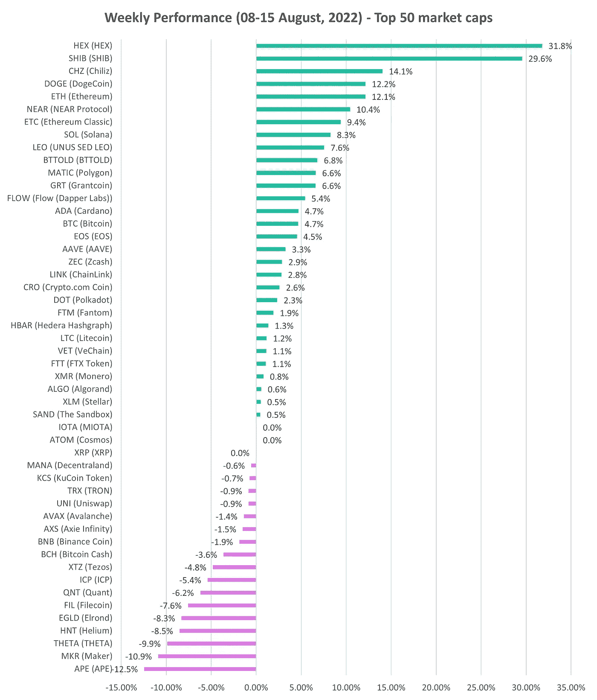
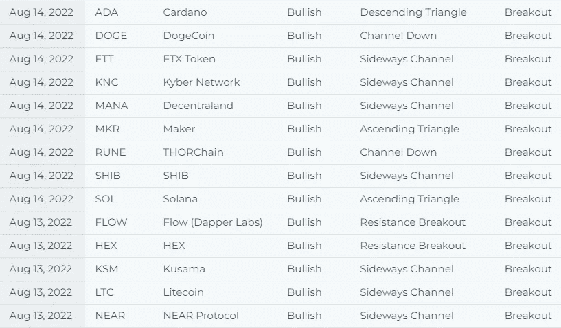

# 每周加密概述

> 原文：<https://medium.com/coinmonks/weekly-crypto-overview-fa4942e008b5?source=collection_archive---------38----------------------->

7 月份 CPI 低于预期的 8.5%，这再次推高了加密价格。牛市已经恢复。尽管劳动力市场强劲，但通胀有所缓解，这表明美联储在 9 月份的下一次货币政策会议上不必过于激进地加息。

# **每周演出**

上周表现最好的硬币是 HEX (+31.8%)、SHIB (+29.6%)、CHZ (+14.1%)，最差的是 THETA (-9.9%)、MKR (-9.9%)和 APE (-12.5%)，它们都是市值最高的 50 种硬币。

比特币上涨 4.7%，以太坊上涨 12.1%。以太坊完成了最终的 testnet 过渡到 proof-of-stage，大合并现在定于 9 月 15 日或 16 日。

**不要错过及时的研究！我们首先在六月初写了一份关于以太坊和合并的研究报告，我们强调了合并可能是 ETH 和 altcoins 的巨大催化剂。自那以来，ETH 上涨了 50%以上。自从我们的研究报告以来利多已经涨了 100%以上。访问我们的[专有研究](https://platform.altfins.com/research?utm_source=sendinblue&utm_campaign=weekly%20market%20update&utm_medium=email)。**

Source: altfins.com

# **我们看到许多突破……**

突破是什么意思？当硬币价格爆发时，它可能代表着情绪的重大变化。突破发生在价格突破支撑线或阻力线的时候。

这些是准备交易的设置。赚钱是简单的交易；你去突破方向和目标水平。

在[策划图](https://platform.altfins.com/curatedCharts?utm_source=sendinblue&utm_campaign=weekly%20market%20update&utm_medium=email)设置中查看有突破的硬币。

Source: altFINS.com

**爆料** [**上周的秘密新闻**](https://platform.altfins.com/news?utm_source=sendinblue&utm_campaign=weekly%20market%20update&utm_medium=email)

**BTC:**

*   **[闪电网络对价值 1500 亿美元的支付行业的潜在破坏](https://dailyhodl.com/2022/08/14/coinbase-highlights-lightning-networks-potential-disruption-of-the-150000000000-payments-industry/?utm_source=sendinblue&utm_campaign=weekly%20market%20update&utm_medium=email)**
*   **根据彭博策略师迈克·麦格隆的说法，10 万美元的比特币价格是不可避免的——以下是原因**

****ETH:****

*   **[以太坊计划在 9 月 15 日至 16 日](http://cryptobriefing.com/ethereum-merge-scheduled-launch-september/?utm_source=sendinblue&utm_campaign=weekly%20market%20update&utm_medium=email)之间的某个时间完成“合并”至股权证明**
*   **[以太坊完成 Goerli Testnet 合并](http://thedefiant.io/ethereum-goerli-merge-complete?utm_source=sendinblue&utm_campaign=weekly%20market%20update&utm_medium=email)**
*   **[休眠以太坊供应创历史新高](http://dormant%20ethereum%20supply%20reaches%20all-time%20high/?utm_source=sendinblue&utm_campaign=weekly%20market%20update&utm_medium=email)**

****山寨币:****

*   **【Acala 网络泄露后基于 Polkadot 的 stable coin aUSD depegs**
*   **[Uniswap 实验室校友提议 Uniswap 基金会促进交流](https://www.theblock.co/post/161551/uniswap-labs-alum-propose-creating-uniswap-foundation-to-boost-exchange?utm_source=sendinblue&utm_campaign=weekly%20market%20update&utm_medium=email)**

****NFT 的:****

*   **[每周 NFT 销量显示改善，Fantom 和不可变 X NFT 销量激增](https://news.bitcoin.com/weekly-nft-sales-show-improvement-fantom-and-immutable-x-nft-volume-spikes/?utm_source=sendinblue&utm_campaign=weekly%20market%20update&utm_medium=email)**
*   **NFT 游戏比“有钱进，没钱出”游戏更有优势:Polygon 的 Urvit Goel**

****龙卷风现金:****

*   **[美国财政部制裁臭名昭著的虚拟货币搅拌机龙卷风现金](https://home.treasury.gov/news/press-releases/jy0916?utm_source=sendinblue&utm_campaign=weekly%20market%20update&utm_medium=email)**
*   **开发商欠款后，Tornado 现金代币价值损失 24%**

**[阅读加密新闻](https://platform.altfins.com/news?utm_source=sendinblue&utm_campaign=weekly%20market%20update&utm_medium=email)**

> **交易新手？试试[密码交易机器人](/coinmonks/crypto-trading-bot-c2ffce8acb2a)或[复制交易](/coinmonks/top-10-crypto-copy-trading-platforms-for-beginners-d0c37c7d698c)**