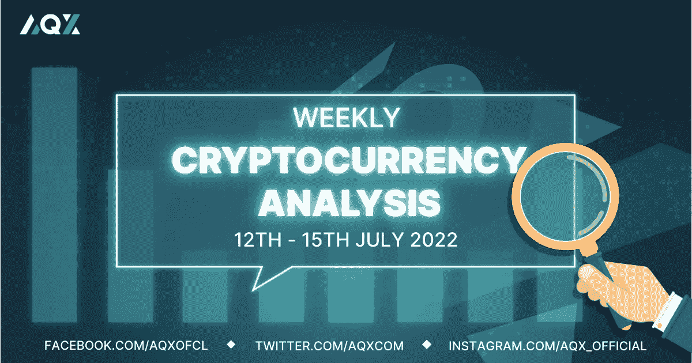
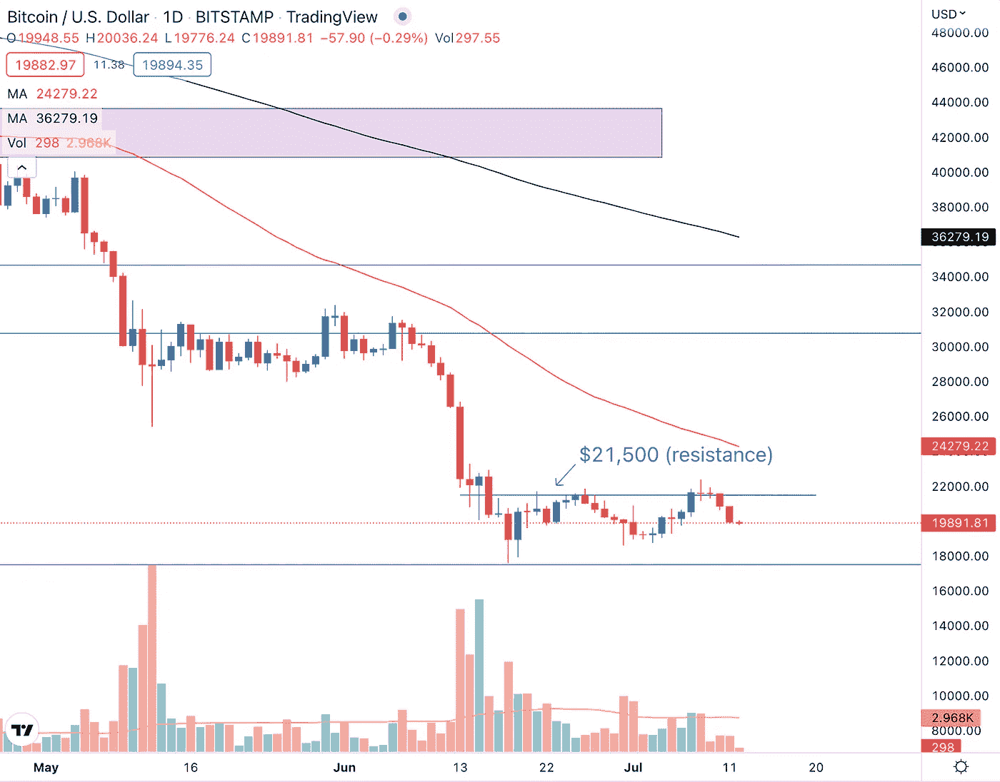
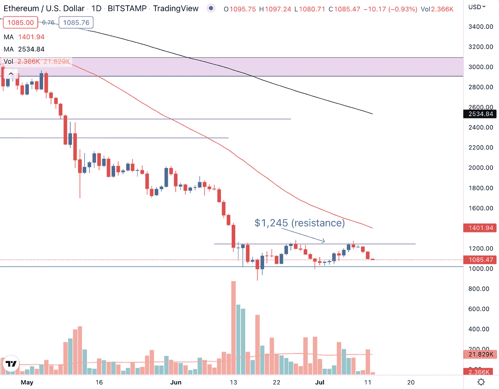
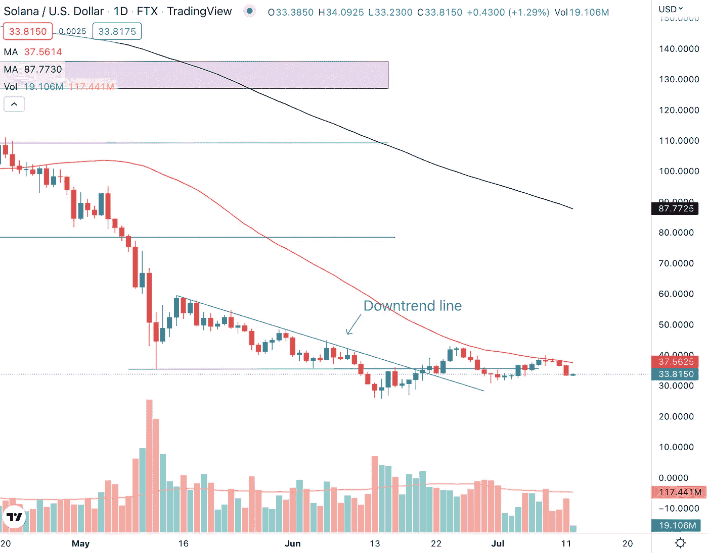
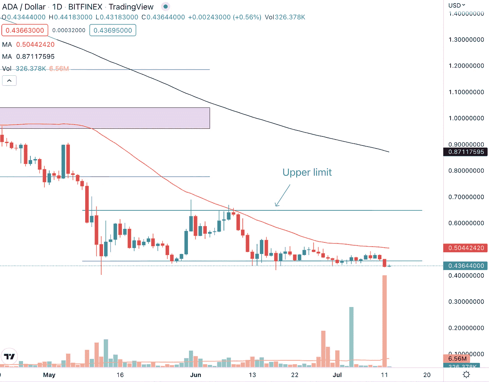

# 每周加密技术分析(7 月 12 日至 15 日)

> 原文：<https://medium.com/coinmonks/weekly-crypto-technical-analysis-12th-15th-july-d457a3f52c9c?source=collection_archive---------37----------------------->

Weekly Crypto Technical Analysis (12th — 15th July)

2022 年 7 月 12 日

你好，密码专家，

美国国债收益率在过去几周大幅下跌后略有反弹。美国通胀数据将于本周晚些时候公布，投资者正积极支持美联储采取进一步的鹰派政策来抗击通胀。6 月份非农就业报告显示，就业岗位净增 37.2 万个，超出预期。

让我们看看我们观察名单上的加密货币在持续的宏观逆风中表现如何。

**比特币(BTC)**

Bitcoin (BTC) faces a huge amount of supply (resistance) at the $21,500 price level.

事实证明，21500 美元的价格水平是比特币的强大阻力，因为加密货币的价格仍然无法突破这一水平。在第 8 和第 9 个交易日形成的两个[多吉烛台](/aqx-official/candlestick-patterns-explained-with-examples-a-comprehensive-guide-to-candlestick-patterns-7315e11ac522)反映了投资者和交易者在阻力(供应)区的犹豫不决。

由于投资者和交易员对 BTC 价格持观望态度，我们可能会进一步测试 21，500 美元的价格水平，而不会大幅突破该水平。如果比特币要上演强劲反弹并扭转其跌势，我们希望看到 BTC 价格在强劲的交易量下突破 21500 美元的水平。

**以太坊**

Ethereum (ETH) is currently trading between the $1,020 — $1,245 price range with heavy volume on down days.

虽然以太坊目前在 1020 美元至 1245 美元的价格区间内横盘整理，并设法暂时停止了价格下跌，但其价格走势看起来并不乐观。红色(看跌)日的交易量高于绿色(看涨)日的交易量，这与我们希望看到的健康上升趋势相反。

> 交易新手？尝试[加密交易机器人](/coinmonks/crypto-trading-bot-c2ffce8acb2a)或[复制交易](/coinmonks/top-10-crypto-copy-trading-platforms-for-beginners-d0c37c7d698c)

展望未来，从 1，020 美元至 1，245 美元交易区间的突破方向将为我们提供一个很好的迹象，表明 ETH 的下一个方向。

**索拉纳(SOL)**

Solana (SOL) faces strong resistance at the 50-day moving average.

50 日均线(红线)继续是上周索拉纳的强阻力。虽然 SOL 能够设置更高的低点，但它无法设置更高的高点，因为 50 天移动平均线被证明是加密货币的强大阻力。

虽然三周前从下降趋势线突破时成交量很大，但绿色(看涨)日的成交量已经枯竭。红色(看跌)日的交易量现在高于绿色(看涨)日的交易量。为什么交易量是分析价格行为的关键部分，是因为它可以揭示大玩家的积累或分布。与这些大的市场参与者结盟可以让我们在加密市场获得更高的成功概率。

**卡尔达诺(阿达)**

Cardano (ADA) broke below the $0.45 support on strong volume.

Cardano 跌破 0.45 美元的价格水平，成交量是 50 天平均水平的 10 倍以上。这是过去一年中最高的交易量。下跌日的巨大成交量，多头看跌烛台，跌破支撑位都是 ADA 看跌的信号。

在接下来的一周，我们很有可能看到卡尔达诺价格进一步下跌，下一个主要支撑位在 0.30 美元。如果你相信 Cardano 的长期前景，并且目前持有 ADA 的头寸，你可以使用永久合约对冲多头头寸和空头头寸。

交易永久合约的一种方法是使用 [AQX](http://aqx.com) 。AQX 是一个加密货币交易平台，为散户和交易员提供衍生品交易，以便他们能够在不同类型的市场中获利，而不仅仅是在牛市中。[今天就开始在 AQX 上以你想要的方式交易加密衍生品。](http://aqx.com/signup)

莱纳斯（m.）

*免责声明:本文分享的任何观点仅代表作者的观点和看法，不应被视为财务建议。AQX 对上传的项目或内容不做任何判断。*

关注我们:

[推特](https://twitter.com/AqxCom) | [电报](https://t.me/aqxannouncement) | [脸书](https://www.facebook.com/AQXofcl) | [Instagram](https://www.instagram.com/aqx_official/) | [媒体](https://medium.com/aqx-official) | [不和](https://discord.gg/mn5CNScMev) | [Youtube](https://www.youtube.com/channel/UC_3J-wzFgDu2P8NF_CrjAYg/featured) | [抖音](https://www.tiktok.com/@aqx_official) | [Linkedin](https://www.linkedin.com/company/aqx-official/)

**关于 AQX**

AQX 成立于 2020 年，是面向零售交易商和机构的加密网关。它为用户提供了一个购买、销售、交易和学习密码的一体化平台。AQX 的核心是一个加密货币交易平台，该公司凭借无与伦比的卓越工程设计、世界一流的安全性和卓越的交易功能，为投资者提供全面的服务来管理他们的数字资产组合，从而引领行业发展。

了解更多关于 AQX 的信息:

*   推特:[https://twitter.com/AqxCom](https://twitter.com/AqxCom)
*   电报通知:【https://t.me/aqxannouncement 
*   https://www.facebook.com/AQXofcl[脸书](https://www.facebook.com/AQXofcl)
*   insta gram:[https://www.instagram.com/aqx_official/](https://www.instagram.com/aqx_official/)
*   中:[https://medium.com/aqx-official](https://medium.com/aqx-official)
*   不和:[https://discord.gg/mn5CNScMev](https://discord.gg/mn5CNScMev)
*   YouTube:[https://www . YouTube . com/channel/UC _ 3J-wzfgdu 2 p 8 nf _ CrjAYg/featured](https://www.youtube.com/channel/UC_3J-wzFgDu2P8NF_CrjAYg/featured)
*   https://www.reddit.com/r/AQX_official/
*   https://www.tiktok.com/@aqx_official
*   领英:[https://www.linkedin.com/company/aqx-official/](https://www.linkedin.com/company/aqx-official/)