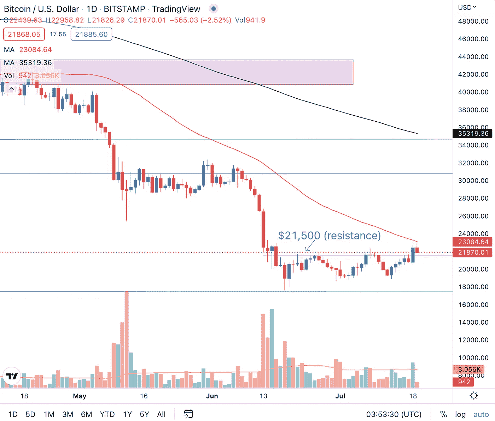
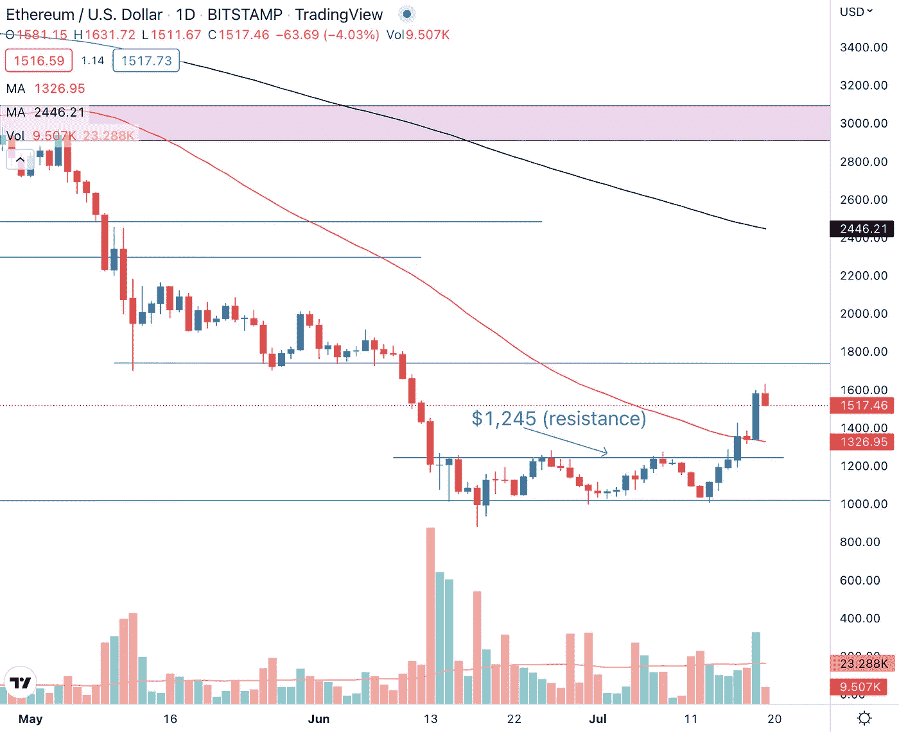
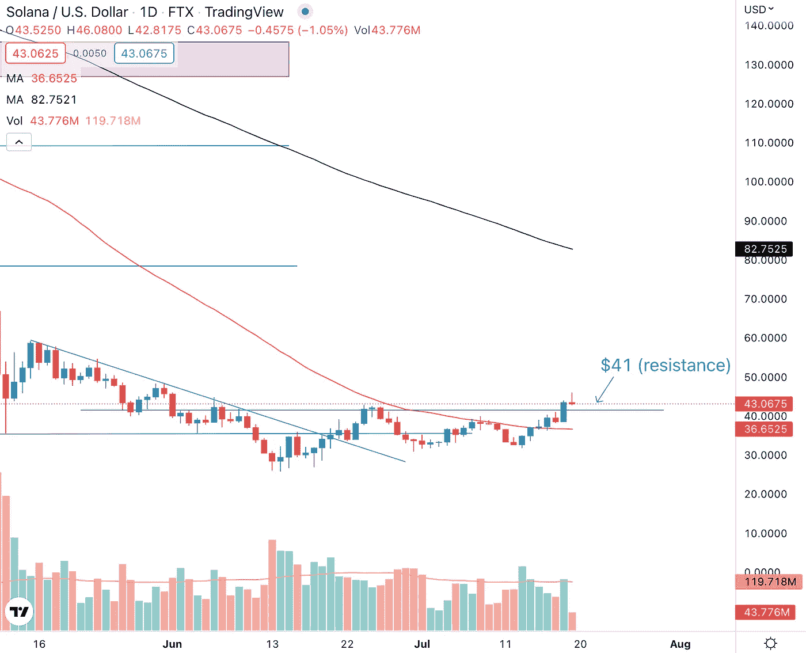
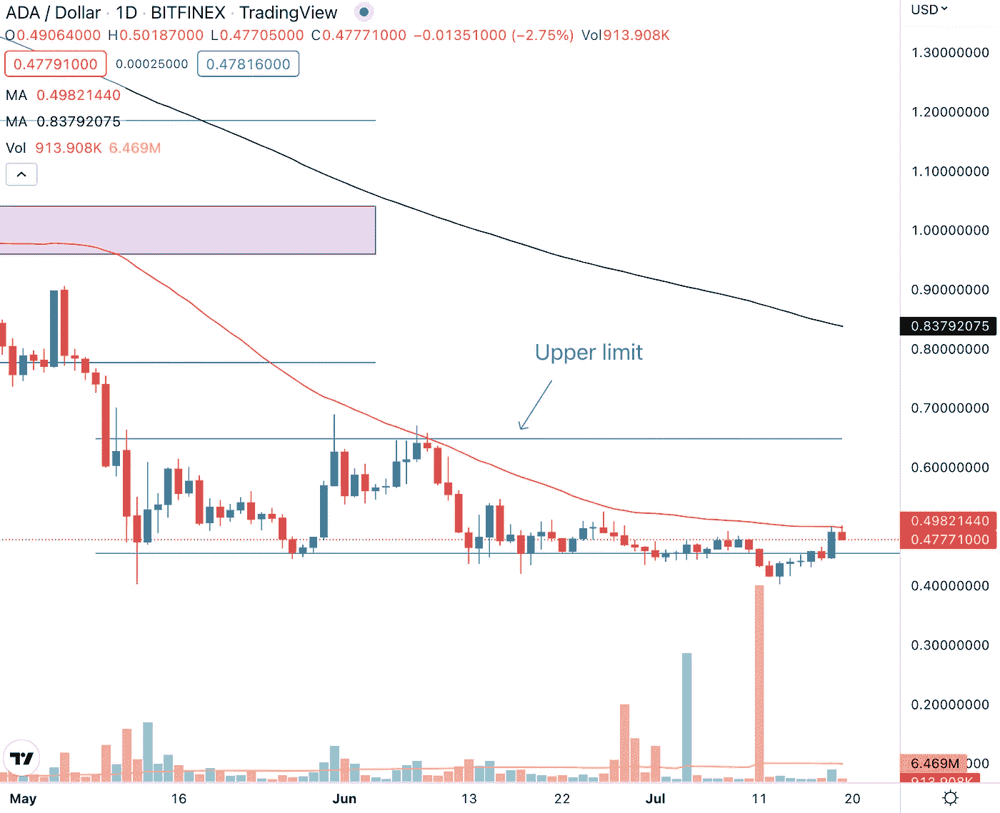

# 每周加密技术分析(7 月 18 日至 22 日)

> 原文：<https://medium.com/coinmonks/weekly-crypto-technical-analysis-18th-22nd-july-7af1bc67262f?source=collection_archive---------33----------------------->

2022 年 7 月 18 日

你好，密码专家，

六月份的通货膨胀是 40 多年来最严重的。股市的反应比预期更积极，表明市场可能已经反映了高通胀数据。收益率曲线变成了 2000 年以来最负的。

让我们来看看在这些宏观经济条件的背景下，我们观察名单上的加密货币表现如何。

**比特币(BTC)**

Bitcoin (BTC) broke above the $21,500 resistance but is now facing resistance at the 50-day moving average.

每当比特币价格达到 21500 美元的关键价格水平时，投资者和交易员都会继续保持观望。事实上，如果我们看看 7 月 16 日和 17 日的交易时段，烛台形成了两个长长的上灯芯。这告诉我们，如果比特币要上演一场持续的反弹，在这个价格水平上仍有 BTC 的供应和卖方需要清理。

如果比特币突破 21500 美元阻力位，我们希望看到伴随这一走势的强劲交易量。这将表明，不仅是散户投资者和交易者购买加密货币，机构也对购买需求做出了贡献。

**以太坊**

Ethereum (ETH) capped off a bullish week with a strong break above its resistance level.

以太坊突破 1245 美元阻力位，收于 50 天移动平均线上方，为牛市一周画上句号。或许唯一的缺点是，价格波动并没有伴随着强劲的成交量上升，而这种强劲的成交量上升会给反弹带来更多动力。

设法在交易区间的低点买入的抄底者可能会锁定部分利润，而在高点买入的被套住的买家可能会希望减少损失。这种获利回吐活动可能会导致 ETH 价格在未来一周回调，但如果大型参与者真的在积累以太坊，他们对 ETH 的需求和胃口应该会超过供应，这样在价格继续创造更高高点之前，任何回调都将是轻微的。

**索拉纳**

Solana (SOL) closed above the 50-day moving average with the next major resistance at the $41 price level.

索拉纳上周创下了更高的高点，并收于 50 天移动平均线上方。对于 SOL 来说，这是朝着正确方向迈出的一步，因为加密货币试图扭转长达数月的下跌趋势，回到高点。

索拉纳很可能遇到的即将到来的阻力是 41 美元的价格水平。在这一水平，一些抛售是意料之中的，但我们理想中希望看到的建设性价格行动是价格小幅回调，并在 50 天移动平均线找到支撑。

**卡尔达诺(阿达)**

Cardano (ADA) rally is a suspect with volume lacking in its up move.

Cardano 上周在强劲的成交量下跌破 0.45 美元的支撑位，表明价格可能会进一步下跌。然而，ADA 已经设法爬回 0.45 美元的价格水平，但目前面临 50 天移动平均线的阻力。

这种反弹仍然是一个疑点，因为在这种上升趋势中缺乏交易量。我们希望看到交易量上升，尤其是在上周下跌的强劲交易量之后，这向我们表明，机构仍然对 Cardano 有兴趣。

莱纳斯（m.）

*免责声明:本文分享的任何观点严格来说是作者的观点和看法，不应被解释为财务建议。AQX 对上传的项目或内容不做任何判断。*

关注我们:

[推特](https://twitter.com/AqxCom) | [电报](https://t.me/aqxannouncement) | [脸书](https://www.facebook.com/AQXofcl) | [Instagram](https://www.instagram.com/aqx_official/) | [媒体](https://medium.com/aqx-official) | [不和](https://discord.gg/mn5CNScMev) | [Youtube](https://www.youtube.com/channel/UC_3J-wzFgDu2P8NF_CrjAYg/featured) | [抖音](https://www.tiktok.com/@aqx_official) | [Linkedin](https://www.linkedin.com/company/aqx-official/)

> 交易新手？试试[加密交易机器人](/coinmonks/crypto-trading-bot-c2ffce8acb2a)或者[复制交易](/coinmonks/top-10-crypto-copy-trading-platforms-for-beginners-d0c37c7d698c)

**关于 AQX**

AQX 成立于 2020 年，是面向零售交易商和机构的加密网关。它为用户提供了一个购买、销售、交易和学习密码的一体化平台。AQX 的核心是一个加密货币交易平台，该公司凭借无与伦比的卓越工程设计、世界一流的安全性和卓越的交易功能，为投资者提供全面的服务来管理他们的数字资产组合，从而引领行业发展。

了解更多关于 AQX 的信息:

*   推特:https://twitter.com/AqxCom
*   电报通知:[https://t.me/aqxannouncement](https://t.me/aqxannouncement)
*   https://www.facebook.com/AQXofcl 脸书
*   insta gram:[https://www.instagram.com/aqx_official/](https://www.instagram.com/aqx_official/)
*   中:[https://medium.com/aqx-official](https://medium.com/aqx-official)
*   不和:【https://discord.gg/mn5CNScMev】T2
*   YouTube:[https://www . YouTube . com/channel/UC _ 3J-wzfgdu 2 p 8 nf _ CrjAYg/featured](https://www.youtube.com/channel/UC_3J-wzFgDu2P8NF_CrjAYg/featured)
*   https://www.reddit.com/r/AQX_official/
*   https://www.tiktok.com/@aqx_official 抖音
*   领英:[https://www.linkedin.com/company/aqx-official/](https://www.linkedin.com/company/aqx-official/)