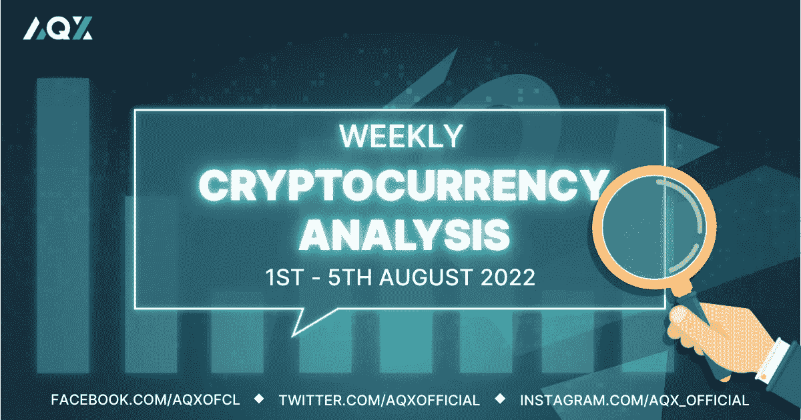
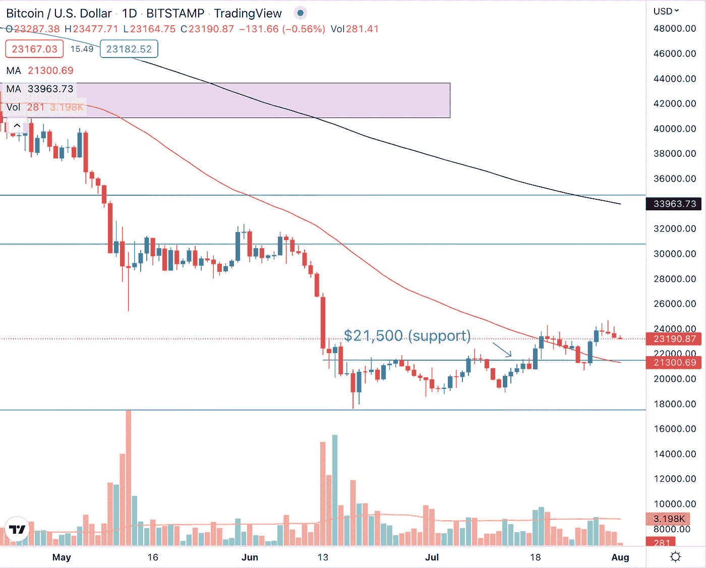
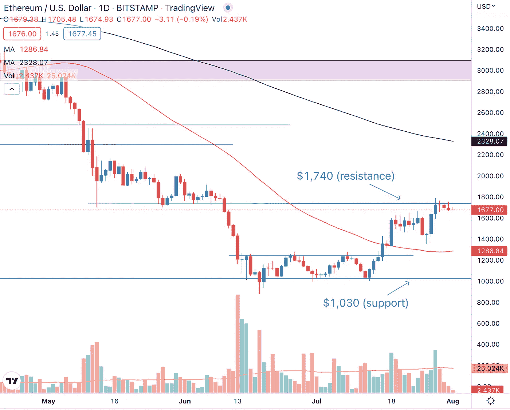
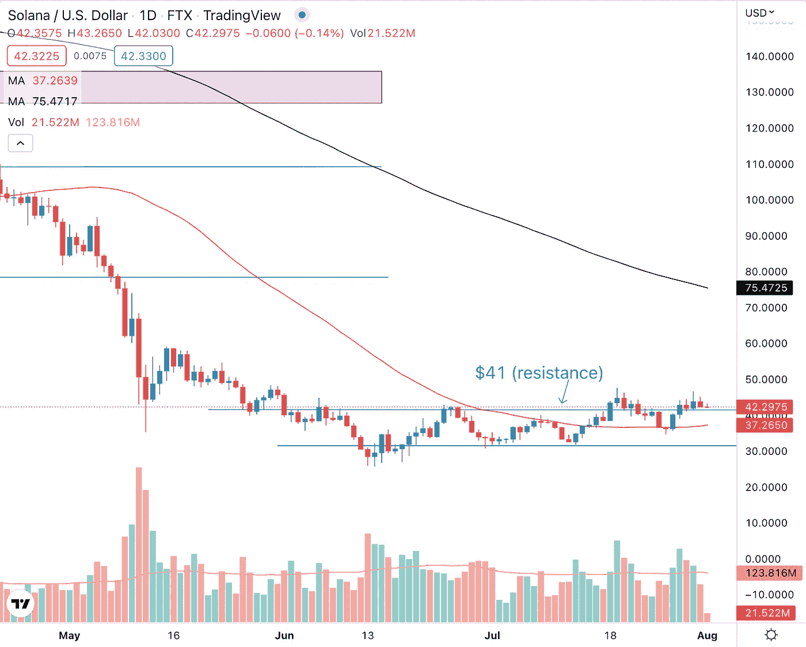
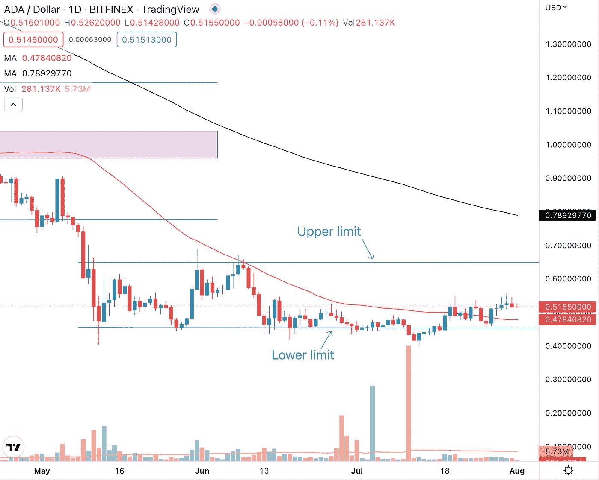

# 每周加密技术分析(8 月 1 日至 5 日)

> 原文：<https://medium.com/coinmonks/weekly-crypto-technical-analysis-1st-5th-august-19ec19f86561?source=collection_archive---------13----------------------->

Weekly Crypto Technical Analysis (1st — 5th August)

2022 年 8 月 1 日

你好，密码专家，

美联储将基准利率提高了 75 个基点，目前为 2.5%。美国经济连续第二个季度收缩，进一步加剧了人们对衰退的担忧。尽管有“坏”消息，股票市场设法结束了一个积极的一周。

即使市场开始再次表现，我们观察名单上的加密货币表现如何？

> *加入 Coinmonks* [*电报频道*](https://t.me/coincodecap) *和* [*Youtube 频道*](https://www.youtube.com/c/coinmonks/videos) *获取每日* [*加密新闻*](http://coincodecap.com/)

## **比特币(BTC)**

Bitcoin (BTC) undercut the $21,500 price level before rallying up.

比特币保持在 21500 美元的价格水平，这是我们在之前的每周加密技术分析文章中确定的。虽然 BTC 价格确实低于 7 月 26 日交易时段的价格水平，但在价格回升之前，这种降低是短暂的(一个交易时段)。我想强调这种削弱，因为对于比特币的反弹来说，这实际上是一种积极的发展，而不是消极的发展。

许多其他交易员也可能将 21500 美元的价格水平视为比特币的支撑，因此那些在 BTC 做多的人可能会将止损点设在该支撑水平下方。当比特币低于 21500 美元的价格水平时，价格消除了这些交易员的止损，并动摇了“弱势持有人”。这是机构玩家淘汰散户的典型打法。如果是这样的话，那么这意味着机构可能正在积累比特币，我们可以期待下跌趋势的逆转和从这里开始的反弹。

## **以太坊(ETH)**

Ethereum (ETH) is encountering resistance at the top end of the range which was also a key price level for prices a couple of months ago.

以太坊目前的交易价格在 1030 美元到 1740 美元之间。ETH 从区间底部到顶部的上升是以有序的阶梯方式进行的，每次上升都伴随着一段时间的横向移动。上涨是在高于平均水平的成交量上，而回调/横向移动是在低于平均水平的成交量上。这些都是以太坊的看涨信号。

然而，尽管如此，随着加密价格在短短三周内从区间底部上升到区间顶部超过 60%，我们可以预计在区间顶部会有一些获利回吐。此外，1，740 美元的价格水平，对应于该区间的顶部，也是几个月前以太坊的关键支撑，现在可能是一个阻力位。

## **索拉纳(SOL)**

Solana (SOL) has to contend with the overhead supply after breaking above the $41 resistance level.

在两周前的假突破后，索拉纳突破了 41 美元的阻力。最近的突破也面临着与前一次突破相同的间接供应问题，间接供应压倒了需求。这反映在突破后烛台上相对较长的灯芯上。

在间接供应耗尽之前，我们可以预计 SOL 的价格要么跌破 41 美元的价格水平，要么横盘整理。

## **卡尔达诺(阿达)**

Cardano (ADA) is trading sideways within the range bounded by the upper and lower limits.

在 Cardano 的价格图表上发现的最近的烛台的“wicky”性质反映了投资者和交易者的犹豫不决。这种犹豫不决是 ADA 交易的更大的整体横向运动的一部分(在上下区间之间)。

除非你是区间交易者，否则最好在卡尔达诺横向交易时持有现金，只在阿达向一个方向突破且趋势稳固时配置现金。

莱纳斯（m.）

*免责声明:本文分享的任何观点仅代表作者的观点和看法，不应被视为财务建议。AQX 对上传的项目或内容不做任何判断。*

关注我们:

[推特](https://twitter.com/AqxCom) | [电报](https://t.me/aqxannouncement) | [脸书](https://www.facebook.com/AQXofcl) | [Instagram](https://www.instagram.com/aqx_official/) | [媒体](https://medium.com/aqx-official) | [不和](https://discord.gg/mn5CNScMev) | [Youtube](https://www.youtube.com/channel/UC_3J-wzFgDu2P8NF_CrjAYg/featured) | [抖音](https://www.tiktok.com/@aqx_official) | [Linkedin](https://www.linkedin.com/company/aqx-official/)

**关于 AQX**

AQX 成立于 2021 年，是面向零售交易商和机构的加密网关。它为用户提供了一个购买、销售、交易和学习密码的一体化平台。AQX 的核心是一个加密货币交易平台，该公司凭借无与伦比的卓越工程设计、世界一流的安全性和卓越的交易功能，为投资者提供全面的服务来管理他们的数字资产组合，从而引领行业发展。

了解更多关于 AQX 的信息:

*   推特:https://twitter.com/AqxCom
*   电报通知:[https://t.me/aqxannouncement](https://t.me/aqxannouncement)
*   https://www.facebook.com/AQXofcl[脸书](https://www.facebook.com/AQXofcl)
*   insta gram:【https://www.instagram.com/aqx_official/ 
*   中:[https://medium.com/aqx-official](https://medium.com/aqx-official)
*   不和:[https://discord.gg/mn5CNScMev](https://discord.gg/mn5CNScMev)
*   YouTube:[https://www . YouTube . com/channel/UC _ 3J-wzfgdu 2 p 8 nf _ CrjAYg/featured](https://www.youtube.com/channel/UC_3J-wzFgDu2P8NF_CrjAYg/featured)
*   https://www.reddit.com/r/AQX_official/
*   https://www.tiktok.com/@aqx_official
*   领英:[https://www.linkedin.com/company/aqx-official/](https://www.linkedin.com/company/aqx-official/)