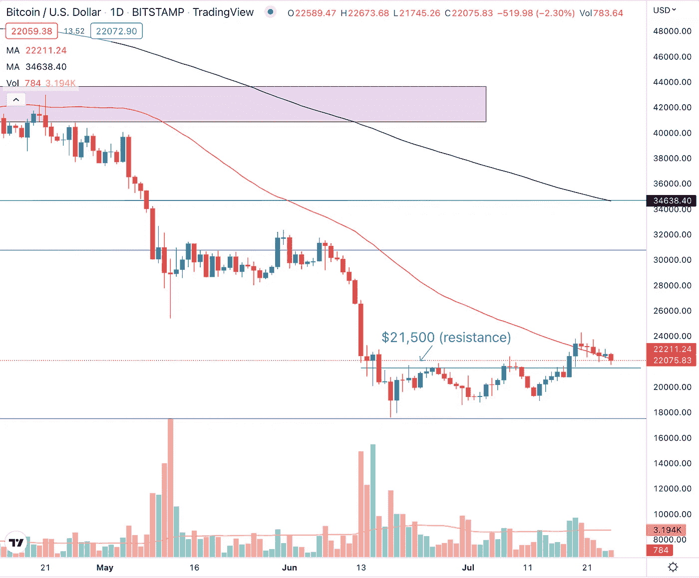

# 每周加密技术分析(7 月 25 日至 29 日)

> 原文：<https://medium.com/coinmonks/weekly-crypto-technical-analysis-25th-29th-july-a46bcb30c235?source=collection_archive---------58----------------------->

Weekly Crypto Technical Analysis (25th — 29th July)

2022 年 7 月 25 日

你好，密码专家，

美国股市上周结束了强劲的一周，尽管随着大型科技股本周发布财报，收益季节开始回升。预计美联储将实现连续三个季度的加息。第二季度 GDP 等经济数据也将于本周公布。

让我们来看看以太坊即将合并的消息是如何影响我们观察名单上的加密货币的？

**比特币(BTC)**

Bitcoin (BTC) pullback on declining volume after last week’s run-up.

上周，比特币勉强守住并收于 50 天移动平均线上方。然而，上周仍有一些积极的迹象。BTC 以强劲的成交量突破了 21，500 美元的价格水平和 50 天移动平均线(高于 50 天平均成交量)，而随后的回调发生在下跌和低于平均水平的成交量上。

这表明投资者和交易者有购买需求，但获利回吐很少，这是我们希望在健康的上涨趋势中看到的。只要比特币能够在 21500 美元的价格水平找到支撑，我们就可以预计比特币将扭转其长达数月的下跌趋势，并继续上行。

**以太坊**

Ethereum (ETH) is currently trading sideways after surging more than 50% in the past two weeks.

最近以太坊合并的积极进展使得以太坊的价格在过去两周内上涨了 50%以上。这一上涨见证了加密价格突破 1245 美元的价格水平和 50 天移动平均线，我们已经确定为阻力。在如此快速的上涨之后，以太坊停下来消化它的收益是很自然的。

幸运地在 ETH 1000 美元的低点抄底的加密投资者和交易员可能希望锁定部分利润，这解释了以太坊价格目前横向波动的原因。虽然一些获利回吐是可以预期的，但低于平均水平的抛售量表明没有太多的抛售需求，这给了我们一些暗示，即强劲的持有者还没有抛售他们的 ETH。

**索拉纳**

Solana (SOL) break above the $41 resistance level was short-lived as prices fell below the price level after just three trading sessions.

索拉纳突破 41 美元阻力位被证明是短暂的，因为价格在突破日之后仅三个交易日就跌破了突破水平。虽然事后诸葛总是 20/20，但已经有迹象表明突破容易失败。这是因为在 7 月 19 日的交易时段，突破后的第二天，溶胶形成了一个长灯芯的烛台。

虽然价格仍设法收于开盘价以上，但当天的长上灯芯表明，在交易时段结束时有卖盘需求，推动价格从 47.67 美元的高点收于 44.86 美元。展望本周，索拉纳的下一个支撑位是 50 日均线。如果价格可以在那里找到支撑，我们可以看到索拉纳试图第二次突破。

**卡尔达诺(阿达)**

Cardano (ADA) managed to rally above the $0.45 price level despite the strong sell-off two weeks ago.

在之前的每周加密技术分析中，我强调了卡尔达诺的反弹可能是可疑的，因为当 ADA 跌破 0.45 美元的主要支撑位时，下跌量巨大。然而，加密货币的价格设法反弹并保持在 0.45 美元的价格水平之上。

对于卡尔达诺的价格行为，有两种可能的解释。第一，这次反弹是一个牛市陷阱，因此一旦投资者和交易者被引诱做 ADA 的多头头寸，价格将迅速反转，以“套住”这些投资者和交易者。第二，7 月 11 日的下跌是投降式下跌，这意味着我们可能会看到卡尔达诺触底。卡尔达诺在未来几周的价格走势将让我们更清楚地知道我们可以期待什么。

莱纳斯（m.）

*免责声明:本文分享的任何观点严格来说是作者的观点和看法，不应被解释为财务建议。AQX 对上传的项目或内容不做任何判断。*

关注我们:

[推特](https://twitter.com/AqxCom) | [电报](https://t.me/aqxannouncement) | [脸书](https://www.facebook.com/AQXofcl) | [Instagram](https://www.instagram.com/aqx_official/) | [媒体](https://medium.com/aqx-official) | [不和](https://discord.gg/mn5CNScMev) | [Youtube](https://www.youtube.com/channel/UC_3J-wzFgDu2P8NF_CrjAYg/featured) | [抖音](https://www.tiktok.com/@aqx_official) | [Linkedin](https://www.linkedin.com/company/aqx-official/)

**关于 AQX**

AQX 成立于 2020 年，是面向零售交易商和机构的加密网关。它为用户提供了一个购买、销售、交易和学习密码的一体化平台。AQX 的核心是一个加密货币交易平台，该公司凭借无与伦比的卓越工程设计、世界一流的安全性和卓越的交易功能，为投资者提供全面的服务来管理他们的数字资产组合，从而引领行业发展。

了解更多关于 AQX 的信息:

*   推特:[https://twitter.com/AqxCom](https://twitter.com/AqxCom)
*   电报通知:[https://t.me/aqxannouncement](https://t.me/aqxannouncement)
*   https://www.facebook.com/AQXofcl
*   insta gram:【https://www.instagram.com/aqx_official/ 
*   中:【https://medium.com/aqx-official】T4
*   不和:[https://discord.gg/mn5CNScMev](https://discord.gg/mn5CNScMev)
*   YouTube:[https://www . YouTube . com/channel/UC _ 3J-wzfgdu 2 p 8 nf _ CrjAYg/featured](https://www.youtube.com/channel/UC_3J-wzFgDu2P8NF_CrjAYg/featured)
*   https://www.reddit.com/r/AQX_official/
*   https://www.tiktok.com/@aqx_official
*   领英:[https://www.linkedin.com/company/aqx-official/](https://www.linkedin.com/company/aqx-official/)

> 交易新手？尝试[加密交易机器人](/coinmonks/crypto-trading-bot-c2ffce8acb2a)或[复制交易](/coinmonks/top-10-crypto-copy-trading-platforms-for-beginners-d0c37c7d698c)