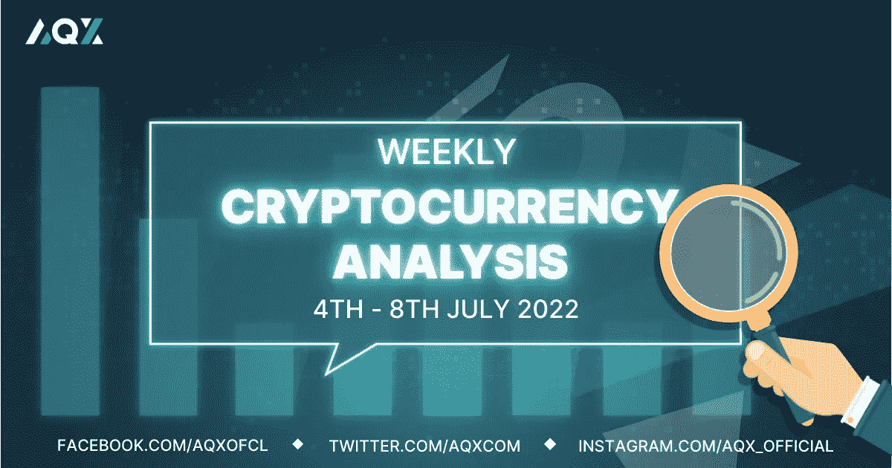
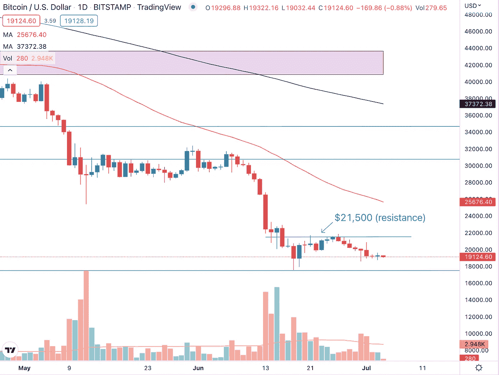
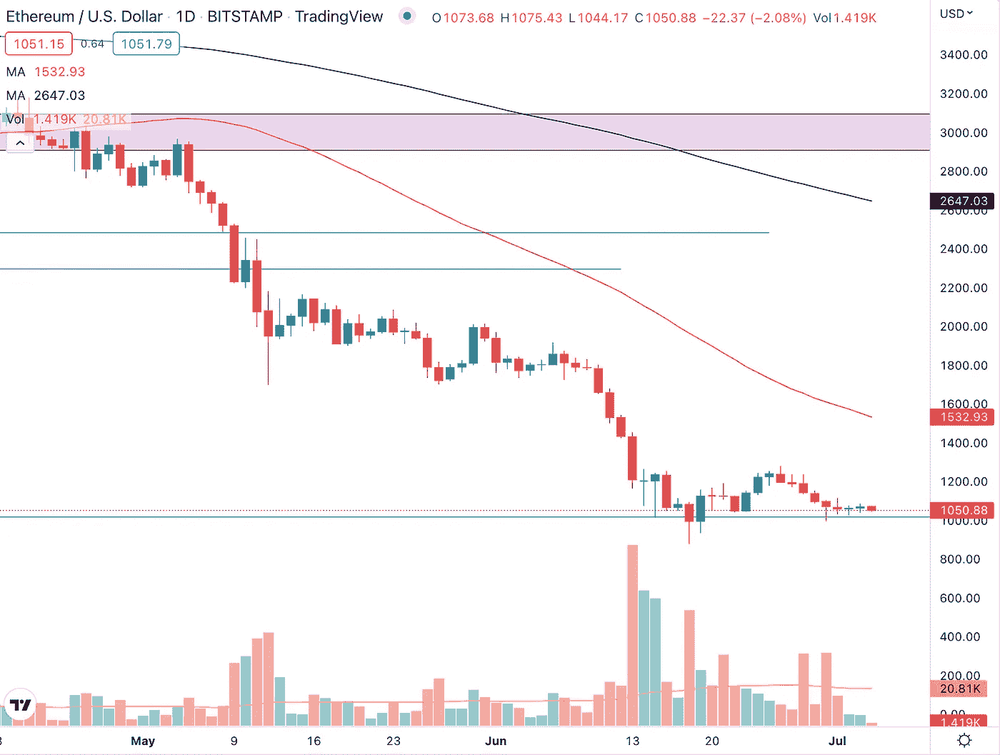
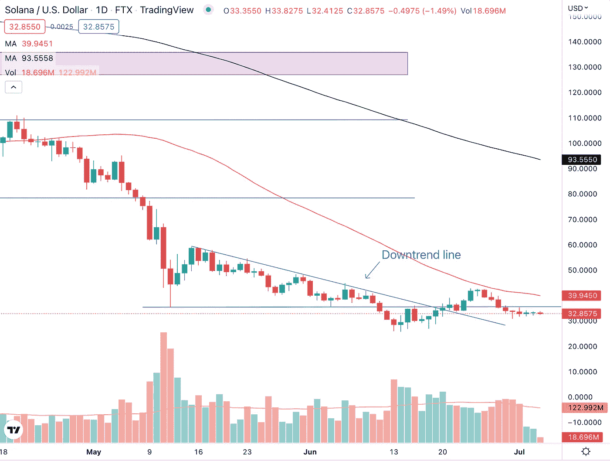
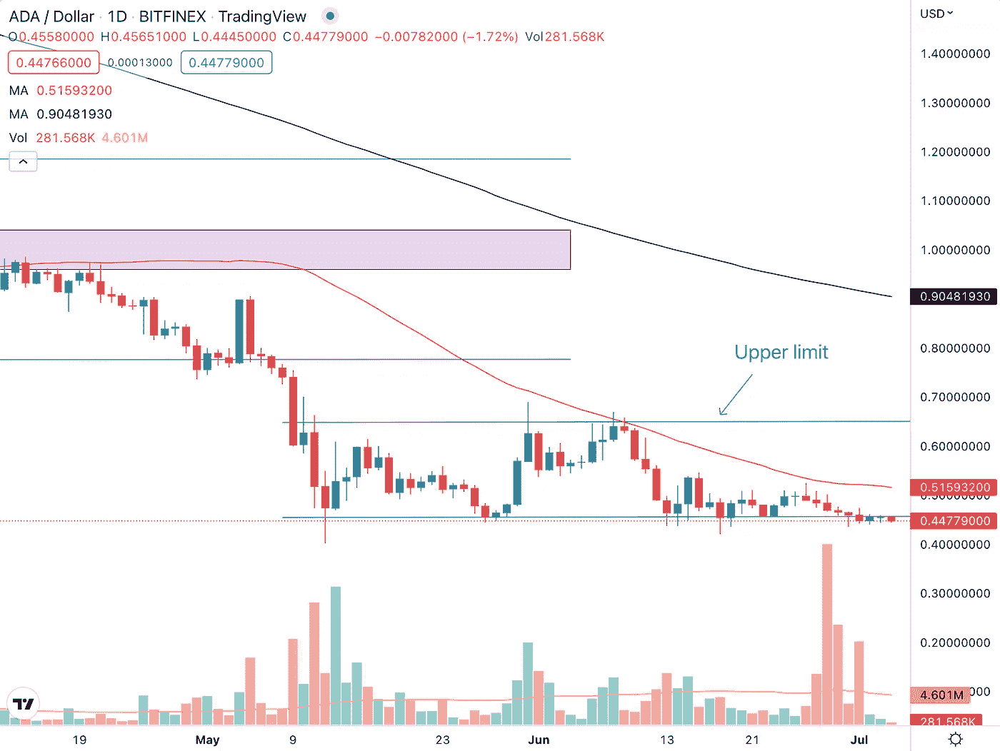

# 每周加密技术分析(7 月 4 日至 8 日)

> 原文：<https://medium.com/coinmonks/weekly-crypto-technical-analysis-4th-8th-july-4f95913652ad?source=collection_archive---------69----------------------->

Weekly Crypto Technical Analysis (4th — 8th July)

2022 年 7 月 4 日

你好，密码专家，

随着 2022 年上半年的过去，只有能源行业实现了正增长，尽管该行业的其他行业和整体股市都遭受了打击。美国国债收益率也开始从 6 月初 3.5%的高点回落。

最近几周，密码市场接二连三地受到坏消息的冲击。让我们来看看我们观察名单上的加密货币上周的表现，以及未来一周的展望。

**比特币(BTC)**

Bitcoin (BTC) has thus far managed to hold above the $17,500 level putting a temporary stop to the lower lows that it has been forming for the past few months.

比特币在前一周多次遭遇阻力后，无法突破 21500 美元的价格水平。BTC 尚未收于 6 月 18 日交易时段形成的前期低点以下，但如果价格在未来几天和几周收于该水平以下，这是加密的另一个熊市信号。

> 交易新手？试试[密码交易机器人](/coinmonks/crypto-trading-bot-c2ffce8acb2a)或者[复制交易](/coinmonks/top-10-crypto-copy-trading-platforms-for-beginners-d0c37c7d698c)

如果发生这种情况，这将意味着比特币将形成另一个更低的低点，延续数月的跌势，这种市值最大的加密货币已经出现了更低的高点和更低的低点。“波动”的情况(6 月 30 日和 7 月 1 日的交易时段)告诉我们，买家和卖家都犹豫不决，不确定。未来一周，BTC 极有可能在 17，500 美元至 21，500 美元的价格区间内横盘整理。

**以太坊**

Ethereum (ETH) continues to find support at the $1,000 level and is potentially forming a double bottom pattern.

以太坊继续在 1000 美元的心理价位寻找支持，我们在之前的几篇每周加密技术分析文章中强调了这一点。ETH 现在正在图表上形成第二个底部，如果价格可以超过 1245 美元的价格水平，加密将形成一个双底模式。

双底形态是一种强烈的看涨价格形态，表明下跌趋势可能已经结束，新的上涨趋势正在形成。因此，在未来一周，我将密切关注以太坊的价格走势，以及该加密算法对 1000 美元支撑位的反应，以及它是否能在 1245 美元上方移动。

**索拉纳(SOL)**

Solana (SOL) could not break above the 50-day moving average that we highlighted in our previous article.

我们在上周的文章中提出，50 天移动平均线可能会成为索拉纳的阻力，尽管索拉纳已经设法突破了下降趋势线，但它无法找到足够的需求推动 50 天移动平均线(红线)上方。自那以来，SOL 下跌了 25%，收于 35 美元支撑位以下。

但是事情并不都是悲观的。从 26 美元左右的低点上涨到 43 美元(上涨 60%)，当到达 50 天移动平均线时，索拉纳暂停甚至下跌也就不足为奇了。重要的是，索拉纳迄今为止已经设法形成了一个更高的低点，这是一个积极的迹象加密。展望未来一周，索拉纳要实现复苏，我们不希望看到索尔跌破之前的低点 26 美元。

**卡尔达诺(阿达)**

The high volume on the bearish trading sessions last week coupled with Cardano currently trading below the lower limit are bearish signs for ADA.

6 月 28 日和 29 日的熊市交易时段以及 7 月 1 日的交易时段的高交易量提供了强烈的迹象，表明我们可以看到 Cardano 的进一步潜在下跌。ADA 目前的交易价格低于 0.45 美元至 0.65 美元价格区间的下限，加密货币尚未设法交易高于或接近下限。

跌破并未能在支撑位(下限)上方收盘，显示了卡尔达诺价格走势的疲软。除非 Cardano 能够反弹到强劲交易量的下限之上，否则我们可以看到加密货币的另一个潜在下行趋势。

莱纳斯（m.）

*免责声明:本文分享的任何观点仅代表作者的观点和看法，不应被视为财务建议。AQX 对上传的项目或内容不做任何判断。*

关注我们:

[推特](https://twitter.com/AqxCom) | [电报](https://t.me/aqxannouncement) | [脸书](https://www.facebook.com/AQXofcl) | [Instagram](https://www.instagram.com/aqx_official/) | [媒体](https://medium.com/aqx-official) | [不和](https://discord.gg/mn5CNScMev) | [Youtube](https://www.youtube.com/channel/UC_3J-wzFgDu2P8NF_CrjAYg/featured) | [抖音](https://www.tiktok.com/@aqx_official) | [Linkedin](https://www.linkedin.com/company/aqx-official/)

**关于 AQX**

AQX 成立于 2020 年，是面向零售交易商和机构的加密网关。它为用户提供了一个购买、销售、交易和学习密码的一体化平台。AQX 的核心是一个加密货币交易平台，该公司凭借无与伦比的卓越工程设计、世界一流的安全性和卓越的交易功能，为投资者提供全面的服务来管理他们的数字资产组合，从而引领行业发展。

了解更多关于 AQX 的信息:

*   推特:[https://twitter.com/AqxCom](https://twitter.com/AqxCom)
*   电报通知:【https://t.me/aqxannouncement 
*   https://www.facebook.com/AQXofcl[脸书](https://www.facebook.com/AQXofcl)
*   insta gram:[https://www.instagram.com/aqx_official/](https://www.instagram.com/aqx_official/)
*   中:[https://medium.com/aqx-official](https://medium.com/aqx-official)
*   不和:[https://discord.gg/mn5CNScMev](https://discord.gg/mn5CNScMev)
*   YouTube:[https://www . YouTube . com/channel/UC _ 3J-wzfgdu 2 p 8 nf _ CrjAYg/featured](https://www.youtube.com/channel/UC_3J-wzFgDu2P8NF_CrjAYg/featured)
*   https://www.reddit.com/r/AQX_official/
*   https://www.tiktok.com/@aqx_official
*   领英:[https://www.linkedin.com/company/aqx-official/](https://www.linkedin.com/company/aqx-official/)