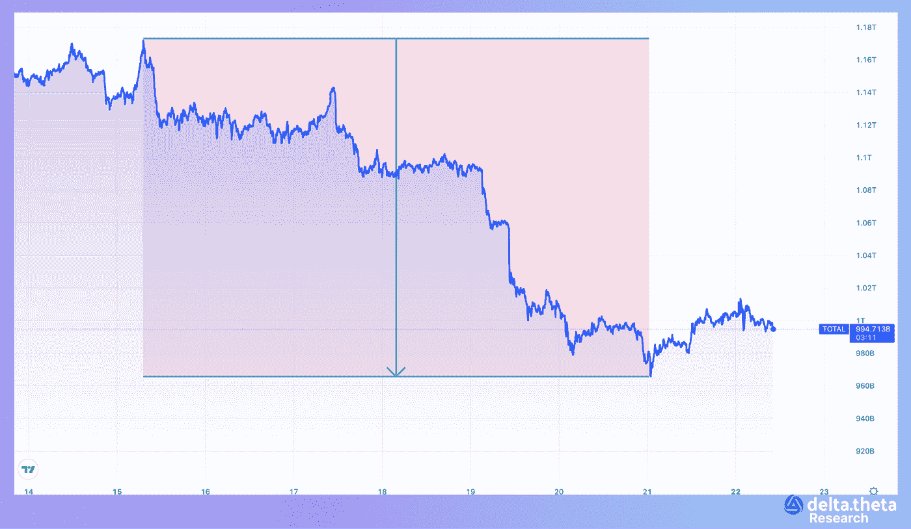

# 每周市场评论。守住防线！

> 原文：<https://medium.com/coinmonks/weekly-market-review-eth-hold-the-line-b33d6bdd7f98?source=collection_archive---------27----------------------->

在上周初达到 1.167 万亿美元的本地峰值后，加密货币总市值指数开始急剧下降。到本周中期，该指数为 1.089 万亿美元，到期末时已降至 9725 亿美元。最终跌幅达 16.6%。

比特币的情况大体上遵循了同样的模式。本周初，“第一种加密货币”的价格超过了 25 000 英镑(25 040 英镑)，但在达到当地峰值后，价格立即开始急剧下降。到本周中期，价格降至 23 400 英镑，到周末降至 20 960 英镑。截至周末，总跌幅为 16.3%。

尽管 Etherium network 的“合并”即将到来，但过去一周，该资产的价格与比特币的相关性相当强。Etherium 在比特币达到峰值的前一天达到当地峰值(约为 2016 美元的水平)，并在本周开始小幅走低(从 1908 美元开始)。然后进一步下降到 1564 年。一周跌幅达 18.02%。

# 新闻

面向中小型企业的 web3 存储解决方案 safe harbor[宣布完成 700 万美元的首轮融资](https://member.fintech.global/2022/08/22/singapores-safeheron-bags-7m-pre-series-a/)。本轮投资者包括风险投资公司云起合伙公司、混合风险投资和对冲基金 Webvision。其他投资者包括 M77 Ventures、Prime BlockVentures 和 Waterdrip Capital。总部位于新加坡的 Safenet 由 Wade Wang，Max He 和 Bruce Wang 于 2019 年创立。创始团队由科技行业的重量级人物组成:布鲁斯曾在腾讯和阿里巴巴的科技团队工作多年，而韦德在中国最大的演唱会票务电子商务平台 Damai.com 的创建过程中发挥了创始作用。

在加密货币市场动荡时期，Web3 投资基金 CoinFund [已经筹集了 3 亿美元](https://www.coindesk.com/business/2022/08/17/crypto-investment-firm-coinfund-launches-300m-web3-fund/)。这只新基金得到了机构投资者、家族理财室和加密货币初创企业创始人的支持。有限的合作伙伴包括德州教师退休系统、亚当斯街合作伙伴、StepStone 集团、Accolade Partners 和 Theta Capital Management。

由 Stable Universal 发行的稳定货币 HUSD 失去了与美元的联系，周四跌至 0.88 美元。stablecoin 目前的售价为 0.90 美元。价格下跌的第一阶段让位于恢复到 97 美分。然而，这种反弹是短暂的，因为资产再次下跌。价格下跌还导致可用于 HUSD 交易的流动性减少。流动性的减少可能是由于交易员退出了他们的 HUSD 头寸。目前，稳定的欧元几乎重新与美元挂钩。

大约 50 名加密货币隐私倡导者[在阿姆斯特丹的 Dam 广场参加了抗议逮捕 Tornado Cash 开发者 Alexei Pertsev](https://www.theblock.co/post/164657/developers-family-protest-arrest-of-tornado-cash-developer-in-amsterdam) 的活动。8 月 12 日，佩尔采夫在荷兰被荷兰当局逮捕，两天前，美国政府对 Tornado Cash 实施制裁，声称它被用于为朝鲜演员清洗被盗资金。荷兰当局声称，龙卷风现金背后的人从这些交易中获取了大量利润。抗议者认为，Pertsev 不应该为编写开源软件负责，不管它是如何被无良行为者使用的。

# 市场情况

自 8 月初以来，比特币继续在 18 000 至 25 000 的相对狭窄的通道内交易。尽管最近人们认为加密货币与传统市场高度相关，但值得注意的是，近几个月来，ETH 和 BTC 的价格动态明显不同。首先，在即将到来的区块链认证共识变化的背景下，ETH 表现出了独立和强大的表现。其次，在当地新闻的影响下，加密资产很容易失去对股票市场的锚定——这对于价格上涨和下跌都是如此。第三，尽管股市自 8 月初以来一直处于盘整区，但瑞士联邦理工学院和 BTC 更容易受到价格下跌的影响，由于 OFAC 方面可能阻止广泛地址的消息，这两家公司损失了大部分已获得的资本。

glassnode 的 onchain 分析也表明，即将到来的市场下跌可能会持续很长时间。假设当前的熊市与上一次熊市相似，评估价格低于平均买价的时间，可以得出结论，未来至少还有一个季度的不确定性和价格压力。

# 期权市场

周末前的价格下跌对 ETH 期权交易员的中期乐观情绪影响不大。购买执行价格在 3000-4500 之间的看涨期权仍然是最受欢迎的策略之一。此外，买入价差和“蝴蝶”的大宗交易非常受欢迎。BTC 和瑞士联邦理工学院之间的动态差异并没有被忽视，这导致了交叉波动交易——卖出瑞士联邦理工学院的期权，同时买入 BTC 的期权。

总体而言，尽管上周最后一个交易日出现大幅下跌，但市场仍保持相对稳定。面对可能增加的监管压力，对 DeFi 部门的战略前景和验证者的具体情况进行了重新评估，迄今为止，对以太坊网络中的“合并”产生了积极的预期。

> 交易新手？试试[加密交易机器人](/coinmonks/crypto-trading-bot-c2ffce8acb2a)或者[复制交易](/coinmonks/top-10-crypto-copy-trading-platforms-for-beginners-d0c37c7d698c)