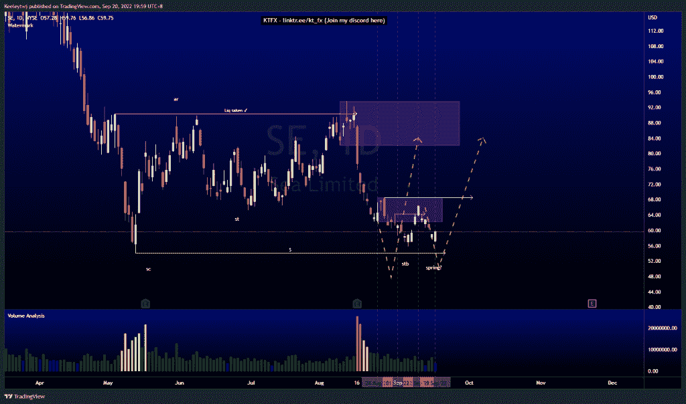
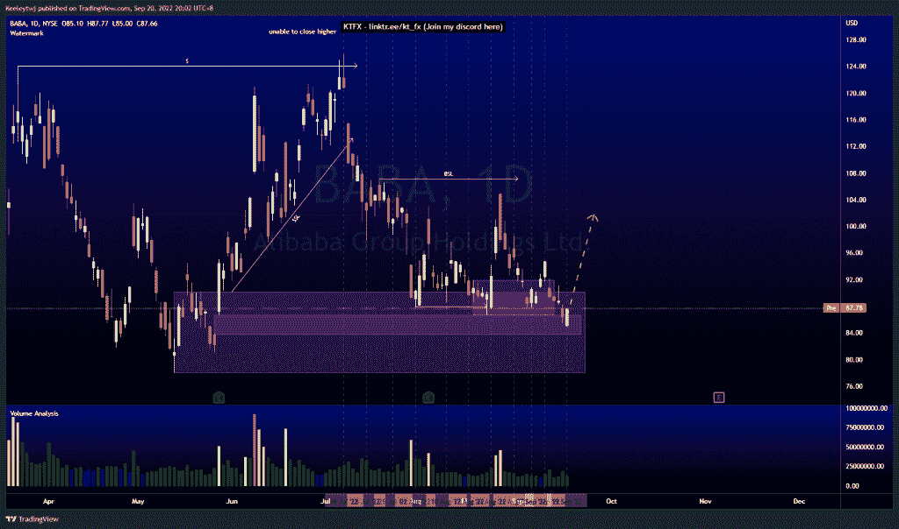
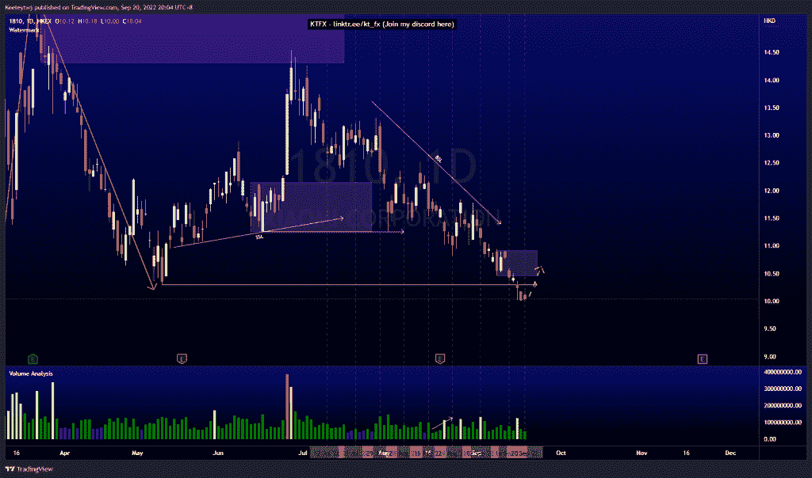

# 每周股票技术分析# 1810 #小米# SE #巴巴

> 原文：<https://medium.com/coinmonks/weekly-stocks-technical-analysis-1810-xiaomi-se-baba-873739eb0762?source=collection_archive---------42----------------------->

在这里找到更多关于我的信息(YouTube/Discord/Telegram):[https://www.linktr.ee/keeleytan](https://www.linktr.ee/keeleytan)

如果你觉得我的帖子有帮助，如果你能在这个帖子上给我一个赞，并关注我以后的类似帖子，我将不胜感激。

如果你同意，请在评论中告诉我你的想法。我在考虑尝试在 discord 上提供免费信号服务。如果你有兴趣，加入我们吧！

#SE

根据我最后的分析，价格正在上涨。价格在 62.15 缓解了看跌点，并走低。现在，我预计价格将根据威科夫累积图运行，通过潜在的 54.06 低点创造一个春天。

#巴巴

上周价格并没有像预期的那样上涨。我原本预计价格会从看涨点反弹至 91.93。然而，请注意，价格仍在 90.17 的主要看涨点内，价格可能会从这里缓解并反弹，同时填补 86.73 的公允价值缺口。

#1810

价格根据上周的分析结果而变化。我原本预计价格会在 10.30 低点，现在价格已经下跌了。目前，我预计上涨会有一个看涨回撤，可能会缓解 10.46 的看跌点。

如果你持有这些公司中的任何一家，就可以点赞、分享和评论！

让我知道，如果你有任何你想让我分析的行情。

一定要在其他社交平台上看看我，我在交易、分析和心理学上发布内容。看看我这里:【https://www.linktr.ee/keeleytan】T2

*原载于 2022 年 9 月 20 日 http://2minutesliteracy.wordpress.com***。**

> *交易新手？尝试[加密交易机器人](/coinmonks/crypto-trading-bot-c2ffce8acb2a)或[复制交易](/coinmonks/top-10-crypto-copy-trading-platforms-for-beginners-d0c37c7d698c)*