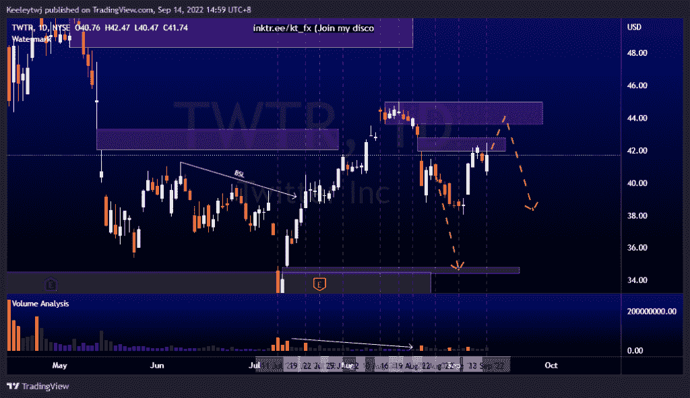
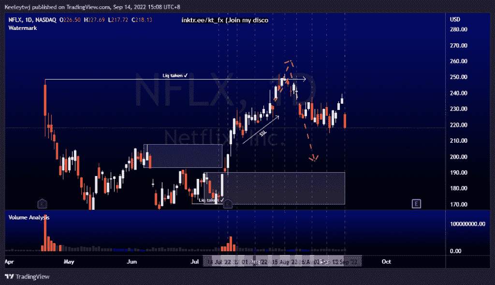
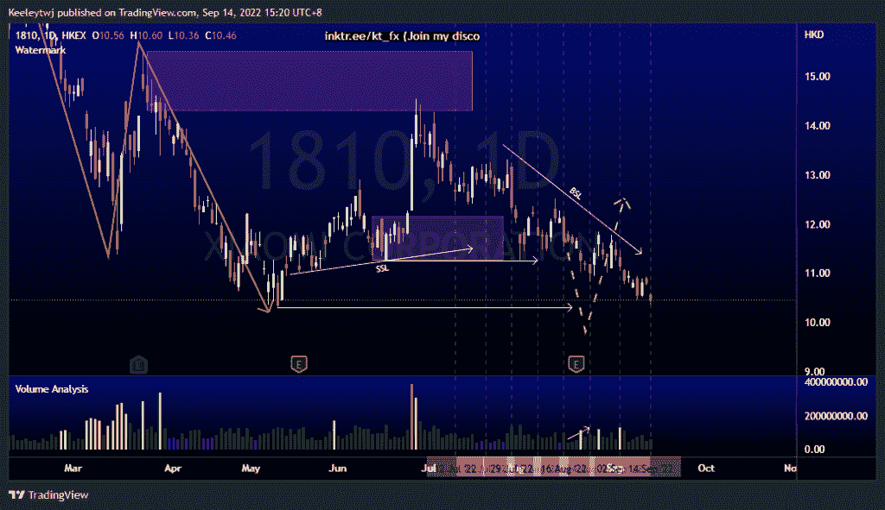

# 每周股票技术分析# 1810 #小米#TWTR #NFLX

> 原文：<https://medium.com/coinmonks/weekly-stocks-technical-analysis-1810-xiaomi-twtr-nflx-8064995ddd66?source=collection_archive---------42----------------------->

附注:我现在在海外，如果可以的话，我会尽量回复所有的问题！

在这里找到更多关于我的信息(YouTube/Discord/Telegram):[https://www.linktr.ee/keeleytan](https://www.linktr.ee/keeleytan)

如果你觉得我的帖子有帮助，如果你能在这个帖子上给我一个赞，并关注我以后的类似帖子，我将不胜感激。

如果你同意，请在评论中告诉我你的想法。我在考虑尝试在 discord 上提供免费信号服务。如果你有兴趣，加入我们吧！

#TWTR

价格并没有像前几周分析的那样发挥作用。我预计价格会下降，但它上升，以填补 41.94 的公允价值差距。现在，我预计价格将填补 34.80 的公允价值缺口。在走低之前，我们可能会看到 43.64 的轻微上行，以缓解看跌点。

#NFLX

当我预计价格会下跌时，价格正在巩固前几周。根据过去几周的分析，价格开始走低。我的期望没有改变。我预计价格将走低，以缓解 190.21 的看涨情绪。

#1810

根据上周的分析，价格正在上涨。我预计价格将根据威科夫累积图运行，并预计价格将在 10.30 的低点，在价格启动上升趋势之前创造一个春天。

如果你持有这些公司中的任何一家，就可以点赞、分享和评论！

让我知道，如果你有任何你想让我分析的行情。

一定要在其他社交平台上看看我，我在交易、分析和心理学上发布内容。看看我这里:【https://www.linktr.ee/keeleytan】T2

*原载于 2022 年 9 月 14 日***。**

> *交易新手？尝试[加密交易机器人](/coinmonks/crypto-trading-bot-c2ffce8acb2a)或[复制交易](/coinmonks/top-10-crypto-copy-trading-platforms-for-beginners-d0c37c7d698c)*