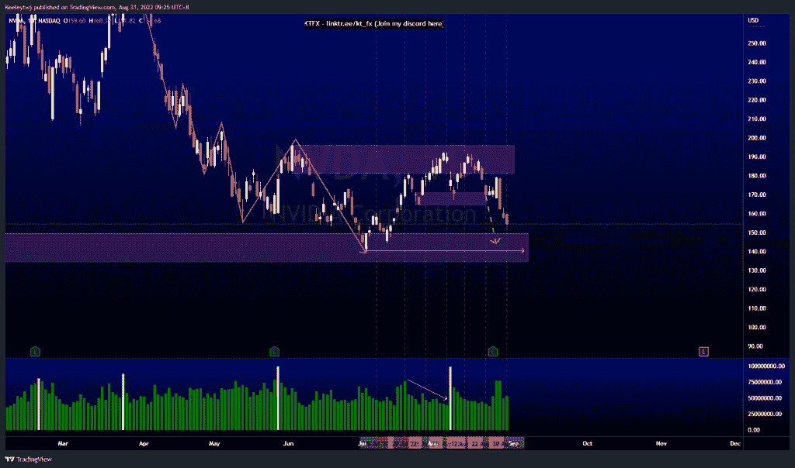
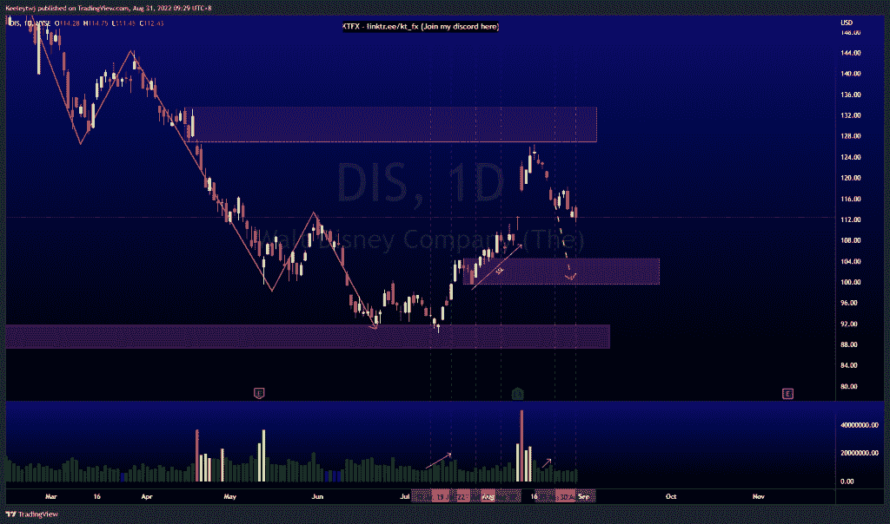
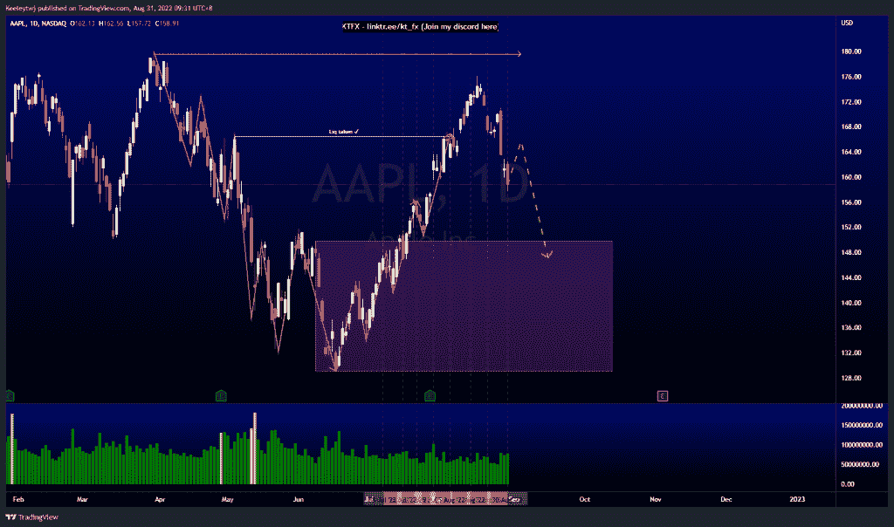

# 每周股票技术分析# AAPL #迪斯#NVDA

> 原文：<https://medium.com/coinmonks/weekly-stocks-technical-analysis-aapl-dis-nvda-592a608ad709?source=collection_archive---------40----------------------->

在这里找到更多关于我的信息(YouTube/Discord/Telegram):[https://www.linktr.ee/keeleytan](https://www.linktr.ee/keeleytan)

如果你觉得我的帖子有帮助，如果你能在这个帖子上给我一个赞，并关注我以后的类似帖子，我将不胜感激。

如果你同意，请在评论中告诉我你的想法。

#NVDA

价格的走势与上周的分析完全一致。我的期望没有改变。我预计价格将再次缓解 149.71 的看涨点，可能会在 140.55 的低点再次回调。

#DIS

上周价格在 117.33 的公允价值缺口处盘整。我预计价格会下跌，并带走卖方的流动性。现在，我们已经完全填补了这个空白。我仍然期待价格下降。这种下降趋势的可能目标是在 104.57 减轻看涨点。

#AAPL

普莱斯上周没有发挥出预期。我预计价格将从 167.81 的看涨点反弹，并在 179.61 的高点回落。价格向下突破了市场结构，引发了下跌趋势。此次下跌的下一个潜在目标是在 149.87 缓解每周看涨 POI。

我在考虑尝试在 discord 上提供免费信号服务。如果你有兴趣，请给我发邮件，让我在那里扮演一个角色！

如果你持有这些公司中的任何一家，就可以点赞、分享和评论！

让我知道，如果你有任何你想让我分析的行情。

一定要在其他社交平台上看看我，我在交易、分析和心理学上发布内容。看看我这里:【https://www.linktr.ee/keeleytan】T2

*原载于 2022 年 8 月 31 日 http://2minutesliteracy.wordpress.com***。**

> *交易新手？尝试[加密交易机器人](/coinmonks/crypto-trading-bot-c2ffce8acb2a)或[复制交易](/coinmonks/top-10-crypto-copy-trading-platforms-for-beginners-d0c37c7d698c)*