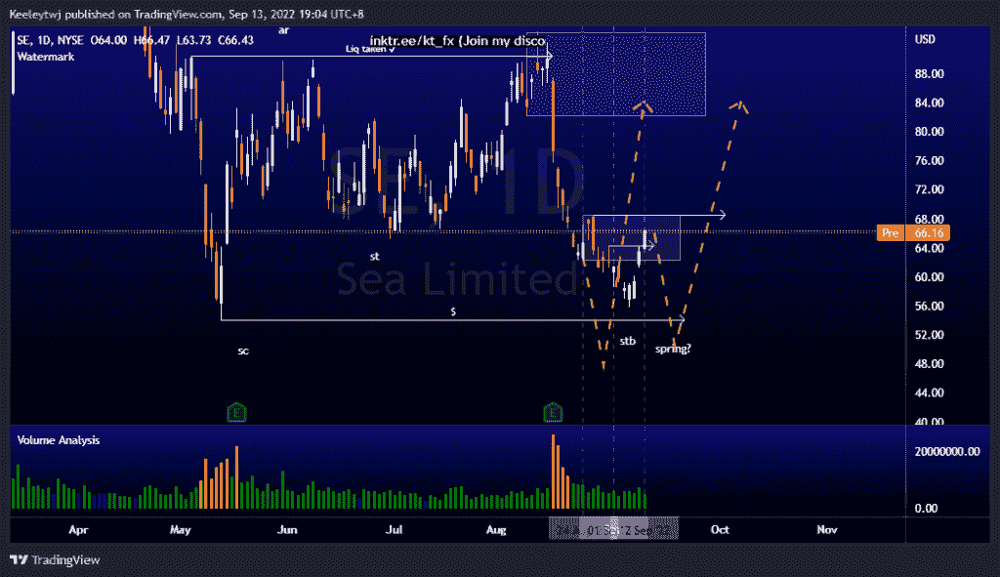
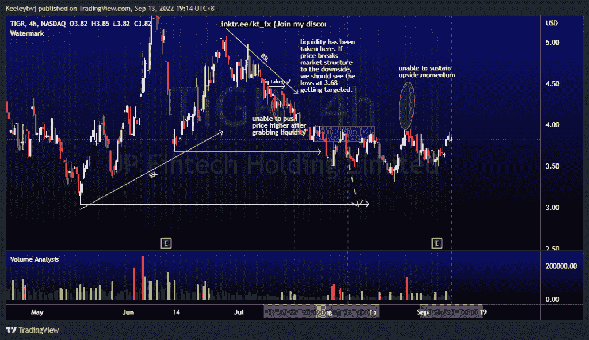
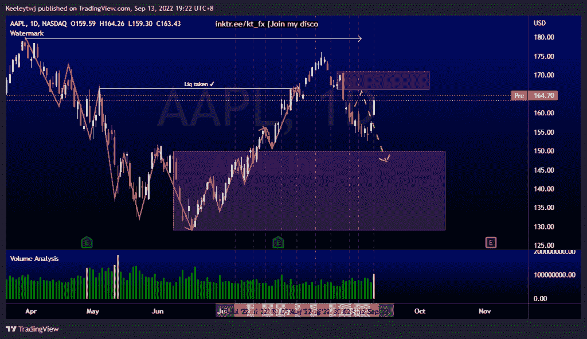

# 每周股票技术分析# AAPL #东南# TIGR

> 原文：<https://medium.com/coinmonks/weekly-stocks-technical-analysis-aapl-se-tigr-1d358bb93a15?source=collection_archive---------45----------------------->

附注:我现在在海外，如果可以的话，我会尽量回复所有的问题！

在这里找到更多关于我的信息(YouTube/Discord/Telegram):[https://www.linktr.ee/keeleytan](https://www.linktr.ee/keeleytan)

如果你觉得我的帖子有帮助，如果你能在这个帖子上给我一个赞，并关注我以后的类似帖子，我将不胜感激。

如果你同意，请在评论中告诉我你的想法。我在考虑尝试在 discord 上提供免费信号服务。如果你有兴趣，加入我们吧！

#SE

我预计价格将在 54.06 低点，形成威科夫累积图的春天。价格目前向上突破了次要结构，缓解了 62.15 的看跌点。根据我最初的预期，我预计价格会下降。

#TIGR

价格目前处于盘整状态。根据我上次的分析，我预计 3.04 的低点会被拿下。8 月 26 日，我们推动了价格的上涨，但上涨势头没有持续，价格下跌，收盘低于开盘价。现在，我的预期是不变的，价格应该会在 3.04 低点。

#AAPL

上周，我预计价格将上涨，并缓解 166.25 的看跌点，但价格反而巩固。目前，价格按照预期运行良好。我最初的预期仍然成立，一旦价格在 166.25 削弱了看跌点，我们应该会看到一个看跌回撤。

如果你持有这些公司中的任何一家，就可以点赞、分享和评论！

让我知道，如果你有任何你想让我分析的行情。

一定要在其他社交平台上看看我，我在交易、分析和心理学上发布内容。看看我这里:【https://www.linktr.ee/keeleytan】T2

*原载于 2022 年 9 月 13 日 http://2minutesliteracy.wordpress.com***。**

> *交易新手？尝试[加密交易机器人](/coinmonks/crypto-trading-bot-c2ffce8acb2a)或[复制交易](/coinmonks/top-10-crypto-copy-trading-platforms-for-beginners-d0c37c7d698c)*