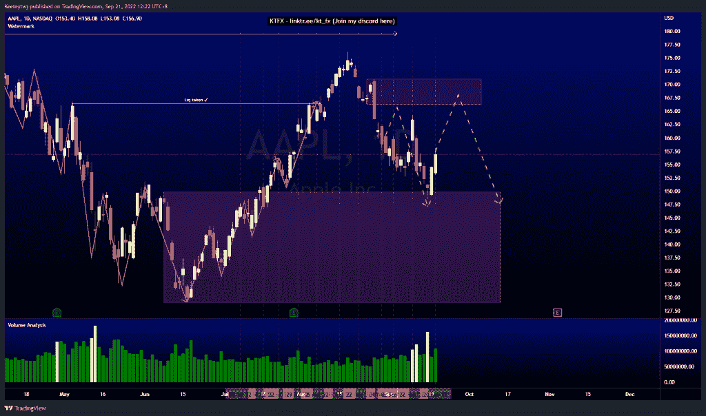

# 每周股票技术分析# AAPL # TSLA #谷歌

> 原文：<https://medium.com/coinmonks/weekly-stocks-technical-analysis-aapl-tsla-goog-833c3605da5d?source=collection_archive---------20----------------------->

在这里找到更多关于我的信息(YouTube/Discord/Telegram):[https://www.linktr.ee/keeleytan](https://www.linktr.ee/keeleytan)

如果你觉得我的帖子有帮助，如果你能在这个帖子上给我一个赞，并关注我以后的类似帖子，我将不胜感激。

如果你同意，请在评论中告诉我你的想法。我在考虑尝试在 discord 上提供免费信号服务。如果你有兴趣，加入我们吧！

#AAPL

价格错过了看跌点 166.25，并如预期的那样从那里抛出。价格也减轻了 149.87 的看涨点，并作出了反应。现在，我预计在下跌之前，多头将再次回撤至空头的 166.25 点。

#GOOG

根据我上次的分析，价格表现相对较好。价格在 108.42 填补了公允价值缺口，但几乎触及 113.78 的看跌点，并从那里下跌。价格跌至 104.76 和 102.21 的低点。我预计价格将在接下来的 110.93 点对公允价值缺口进行看涨回撤。

#TSLA

根据我最后的分析，价格已经上涨了。价格目前处于熊市点 282.68。价格可能会从这里下跌，但在过去几周的两次下跌后，看跌势头无法持续。价格更有可能在再次下跌之前走向 355.55 的熊市点。

如果你持有这些公司中的任何一家，就可以点赞、分享和评论！

让我知道，如果你有任何你想让我分析的行情。

一定要在其他社交平台上看看我，我在交易、分析和心理学上发布内容。看看我这里:【https://www.linktr.ee/keeleytan】T2

*原载于 2022 年 9 月 21 日 http://2minutesliteracy.wordpress.com***。**

> *交易新手？尝试[加密交易机器人](/coinmonks/crypto-trading-bot-c2ffce8acb2a)或[复制交易](/coinmonks/top-10-crypto-copy-trading-platforms-for-beginners-d0c37c7d698c)*