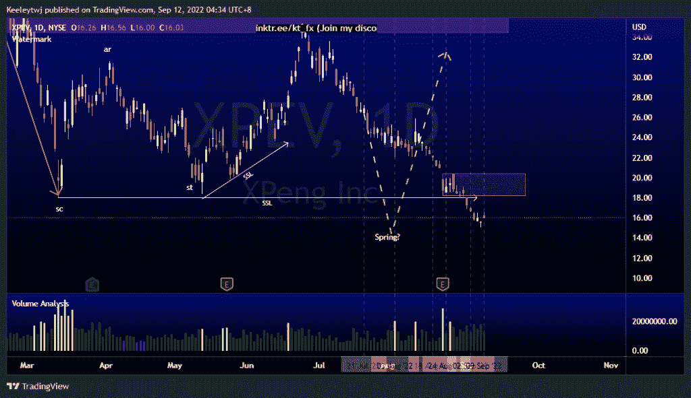

# 每周股票技术分析#AMD #PLTR #XPEV

> 原文：<https://medium.com/coinmonks/weekly-stocks-technical-analysis-amd-pltr-xpev-a21e9b8de818?source=collection_archive---------25----------------------->

附注:我现在在海外，如果可以的话，我会尽量回复所有的问题！

在这里找到更多关于我的信息(YouTube/Discord/Telegram):[https://www.linktr.ee/keeleytan](https://www.linktr.ee/keeleytan)

如果你觉得我的帖子有帮助，如果你能在这个帖子上给我一个赞，并关注我以后的类似帖子，我将不胜感激。

如果你同意，请在评论中告诉我你的想法。我在考虑尝试在 discord 上提供免费信号服务。如果你有兴趣，加入我们吧！

#XPEV

价格与上周的预期相符。现在，如果这是一个威科夫积累的示意图，我们应该看到价格向上突破市场结构。我们也看到在最后一轮下跌中，成交量有所增加，但无法压低价格。我想看到上升的突破和确认多头的交易量。

#PLTR

我预计价格将继续下跌至 7 美元的心理价位。价格反而上涨了。从这里开始，我预计价格将在 8.00 缓解看跌点，并可能继续下跌趋势。

#AMD

价格的走势与上周的分析完全一致。价格从 80.47 的看涨点反弹，并从低点上涨了 10%。此次上涨的潜在目标是 90.90 的看跌点。

如果你持有这些公司中的任何一家，就可以点赞、分享和评论！

让我知道，如果你有任何你想让我分析的行情。

一定要在其他社交平台上看看我，我在交易、分析和心理学上发布内容。看看我这里:【https://www.linktr.ee/keeleytan】T2

*原载于 2022 年 9 月 11 日***。**

> *交易新手？尝试[加密交易机器人](/coinmonks/crypto-trading-bot-c2ffce8acb2a)或[复制交易](/coinmonks/top-10-crypto-copy-trading-platforms-for-beginners-d0c37c7d698c)*