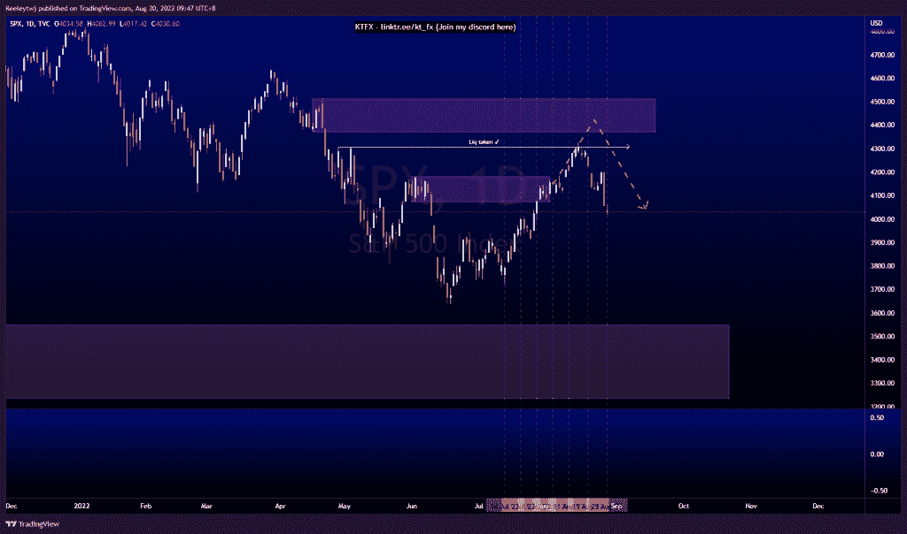
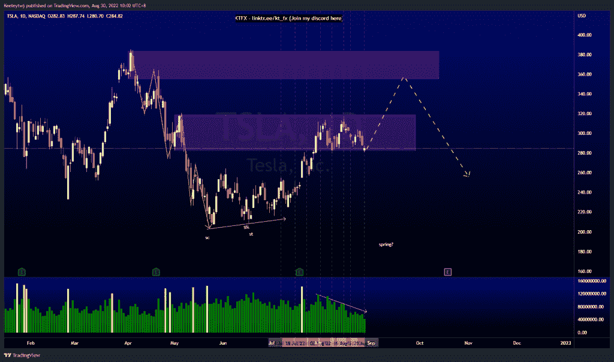
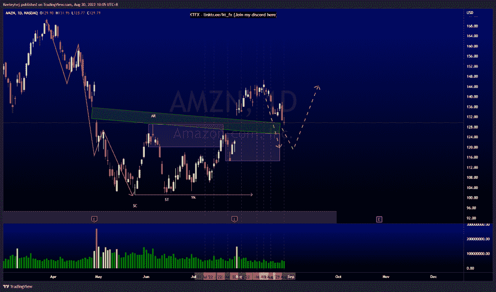

# 每周股票技术分析#AMZN #TSLA #SPX

> 原文：<https://medium.com/coinmonks/weekly-stocks-technical-analysis-amzn-tsla-spx-7d438093efed?source=collection_archive---------28----------------------->

在这里找到更多关于我的信息(YouTube/Discord/Telegram):[https://www.linktr.ee/keeleytan](https://www.linktr.ee/keeleytan)

如果你觉得我的帖子有帮助，如果你能在这个帖子上给我一个赞，并关注我以后的类似帖子，我将不胜感激。

如果你同意，请在评论中告诉我你的想法。

#SPX

在我上周的分析中，价格总体表现良好。价格在 4308.45 处获得流动性，无法收于上方。我预计在 4370.30 的看跌点会出现流动性紧张和缓解。价格早于预期反转，打破了市场向下的结构。现在，价格似乎已经开始下跌。如果我是对的，那么我在 2 个月前的原始偏见将是这一举动，即在 3549.85 减轻看涨的兴趣点。

#TSLA

股票分割后，价格如预期下跌。现在，价格在 282.68 减轻了看跌点。我最初期待威科夫积累的示意图，并期待价格下降到 206 以下，创造一个春天。然而，我们看到现在交易量正在下降。我预计价格将反弹至 355.55 点。

#AMZN

价格的走势与上周的分析完全一致。价格目前正在填补岛屿缺口，这也与价格可能从 125.50 反弹的看涨点一致。目前，短期明智的做法是价格下跌，以填补缺口并缓解看涨情绪。

我在考虑尝试在 discord 上提供免费信号服务。如果你有兴趣，请给我发邮件，让我在那里扮演一个角色！

如果你持有这些公司中的任何一家，就可以点赞、分享和评论！

让我知道，如果你有任何你想让我分析的行情。

一定要在其他社交平台上看看我，我在交易、分析和心理学上发布内容。看看我这里:【https://www.linktr.ee/keeleytan】T2

*原载于 2022 年 8 月 30 日 http://2minutesliteracy.wordpress.com***。**

> *交易新手？尝试[加密交易机器人](/coinmonks/crypto-trading-bot-c2ffce8acb2a)或[复制交易](/coinmonks/top-10-crypto-copy-trading-platforms-for-beginners-d0c37c7d698c)*