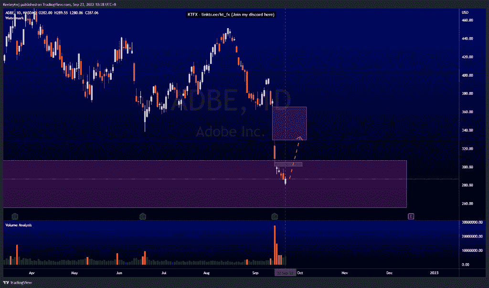
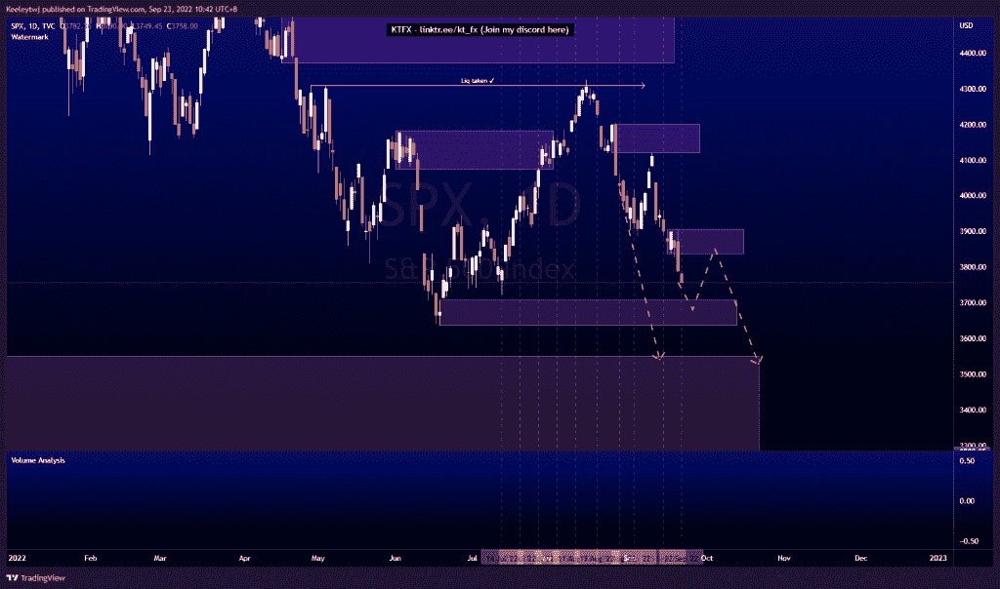
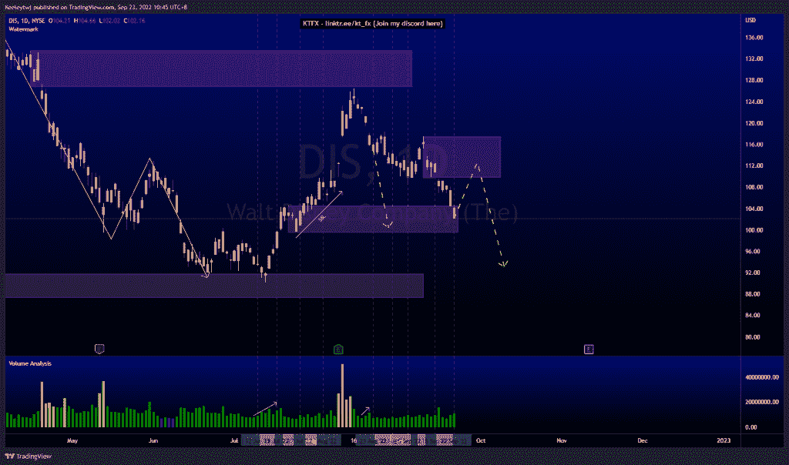

# 每周股票技术分析#DIS #ADBE #SPX

> 原文：<https://medium.com/coinmonks/weekly-stocks-technical-analysis-dis-adbe-spx-6c1b7a7f8501?source=collection_archive---------47----------------------->

在这里找到更多关于我的信息(YouTube/Discord/Telegram):[https://www.linktr.ee/keeleytan](https://www.linktr.ee/keeleytan)

如果你觉得我的帖子有帮助，如果你能在这个帖子上给我一个赞，并关注我以后的类似帖子，我将不胜感激。

如果你同意，请在评论中告诉我你的想法。我在考虑尝试在 discord 上提供免费信号服务。如果你有兴趣，加入我们吧！

#ADBE

在收益电话大幅下降后，Price 目前正在缓解 Q1 2020 年创造的看涨 POI。有一个巨大的缺口需要填补，预计在缓解后将从这里开始一个看涨的回撤。第一个目标是 305.00 的缺口，随后是 329.00。

#SPX

根据我之前的分析，价格运行良好。目前，我预计价格将继续下跌至 3549.85 的看涨点。价格仍有可能从 3707.71 的看涨点反弹至 3837.08 的看跌点，以减轻风险。

#DIS

过去几周的价格走势与分析完全一致。价格目前正在缓解 104.57 的看涨点。我预计看涨回撤至看跌点 109.88，并沿着看跌订单流继续走低。

如果你持有这些公司中的任何一家，就可以点赞、分享和评论！

让我知道，如果你有任何你想让我分析的行情。

一定要在其他社交平台上看看我，我在交易、分析和心理学上发布内容。看看我这里:【https://www.linktr.ee/keeleytan】T2

*原载于 2022 年 9 月 23 日 http://2minutesliteracy.wordpress.com***。**

> *交易新手？尝试[加密交易机器人](/coinmonks/crypto-trading-bot-c2ffce8acb2a)或[复制交易](/coinmonks/top-10-crypto-copy-trading-platforms-for-beginners-d0c37c7d698c)*