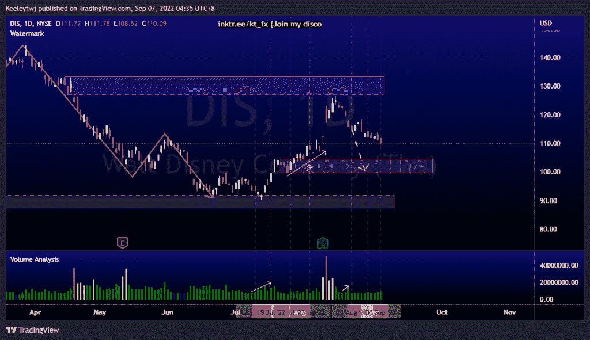
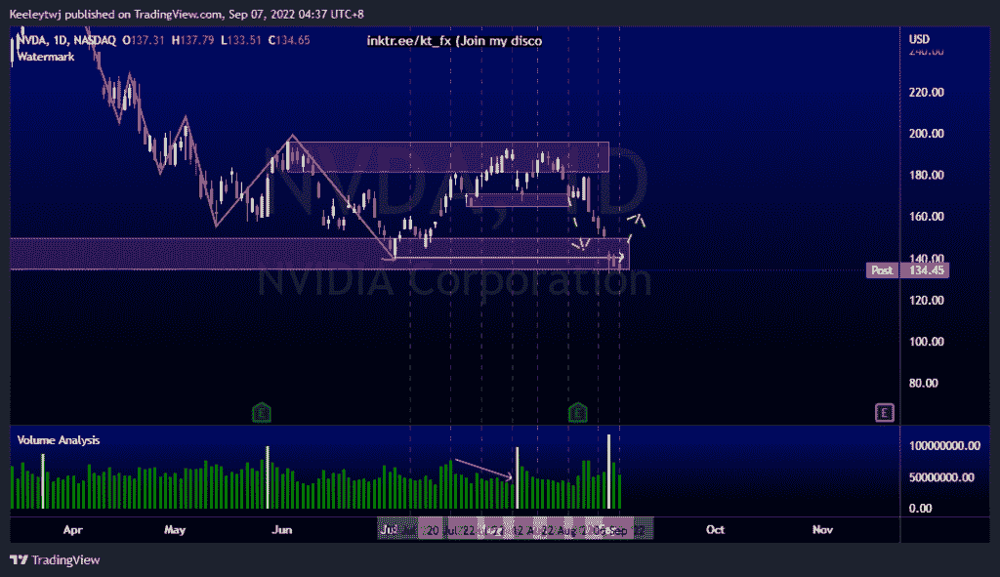
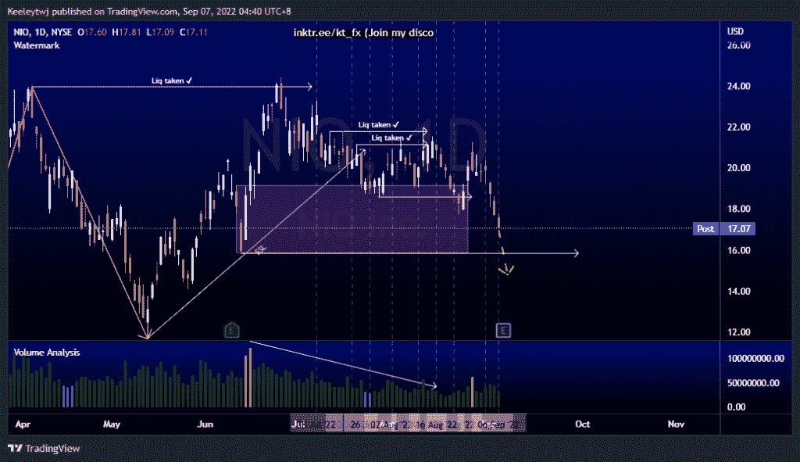

# 每周股票技术分析#DIS #NVDA #NIO

> 原文：<https://medium.com/coinmonks/weekly-stocks-technical-analysis-dis-nvda-nio-fb91d548edcc?source=collection_archive---------42----------------------->

在这里找到更多关于我的信息(YouTube/Discord/Telegram):[https://www.linktr.ee/keeleytan](https://www.linktr.ee/keeleytan)

如果你觉得我的帖子有帮助，如果你能在这个帖子上给我一个赞，并关注我以后的类似帖子，我将不胜感激。

如果你同意，请在评论中告诉我你的想法。我在考虑尝试在 discord 上提供免费信号服务。如果你有兴趣，加入我们吧！

#DIS

价格的走势与我上次的分析完全一致。价格正朝着 104.57 的看涨点前进。我预计价格将继续下跌，以缓解看涨情绪。

#NVDA

过去几周的价格分析显示。价格已经使 140.55 的看涨点失效。目前，我们看到价格无法推低，交易量一直在下降。我预计价格会从这里做一些看涨回撤。

#NIO

价格并没有按照我上次分析的预期发挥作用。价格更深地进入看涨 POI，并朝着 15.84 的低点前进。由于明天是收益，如果收益没有达到预期，价格可能会突破低点。

如果你持有这些公司中的任何一家，就可以点赞、分享和评论！

让我知道，如果你有任何你想让我分析的行情。

一定要在其他社交平台上看看我，我在交易、分析和心理学上发布内容。看看我这里:【https://www.linktr.ee/keeleytan】T2

种类

贴在[技术分析](https://2minutesliteracy.wordpress.com/category/technical-analysis/)

*原载于 2022 年 9 月 6 日 http://2minutesliteracy.wordpress.com**[*。*](https://2minutesliteracy.wordpress.com/2022/09/07/weekly-stocks-technical-analysis-dis-nvda-nio/)*

> *交易新手？尝试[加密交易机器人](/coinmonks/crypto-trading-bot-c2ffce8acb2a)或[复制交易](/coinmonks/top-10-crypto-copy-trading-platforms-for-beginners-d0c37c7d698c)*