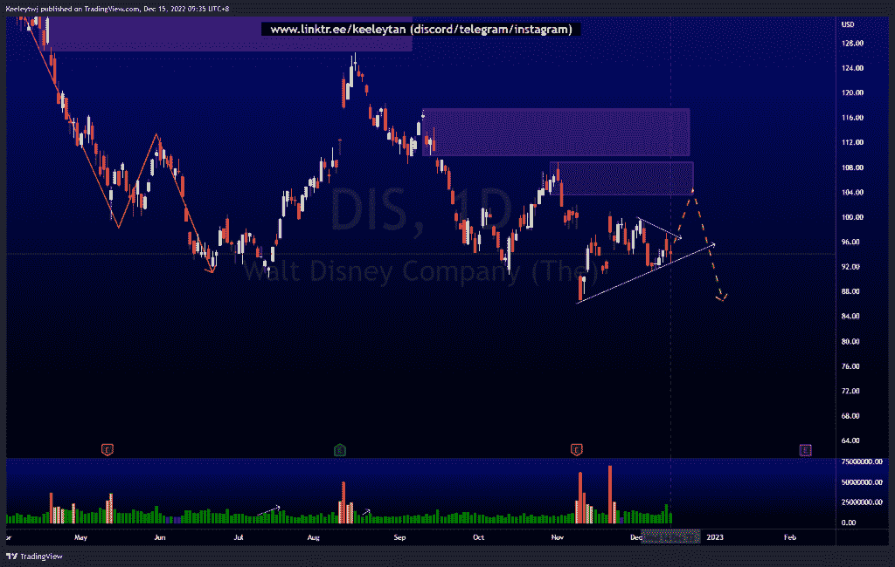
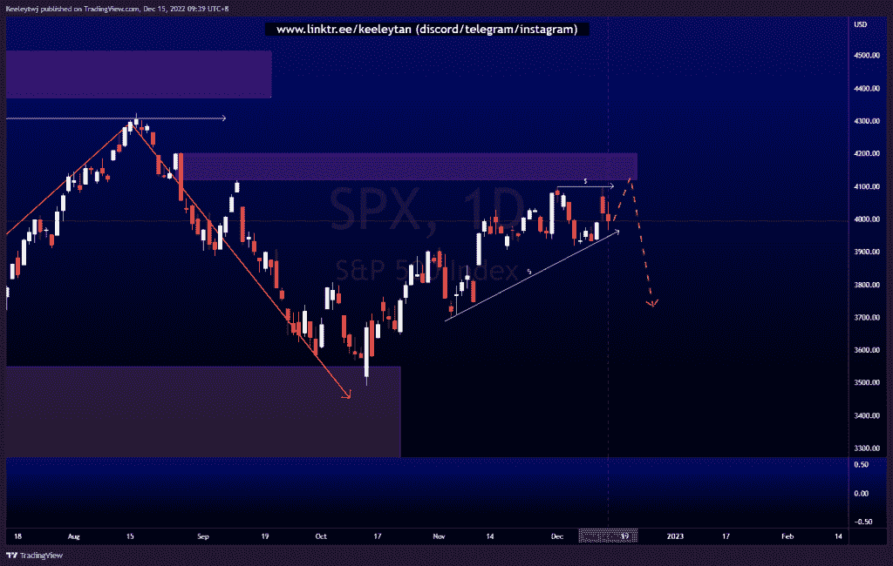
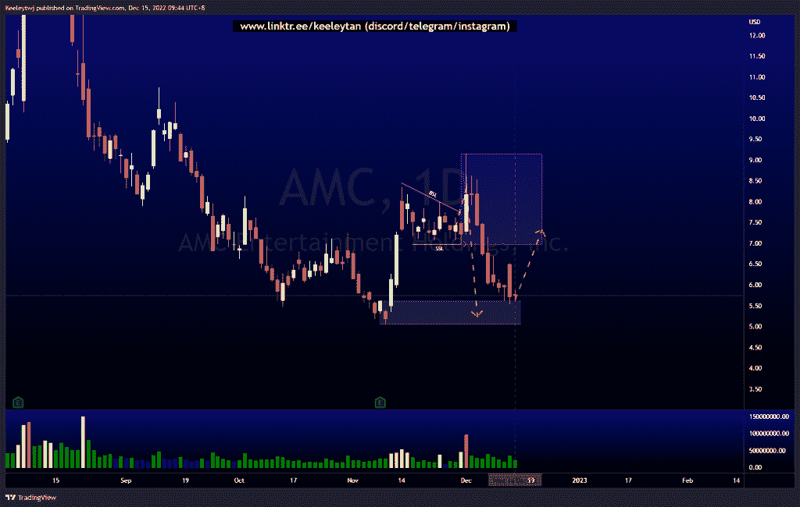

# 每周股票技术分析#DIS #SPX #AMC

> 原文：<https://medium.com/coinmonks/weekly-stocks-technical-analysis-dis-spx-amc-3f81f120c6e0?source=collection_archive---------33----------------------->

在这里了解更多关于我的信息(YouTube/insta gram/Telegram):[https://www.linktr.ee/keeleytan](https://www.linktr.ee/keeleytan)

如果你觉得我的帖子有帮助，如果你能在这个帖子上给我一个赞，并关注我以后的类似帖子，我将不胜感激。如果您有任何意见/反馈，请随时使用上面的谷歌表单链接。

不和谐的免费信号服务正式启动。如果你感兴趣的话，去我的不和谐看看吧！

#DIS

自收益公布以来，价格已经盘整了几个星期。有很多卖方流动性正在增加，而买方流动性最近也在增加。我预计，如果价格想走低，价格将首先消除买方流动性，并缓解 108.84 的看跌点。

[https://www . trading view . com/chart/DIS/qtqxtm 1 f-DIS-Analysis/](https://www.tradingview.com/chart/DIS/QTqXtm1f-DIS-Analysis/)

#SPX

考虑到较高的时间框架看跌点，价格几周以来一直呈上升趋势。价格最近创造了同样的高点，同时创造了大量的卖方流动性。我预计价格将在 4119.97 的高点下跌并缓解看跌点，然后下跌以消除卖方流动性。

[https://www . trading view . com/chart/SPX/S1 v9 shaz-SPX-Analysis/](https://www.tradingview.com/chart/SPX/s1V9sHAZ-SPX-Analysis/)

#AMC

根据我的分析，价格一直表现良好。Price 在接受卖方流动性之前先接受买方流动性，以缓解当前 5.05 的看涨 POI。如果价格想走得更高，这个看涨 POI 将受到尊重，我们将看到至少在 6.96 新形成的看跌 POI 的反应。无论如何，我预计价格会从这里做一个看涨的回撤。

[https://www . trading view . com/chart/AMC/zw 1 xdv 2t-AMC-Analysis/](https://www.tradingview.com/chart/AMC/zw1xdV2t-AMC-Analysis/)

如果你持有这些公司中的任何一家，就可以点赞、分享和评论！

让我知道，如果你有任何你想让我分析的行情。

一定要在其他社交平台上看看我，我在交易、分析和心理学上发布内容。看看我这里:[https://www.linktr.ee/keeleytan](https://www.linktr.ee/keeleytan)

*原载于 2022 年 12 月 15 日 http://2minutesliteracy.wordpress.com***。**

> **交易新手？试试* [*密码交易机器人*](/coinmonks/crypto-trading-bot-c2ffce8acb2a) *或* [*复制交易*](/coinmonks/top-10-crypto-copy-trading-platforms-for-beginners-d0c37c7d698c)*
> 
> **分散密码持有量，了解* [*币安替代品*](https://coincodecap.com/binance-alternatives)*
> 
> **加入 Coinmonks* [*电报频道*](https://t.me/coincodecap) *和* [*Youtube 频道*](https://www.youtube.com/c/coinmonks/videos) *获取每日* [*加密新闻*](http://coincodecap.com/)*

# *另外，阅读*

*   *[复制交易](/coinmonks/top-10-crypto-copy-trading-platforms-for-beginners-d0c37c7d698c) | [加密税务软件](/coinmonks/crypto-tax-software-ed4b4810e338)*
*   *[网格交易](https://coincodecap.com/grid-trading) | [加密硬件钱包](/coinmonks/the-best-cryptocurrency-hardware-wallets-of-2020-e28b1c124069)*
*   *[密码电报信号](/coinmonks/top-3-telegram-channels-for-crypto-traders-in-2021-8385f4411ff4) | [密码交易机器人](/coinmonks/crypto-trading-bot-c2ffce8acb2a)*
*   *[最佳加密交易所](/coinmonks/crypto-exchange-dd2f9d6f3769) | [印度最佳加密交易所](/coinmonks/bitcoin-exchange-in-india-7f1fe79715c9)*
*   *[面向开发者的最佳加密 API](/coinmonks/best-crypto-apis-for-developers-5efe3a597a9f)*
*   *最佳[密码借贷平台](/coinmonks/top-5-crypto-lending-platforms-in-2020-that-you-need-to-know-a1b675cec3fa)*
*   *[免费加密信号](/coinmonks/free-crypto-signals-48b25e61a8da) | [加密交易机器人](/coinmonks/crypto-trading-bot-c2ffce8acb2a)*
*   *杠杆代币的终极指南*