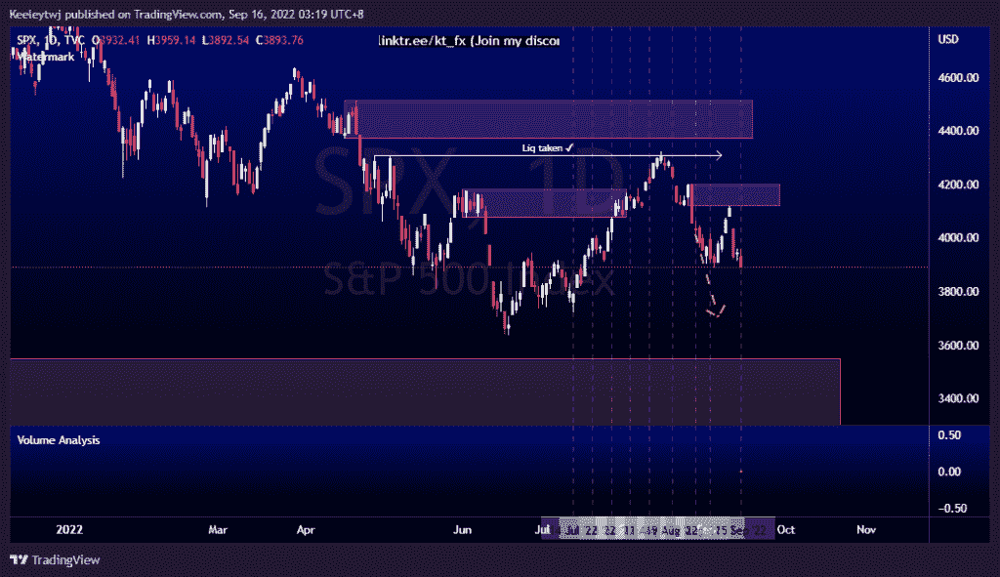
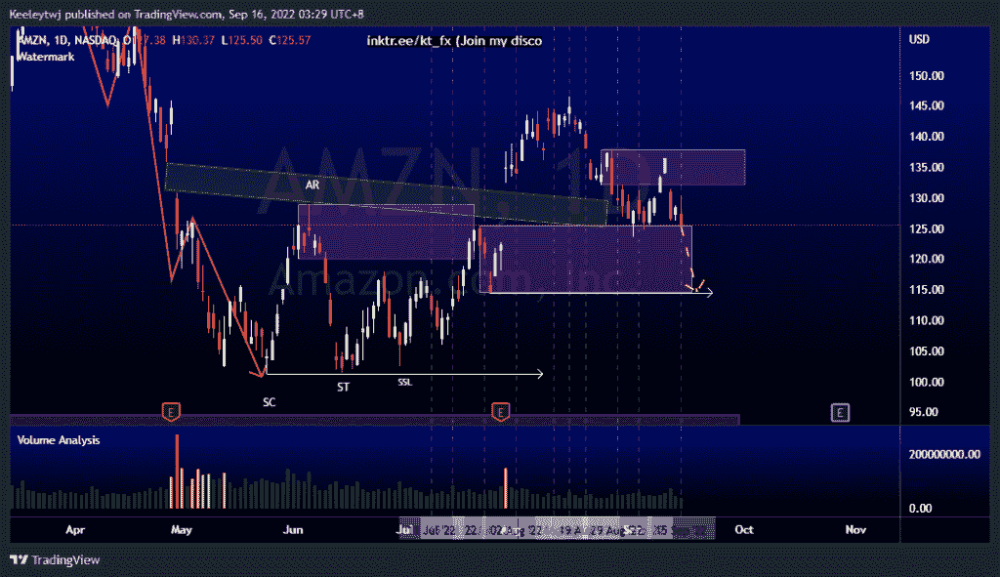
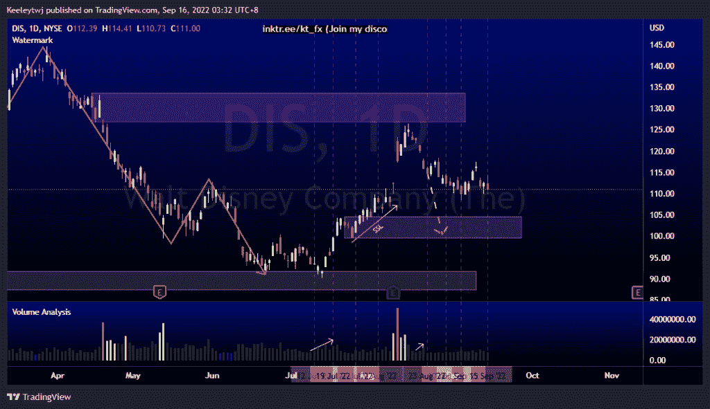

# 每周股票技术分析#DIS #SPX #AMZN

> 原文：<https://medium.com/coinmonks/weekly-stocks-technical-analysis-dis-spx-amzn-d2b3b4a4a1db?source=collection_archive---------33----------------------->

附注:我现在在海外，如果可以的话，我会尽量回复所有的问题！

在这里找到更多关于我的信息(YouTube/Discord/Telegram):[https://www.linktr.ee/keeleytan](https://www.linktr.ee/keeleytan)

如果你觉得我的帖子有帮助，如果你能在这个帖子上给我一个赞，并关注我以后的类似帖子，我将不胜感激。

如果你同意，请在评论中告诉我你的想法。我在考虑尝试在 discord 上提供免费信号服务。如果你有兴趣，加入我们吧！

#SPX

我上周的分析没有变化。上周，我预计价格会走低，但在回落之前，价格走高以缓解 4119.97 的看跌情绪。现在，我的预期仍然是一样的，价格会走低，并在 3549.85 减轻看涨的 POI。

#AMZN

价格完全按照上周的分析运行，价格从 125.50 反弹。价格在 132.10 缓解了看跌点，并从那里向下跳空。最近价格走势表明没有上涨的势头。现在，我预计价格将进一步缓解 132.10 的看跌点，并可能在 114.53 的低点。

#DIS

自从我上次分析后，价格稳定了。我的期望仍然没有改变。我仍然预计价格将走低，以缓解 104.57 的看涨点，并带走卖方流动性。

如果你持有这些公司中的任何一家，就可以点赞、分享和评论！

让我知道，如果你有任何你想让我分析的行情。

一定要在其他社交平台上看看我，我在交易、分析和心理学上发布内容。看看我这里:【https://www.linktr.ee/keeleytan】T2

*原载于 2022 年 9 月 15 日 http://2minutesliteracy.wordpress.com***。**

> *交易新手？尝试[加密交易机器人](/coinmonks/crypto-trading-bot-c2ffce8acb2a)或[复制交易](/coinmonks/top-10-crypto-copy-trading-platforms-for-beginners-d0c37c7d698c)*