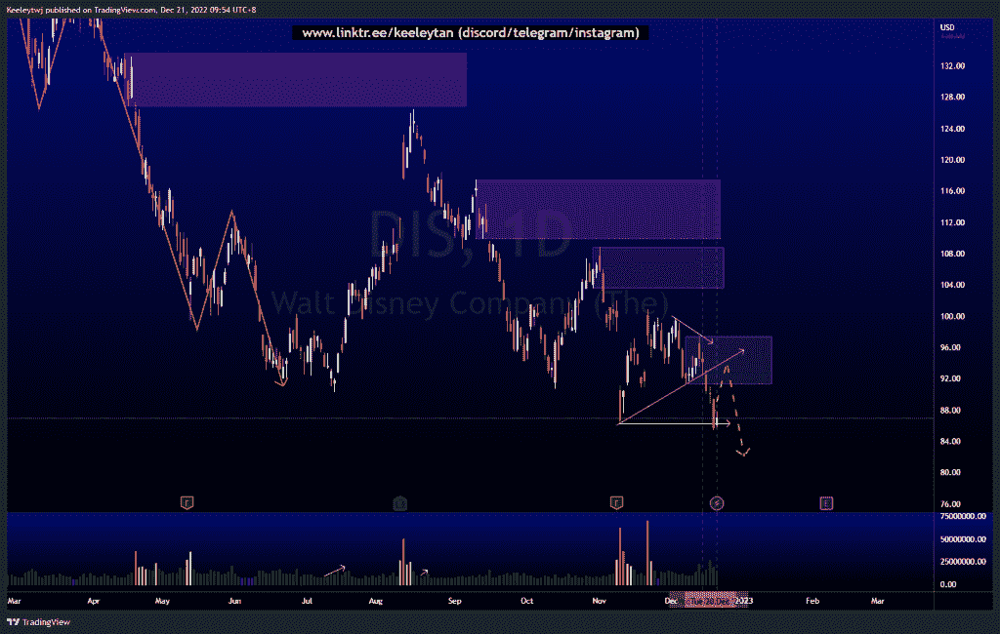
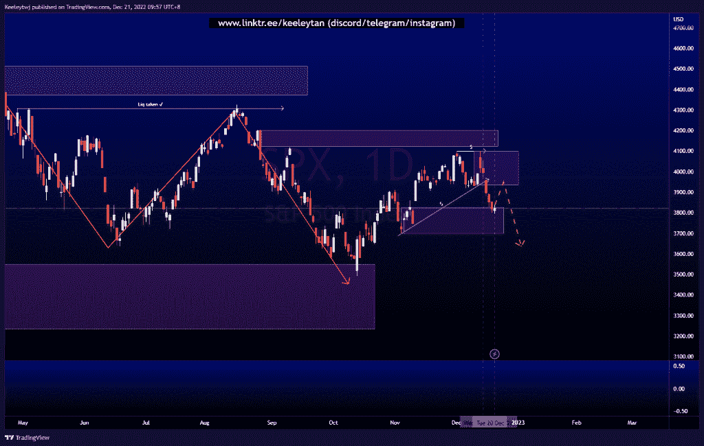
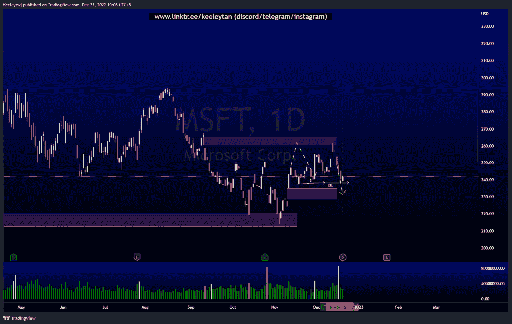

# 每周股票技术分析#DIS #SPX #MSFT

> 原文：<https://medium.com/coinmonks/weekly-stocks-technical-analysis-dis-spx-msft-9b9a321aa0fe?source=collection_archive---------47----------------------->

在这里了解更多关于我的信息(YouTube/insta gram/Telegram):[https://www.linktr.ee/keeleytan](https://www.linktr.ee/keeleytan)

如果你觉得我的帖子有帮助，如果你能在这个帖子上给我一个赞，并关注我以后的类似帖子，我将不胜感激。如果您有任何意见/反馈，请随时使用上面的谷歌表单链接。

#DIS

价格没有像上周分析的那样发挥作用，即消除买方流动性，并在下跌前缓解 108.84 的看跌点。普莱斯首先剔除了卖方流动性。价格在 86.28 时也考虑了流动性，现在在较低的时间框架上显示出特征的变化。我预计接下来价格将回撤至 97.39 的看跌点。

[https://www . trading view . com/chart/DIS/h 78 pkrdb-DIS-Analysis/](https://www.tradingview.com/chart/DIS/h78pkrdB-DIS-Analysis/)

#SPX

价格已经采取了卖方流动性的预期，打破市场结构下行。然而，价格目前正在 3828.10 处缓解看涨 POI，必须做出价格走高或走低的决定。目前，回撤至上行的可能性更大。

[https://www . trading view . com/chart/SPX/xwk 1 huec-SPX-Analysis/](https://www.tradingview.com/chart/SPX/XwK1HUec-SPX-Analysis/)

#MSFT

根据上周的分析，价格运行良好。价格尚未消除卖方流动性，并通过在 238.21 点创造同等低点，创造了更多的流动性。我预计价格将从这里继续走低，至少进入 235.00 的公允价值缺口。

[https://www . trading view . com/chart/MSFT/OcsOGPrZ-MSFT-Analysis/](https://www.tradingview.com/chart/MSFT/OcsOGPrZ-MSFT-Analysis/)

不和谐的免费信号服务正式启动。如果你感兴趣的话，去我的不和谐看看吧！

如果你持有这些公司中的任何一家，就可以点赞、分享和评论！

让我知道，如果你有任何你想让我分析的行情。

一定要在其他社交平台上看看我，我在交易、分析和心理学上发布内容。看看我这里:[https://www.linktr.ee/keeleytan](https://www.linktr.ee/keeleytan)

*原载于 2022 年 12 月 21 日 https://2minutesliteracy.wordpress.com***。**

> **交易新手？试试* [*密码交易机器人*](/coinmonks/crypto-trading-bot-c2ffce8acb2a) *或* [*复制交易*](/coinmonks/top-10-crypto-copy-trading-platforms-for-beginners-d0c37c7d698c)*
> 
> **分散密码持有量，了解* [*币安替代品*](https://coincodecap.com/binance-alternatives)*
> 
> **加入 Coinmonks* [*电报频道*](https://t.me/coincodecap) *和* [*Youtube 频道*](https://www.youtube.com/c/coinmonks/videos) *获取每日* [*加密新闻*](http://coincodecap.com/)*

# *另外，阅读*

*   *[复制交易](/coinmonks/top-10-crypto-copy-trading-platforms-for-beginners-d0c37c7d698c) | [加密税务软件](/coinmonks/crypto-tax-software-ed4b4810e338)*
*   *[网格交易](https://coincodecap.com/grid-trading) | [加密硬件钱包](/coinmonks/the-best-cryptocurrency-hardware-wallets-of-2020-e28b1c124069)*
*   *[密码电报信号](/coinmonks/top-3-telegram-channels-for-crypto-traders-in-2021-8385f4411ff4) | [密码交易机器人](/coinmonks/crypto-trading-bot-c2ffce8acb2a)*
*   *[最佳加密交易所](/coinmonks/crypto-exchange-dd2f9d6f3769) | [印度最佳加密交易所](/coinmonks/bitcoin-exchange-in-india-7f1fe79715c9)*
*   *[面向开发者的最佳加密 API](/coinmonks/best-crypto-apis-for-developers-5efe3a597a9f)*
*   *最佳[密码借贷平台](/coinmonks/top-5-crypto-lending-platforms-in-2020-that-you-need-to-know-a1b675cec3fa)*
*   *[免费加密信号](/coinmonks/free-crypto-signals-48b25e61a8da) | [加密交易机器人](/coinmonks/crypto-trading-bot-c2ffce8acb2a)*
*   *杠杆代币的终极指南*