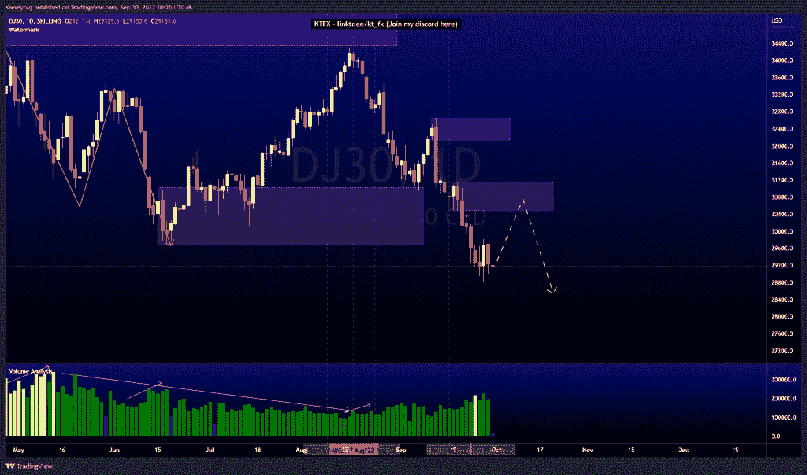

# 每周股票技术分析#DJ30 #AAPL #TSLA

> 原文：<https://medium.com/coinmonks/weekly-stocks-technical-analysis-dj30-aapl-tsla-71501cd3adbb?source=collection_archive---------43----------------------->

在这里找到更多关于我的信息(YouTube/Discord/Telegram):[https://www.linktr.ee/keeleytan](https://www.linktr.ee/keeleytan)

如果你觉得我的帖子有帮助，如果你能在这个帖子上给我一个赞，并关注我以后的类似帖子，我将不胜感激。

如果你同意，请在评论中告诉我你的想法。我在考虑尝试在 discord 上提供免费信号服务。如果你有兴趣，加入我们吧！

#DJ30

根据我最后的分析，价格没有发挥作用。我预计价格在下跌前会在 32136.6 减轻看跌情绪。价格没有降低。现在，价格已经打破市场结构向下。我预计在继续走低之前，30485.6 将是一个看涨回撤至看跌点。

#AAPL

价格未能推高至看跌点 166.25，然后下跌，如上周分析的那样。价格走低，以缓解 149.87 的看涨点，打破市场结构下行。我预计价格将在继续走低之前，在 148.56 的位置进行看涨回撤至看跌点。

#TSLA

看跌的 POI 在 282.68 保持价格，现在，价格在 266.15 创造了同样的低点。价格下跌的可能性很大，我预计价格会从这里继续走低。

如果你持有这些公司中的任何一家，就可以点赞、分享和评论！

让我知道，如果你有任何你想让我分析的行情。

一定要在其他社交平台上看看我，我在交易、分析和心理学上发布内容。看看我这里:【https://www.linktr.ee/keeleytan】T2

*原载于 2022 年 9 月 30 日 http://2minutesliteracy.wordpress.com***。**

> *交易新手？尝试[加密交易机器人](/coinmonks/crypto-trading-bot-c2ffce8acb2a)或[复制交易](/coinmonks/top-10-crypto-copy-trading-platforms-for-beginners-d0c37c7d698c)*