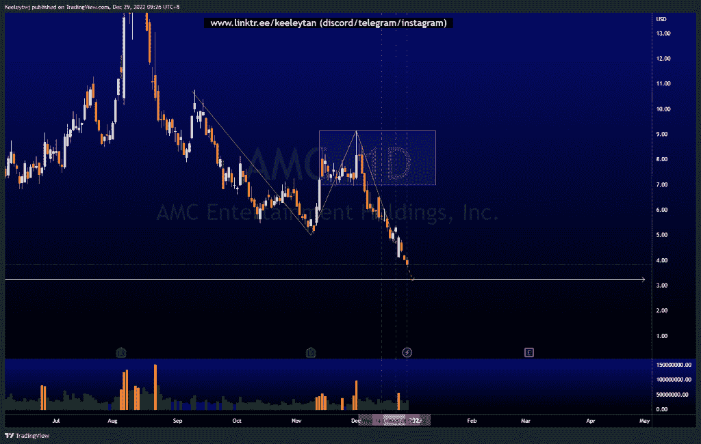

# 每周股票技术分析+基本面头条新闻#AMC #AMZN #SE

> 原文：<https://medium.com/coinmonks/weekly-stocks-technical-analysis-fundamental-headline-news-amc-amzn-se-e7c9792a674d?source=collection_archive---------53----------------------->

在这里了解更多关于我的信息(YouTube/insta gram/Telegram):[https://www.linktr.ee/keeleytan](https://www.linktr.ee/keeleytan)

如果你觉得我的帖子有帮助，如果你能在这个帖子上给我一个赞，并关注我以后的类似帖子，我将不胜感激。如果您有任何意见/反馈，请随时使用上面的谷歌表单链接。

不和谐的免费信号服务正式启动。如果你感兴趣的话，去我的不和谐看看吧！

> 交易新手？在[最佳加密交易](/coinmonks/crypto-exchange-dd2f9d6f3769)上尝试[加密交易机器人](/coinmonks/crypto-trading-bot-c2ffce8acb2a)或[复制交易](/coinmonks/top-10-crypto-copy-trading-platforms-for-beginners-d0c37c7d698c)

增加了一行新的标题新闻，可能是重要的，是从电视本身提取的。

#AMC

价格并没有像上周分析的那样发挥作用。我预计，在获得外部流动性后，价格将在 6.96 的熊市点进行看涨回撤。在看跌订单流之后，价格继续走低。目前，我预计随着订单的增加，价格会继续走低。这次下跌的下一个目标可能是 3.23 等值低点。

头条新闻:
标准普尔信用评级下调后，AMC 娱乐公司股价下跌
标准普尔因“不良”交换计划下调 AMC 娱乐公司对 CC 的信用评级
AMC 娱乐公司、NGL 能源伙伴公司、上市前亏损公司中的 LightJump 收购案

[https://www . trading view . com/chart/AMC/TYXFPADQ-AMC-Analysis/](https://www.tradingview.com/chart/AMC/TYXFPADQ-AMC-Analysis/)

#AMZN

根据上周的分析，价格几乎从 81.30 的低点回升，以获取外部流动性。现在，我预计低点将被接受，我们将看到价格在该区域的反应。如果价格不想进一步下跌，看涨回撤的潜在目标将是 97.23 的同等高点。

头条新闻:
零售商在库存水平上升的情况下兜售节后销售
市场传言:据报道，Amazon.com 计划开发独立的体育流媒体应用
亚马逊可能会随着需求的缓解销售过剩的航空货运空间——报道

[https://www . trading view . com/chart/AMZN/ypbj 3 XRD-AMZN-Analysis/](https://www.tradingview.com/chart/AMZN/YpBJ3XRd-AMZN-Analysis/)

#SE

自从我上次分析后，价格稳定了。在 51.76 获得流动性后，价格未能在 68.77 做看涨回撤至看跌点。价格从这里开始向下突破市场结构。我预计随着订单的增加，价格会继续走低。

[https://www.tradingview.com/chart/SE/R0QyPj4Y-SE-Analysis/](https://www.tradingview.com/chart/SE/R0QyPj4Y-SE-Analysis/)

如果你持有这些公司中的任何一家，就可以点赞、分享和评论！

让我知道，如果你有任何你想让我分析的行情。

一定要在其他社交平台上看看我，我在交易、分析和心理学上发布内容。看看我这里:【https://www.linktr.ee/keeleytan】T2

*原载于 2022 年 12 月 29 日***。**

> *加入 Coinmonks [电报频道](https://t.me/coincodecap)和 [Youtube 频道](https://www.youtube.com/c/coinmonks/videos)了解加密交易和投资*

# *另外，阅读*

*   *[如何使用 Solidity 在以太坊上创建 DApp？](https://coincodecap.com/create-a-dapp-on-ethereum-using-solidity)*
*   *[加密交易机器人](/coinmonks/crypto-trading-bot-c2ffce8acb2a) | [OKEx vs 币安](https://coincodecap.com/okex-vs-binance)*
*   *[币安 vs FTX](https://coincodecap.com/binance-vs-ftx) | [最佳(SOL)索拉纳钱包](https://coincodecap.com/solana-wallets)*
*   *[如何在 Uniswap 上交换加密？](https://coincodecap.com/swap-crypto-on-uniswap) | [A-Ads 评论](https://coincodecap.com/a-ads-review)*
*   *[加密货币储蓄账户](/coinmonks/cryptocurrency-savings-accounts-be3bc0feffbf) | [YoBit 审核](/coinmonks/yobit-review-175464162c62)*
*   *[Botsfolio vs nap bots vs Mudrex](/coinmonks/botsfolio-vs-napbots-vs-mudrex-c81344970c02)|[gate . io 交流回顾](/coinmonks/gate-io-exchange-review-61bf87b7078f)*